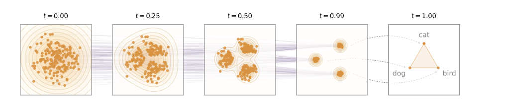
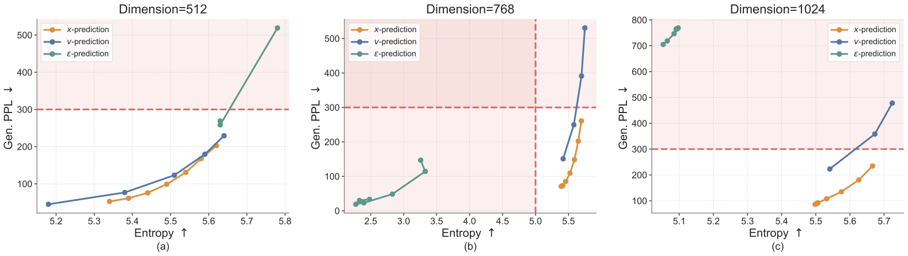
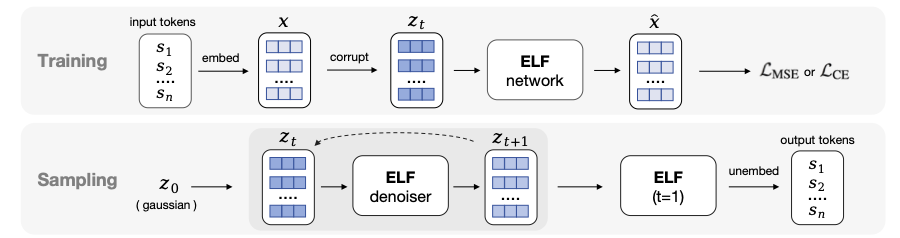
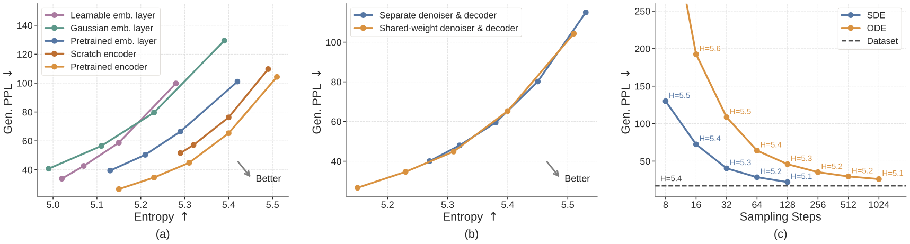
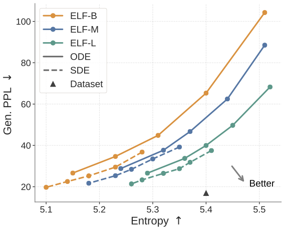
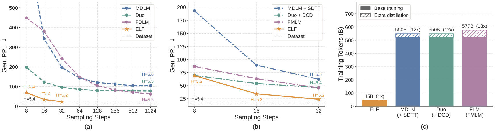
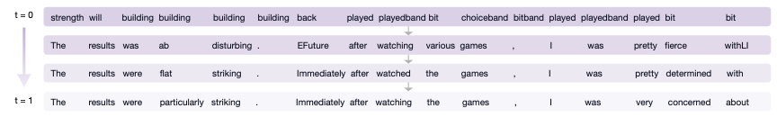

# ELF: Embedded Language Flows

## 本地文件

- PDF: [ELF_Embedded_Language_Flows_arXiv_2605.10938.pdf](ELF_Embedded_Language_Flows_arXiv_2605.10938.pdf)
- arXiv 源码包: [ELF_arXiv_2605.10938_source.tar.gz](ELF_arXiv_2605.10938_source.tar.gz)
- arXiv 源码目录: [ELF_arXiv_2605.10938_source](ELF_arXiv_2605.10938_source)
- 关键图片目录: [images](images)
- arXiv: https://arxiv.org/abs/2605.10938
- 官方代码: https://github.com/lillian039/ELF

## 一句话理解

ELF 想回答的问题是:

> 语言 diffusion 一定要在离散 token 上做 mask / unmask 吗？能不能像图像 diffusion 一样，主要在连续空间里流动，只在最后一步把连续表示翻译回 token？

它给出的答案是: 可以。做法是把文本先编码成连续 embedding，然后用 Flow Matching 从高斯噪声一路 denoise 到干净 embedding；整个生成过程几乎都待在连续 embedding space 里，最后一步才用同一个网络切到 decode mode，把 embedding 投影回离散 token。

所以 ELF 可以粗略理解成:

```text
LLaDA / MDLM:
  token -> mask corruption -> 反复预测离散 token

ELF:
  token -> continuous embedding -> Gaussian noise
  noise -> embedding flow -> final token decode
```

这篇论文适合放在 Diffusion 下面，因为它不是单纯的文本 embedding 方法，而是在语言建模里把 **continuous-time Flow Matching + continuous diffusion tricks** 重新接起来。

## 论文主线

### 1. 当前 DLM 的分歧: 离散派强，连续派没死

Diffusion Language Model 大体有两条路线:

| 路线 | 状态空间 | 代表直觉 |
|---|---|---|
| Discrete DLM | token / mask / categorical distribution | LLaDA、MDLM、Duo 这类直接在离散符号上扩散 |
| Continuous DLM | embedding / latent / simplex | 先把 token 放进连续空间，再做 denoising |

最近更强的结果多来自 discrete DLM，尤其是 masked diffusion。一个自然结论会是: 语言本来就是离散符号，所以连续 diffusion 不适合。

ELF 反过来问: 连续 DLM 不强，究竟是因为语言本质离散，还是因为过去的连续 DLM 在方法设计上还没有吃到图像 diffusion / flow matching 的红利？

### 2. ELF 的核心判断: 不要每一步都急着离散化

很多连续 DLM 其实并没有完全放开连续空间。它们虽然把 token 映射成 embedding，但训练时会加入 per-step token-level cross entropy、rounding loss、simplex constraint，或者需要一个单独 decoder 把 latent 转回 token。

ELF 的想法更“图像 diffusion 化”:

```text
大多数时间:
  只做 continuous denoising

最后一步:
  才做 continuous-to-discrete decoding
```

这样做有两个好处:

1. 轨迹不被 token-level supervision 反复拉回离散空间，可以像图像生成那样学连续 flow。
2. CFG、SDE sampler、time schedule、x-prediction 这些连续 diffusion / flow matching 技术可以比较自然地搬进语言生成。

### 3. 时间方向要先记住

ELF 的时间记号和 DDPM 笔记里常见写法相反:

```text
ELF:
  t = 0: Gaussian noise
  t = 1: clean embedding / data

DDPM 常见写法:
  t = 0: clean data
  t = T: noise
```

ELF 的 flow 是从 `z_0` 噪声走到 `z_1` 数据。读公式时要一直带着这个方向，否则会误读。

## 方法直觉

### 1. 从 token 到 continuous embedding

给一段 token 序列:

```text
s = [s_1, ..., s_L]
```

ELF 先用 encoder 把它映射到连续 embedding:

```text
x = encode(s)
```

默认 encoder 是 frozen pretrained T5-small encoder，得到 contextual embeddings。论文也试了 scratch encoder、T5 token embedding、Gaussian embedding、learnable embedding 等变体。

这里的关键不是“用了 T5 所以变强”，而是: ELF 需要一个比较顺滑的连续语言表示空间。消融显示 contextual embedding 比非 contextual embedding 更适合这个任务。

### 2. Flow Matching: 在 embedding space 里从噪声流到数据

ELF 用 rectified flow / flow matching 的线性插值:

$$
z_t = t x + (1-t)e,\quad e \sim \mathcal{N}(0, I),\quad t\in[0,1]
$$

直觉是:

| 时间 | 状态 |
|---:|---|
| $t=0$ | 纯高斯噪声 $e$ |
| $t=0.3$ | 噪声多，少量数据信号 |
| $t=0.7$ | 数据信号多，噪声较少 |
| $t=1$ | 干净 embedding $x$ |

这个路径上的真实速度是:

$$
v = \frac{dz_t}{dt}=x-e
$$

如果模型能预测每个位置该往哪里流，就可以从噪声一步步积分到干净 embedding。



> 这张图要看的是: ELF 的 denoising 轨迹一直在连续 embedding space 里走，最后才把橙色数据点对应回 token。它不像 masked diffusion 那样每一步都在离散 token 空间里改答案。

### 3. 为什么用 x-prediction，而不是 v-prediction / epsilon-prediction

标准 Flow Matching 可以直接让网络预测 velocity:

```text
net(z_t, t) -> v
```

ELF 改成让网络先预测 clean embedding:

```text
net(z_t, t) -> x_hat
```

再把它转成 velocity:

$$
v_\theta(z_t,t)=\frac{x_\theta(z_t,t)-z_t}{1-t}
$$

对应的 denoising loss 是:

$$
\mathcal{L}_{\text{MSE}}=
\mathbb{E}_{t,x,e}
\frac{1}{(1-t)^2}\|x_\theta(z_t,t)-x\|^2
$$

这不是一个小细节。论文给出两个理由:

1. 高维 embedding 上，直接预测 clean data 更稳定。这和图像 flow matching 里对高维 latent 的观察一致。
2. 最后一步 decode 本质上也需要从 hidden embedding 预测 token。让同一个网络一直预测 clean embedding，更容易和最终 CE 解码目标共享权重。

附录消融里，随着 T5 embedding 维度从 512 到 768、1024 增大，`x-prediction` 最稳定；`v-prediction` 在高维下明显退化；`epsilon-prediction` 基本崩。



> 这张图要看的是: embedding 维度越高，预测目标越关键。ELF 不是随便借了 Flow Matching 框架，而是选了更适合语言 embedding manifold 的参数化。

### 4. 最后一步 decode: 同一个网络换 mode

语言生成最终必须输出离散 token。ELF 的巧妙点是: 不额外训练一个 decoder，而是把 `t=1` 这个最终时间步当成 continuous-to-discrete decoding step。

训练时有两条分支:

```text
denoise branch:
  z_t = t * x + (1 - t) * e
  net(z_t, t, mode="denoise") -> x_hat
  用 MSE / flow matching loss

decode branch:
  z_tilde = corrupt(x)
  net(z_tilde, t=1, mode="decode") -> h
  unembed(h) -> token logits
  用 token-level cross entropy
```

两条分支共享同一个 network，只靠 mode token 区分当前任务。论文默认 80% 训练样本走 denoising branch，20% 走 decoding branch。



> 这张图是 ELF 的最核心流程图: 训练时 embedding 先被噪声污染，然后模型要么学连续去噪，要么学最终 token decode；推理时从高斯噪声出发，反复 denoise，最后一步才投影成 token。

为什么 decode branch 还要 `corrupt(x)`？

因为如果 `t=1` 时输入就是干净 embedding，decode 太容易了；但推理时 denoiser 给出的最终 embedding 一定有误差。于是作者在训练 decode mode 时给 clean embedding 加 token-level corruption，让 decode mode 学会从不完美 embedding 里恢复 token。

### 5. 推理过程

ODE 版本可以写成:

```python
z = randn(shape)
for t_i, t_next in schedule:
    x_pred = net(z, t_i, mode="denoise")
    v = (x_pred - z) / (1 - t_i)
    z = z + (t_next - t_i) * v

h = net(z, t=1, mode="decode")
tokens = argmax(unembed(h))
```

注意这里的 `shape` 是目标 embedding 序列的 shape。对无条件生成来说，生成长度需要预先给定；对条件生成来说，条件部分的 clean embeddings 会被拼到目标序列前面。

## 关键设计细节

### 1. Self-conditioning 变成 CFG 的条件

Self-conditioning 的意思是: 模型先做一次预测，得到中间 clean embedding 估计 `x_hat_prime`，再把它作为条件喂给下一次预测。

训练时:

```text
50% denoise samples:
  concatenate [z_t, stopgrad(x_hat_prime)]

其余 samples:
  concatenate [z_t, 0]
```

推理时，直接用上一步的预测作为 self-conditioning，不需要每一步多跑一遍模型。

ELF 的一个漂亮点是: 这个 self-conditioning signal 可以自然变成 CFG 的 condition。于是原本图像 diffusion 里很成熟的 classifier-free guidance，就可以搬到语言 flow 里。

### 2. Training-time CFG: 控制质量和多样性的旋钮

普通 CFG 推理时要跑 conditional 和 unconditional 两次 forward。ELF 采用 training-time CFG，让网络直接学习 CFG 后的目标，从而避免推理时的双倍开销。

CFG scale 的作用和图像生成里类似:

```text
CFG scale 变大:
  生成质量指标更好，Gen. PPL 更低
  但多样性下降，entropy 更低
```

所以 ELF 的结果通常不是一个点，而是一条 Gen. PPL 和 entropy 的 trade-off frontier。

这里要小心: Gen. PPL 是用 GPT-2 Large 给生成样本打困惑度，不是 ELF 自己的 likelihood。它衡量“像不像 GPT-2 认为自然的文本”，但不能完全等同于模型概率质量。

### 3. In-context control tokens

ELF 没有沿用 DiT 里常见的 adaLN-Zero 来注入条件，而是把控制信号作为 token prepend 到序列前:

```text
[time tokens] [CFG-scale tokens] [mode tokens] [condition embeddings] [target embeddings]
```

控制 token 包括:

- 4 个 time tokens，表示连续时间 $t$。
- 4 个 CFG-scale tokens，表示 guidance scale。
- 4 个 mode tokens，表示 denoise / decode。

作者说这种 in-context conditioning 略好于 adaLN-Zero，同时能减少不少参数。ELF-B 如果用 adaLN-Zero 大约 148M，用 in-context conditioning 后是 105M。

### 4. SDE-inspired sampler

ELF 支持 ODE sampler 和 SDE-inspired sampler。

ODE 是确定性积分:

```text
当前 z_t -> 预测 velocity -> 往数据方向走一步
```

SDE-inspired sampler 会在每一步重新注入一点高斯噪声，并把时间稍微推向更 noisy 的区域，再用 denoiser 修正。论文的解释是: 这样可以减少早期错误沿着确定性轨迹被一路放大的问题。

实验里 SDE 在 few-step regime 明显更好，默认使用 noise re-injection scale `gamma=1.0` 或系统对比里的 `gamma=1.5/2.0`。

## 关键实验

### 1. 实验设置

无条件生成:

- 数据: OpenWebText，约 9B tokens。
- 序列长度: 1024。
- 评估: 生成 1000 个 samples，用 GPT-2 Large 计算 generative perplexity，同时报告 unigram entropy。

条件生成:

- WMT14 German-to-English: BLEU。
- XSum summarization: ROUGE-1 / ROUGE-2 / ROUGE-L。
- 条件序列不加噪，目标序列从噪声生成。

模型:

| Model | Depth | Hidden | Heads | Params | OWT epochs |
|---|---:|---:|---:|---:|---:|
| ELF-B | 12 | 768 | 12 | 105M | 5 |
| ELF-M | 24 | 1056 | 16 | 342M | 4 |
| ELF-L | 32 | 1280 | 16 | 652M | 3 |

默认 embedding 是 frozen T5-small encoder，35M 参数。论文在某些条件生成表格里把它写作 `105M (+35M)`。

### 2. 关键设计消融



> 这张图要看三件事: contextual embedding 比非 contextual embedding 更强；shared-weight denoiser-decoder 不输两阶段 decoder，而且更简单；SDE sampling 在相同步数下比 ODE 有更好的质量和效率折中。

主要结论:

| 设计 | 结论 |
|---|---|
| Embedding choice | pretrained contextual T5 embeddings 最好；scratch contextual encoder 也不错；learnable token embedding 最差 |
| Decode strategy | shared-weight decode 和 separate decoder 都能工作，但 shared-weight 更简单，也能到更低 Gen. PPL 区域 |
| Sampler | SDE-inspired sampler 在 few-step 下更强 |
| Bottleneck | 128 维 bottleneck 最平衡；太小牺牲 entropy，太大 Gen. PPL 变差 |
| Denoise/decode 比例 | 80% denoise + 20% decode 最好 |
| Optimizer | Muon 比 AdamW 更好，但 ELF 的强结果不能完全归因于 optimizer |

### 3. Scaling



> 这张图说明 ELF 的 curve 随模型变大继续改善。在相近 entropy 下，大模型 Gen. PPL 更低；在相近 Gen. PPL 下，大模型 entropy 更高。

64-step 采样的一些代表数字:

| Sampler | SC CFG | ELF-B Gen. PPL / Entropy | ELF-M Gen. PPL / Entropy | ELF-L Gen. PPL / Entropy |
|---|---:|---:|---:|---:|
| SDE | 1.0 | 29.50 / 5.23 | 33.45 / 5.30 | 31.82 / 5.37 |
| SDE | 3.0 | 19.72 / 5.10 | 21.69 / 5.18 | 23.31 / 5.28 |
| ODE | 1.0 | 65.30 / 5.40 | 62.47 / 5.44 | 49.72 / 5.45 |
| ODE | 3.0 | 26.62 / 5.15 | 28.80 / 5.24 | 26.57 / 5.29 |

一个有趣现象是，SDE + 更大 CFG 并不总是单调更好。ELF-B / ELF-M 在 CFG 超过 3 后反而出现灰色标注的异常退化点；ELF-L 还能继续从 3.5 / 4.0 受益一点。

### 4. 系统级无条件生成对比



> 这张图是论文主张最强的地方: ELF-B 用更少采样步、更少训练 token，压过了多个 discrete / continuous DLM baseline，并且不需要额外 distillation。

系统级结果里，ELF-B 使用 SDE sampling + self-conditioning CFG scale 3:

| Steps | SC CFG | gamma | Gen. PPL | Entropy |
|---:|---:|---:|---:|---:|
| 8 | 3 | 2.0 | 67.32 ± 2.25 | 5.14 ± 0.085 |
| 16 | 3 | 2.0 | 33.66 ± 1.09 | 5.16 ± 0.026 |
| 32 | 3 | 1.5 | 24.08 ± 0.16 | 5.15 ± 0.002 |

论文强调的比较点:

- ELF-B 是 105M，很多 baseline 约 170M。
- ELF-B 在 32 steps 达到 Gen. PPL 约 24。
- 对比 MDLM、Duo、FLM、LangFlow 等，ELF 在更少步数下有更低 Gen. PPL。
- 对比蒸馏版 MDLM+SDTT、Duo+DCD、FMLM，ELF 不做额外 distillation 也有 few-step 优势。
- 训练 token 预算约 45.2B，而一些 baseline 估算为 524B 到 576B，约 11.6x 到 12.8x。

这组结果支撑了论文最核心的判断: 连续 DLM 的性能差距不一定来自“语言必须离散处理”，也可能来自之前没有用对连续生成模型的工程组合。

### 5. 条件生成: 翻译和摘要

条件生成时，ELF 把条件输入的 clean embeddings prepend 到目标序列前，并在训练和推理时保持条件部分不加噪。目标部分仍然通过 flow 从噪声变成 embedding，最后 decode 成 token。

结果:

| Model | Size | WMT14 De-En BLEU | XSum R1 | XSum R2 | XSum R-L |
|---|---:|---:|---:|---:|---:|
| AR | 99M | 25.2 | 30.5 | 10.2 | 24.4 |
| MDLM | 99M | 18.4 | 33.4 | 11.6 | 25.8 |
| Duo | 170M (+35M) | 21.3 | 31.4 | 10.1 | 25.0 |
| E2D2 | 99M | 24.8 | 28.4 | 8.3 | 22.0 |
| SeqDiffuSeq | - | 21.3 | 19.3 | 1.7 | 14.1 |
| CDCD | - | 24.9 | - | - | - |
| ELF-B | 105M (+35M) | **26.4** | **36.0** | **12.2** | **27.8** |

这说明 ELF 不只是会无条件生成 OWT 风格文本，也能做 text-to-text 条件生成。论文在条件生成里用 64-step ODE sampler，self-conditioning CFG scale 1，input-condition CFG scale 2。

### 6. Denoising trajectory



> 这张图展示的是生成轨迹的语言形态: 从早期不通顺、不稳定的句子，逐步修正成更流畅的文本。它和 LLaDA 的“反复补 mask”观感不同，ELF 是连续 embedding 轨迹在逐步靠近可 decode 的语言区域。

## 和已有 Diffusion 笔记的关系

### 和 DDPM 的关系

DDPM 的基本范式是:

```text
data -> 加噪 -> noisy data
noise -> 逐步去噪 -> data
```

ELF 保留了“从噪声恢复数据”的精神，但把状态空间从 image pixels / latents 换成了 language embeddings，把 DDPM-style discrete timesteps 换成 continuous-time Flow Matching。

### 和 DiT 的关系

ELF 用的是 Diffusion Transformer 风格 backbone，并吸收了图像/视频 flow matching 系列里的技巧，比如 x-prediction、CFG、SDE-like sampling、time schedule。

但 DiT 面对的是图像 latent，最后还是 continuous image latent；ELF 最难的接口是:

```text
continuous embedding -> discrete tokens
```

所以它的 shared-weight decode branch 是语言场景特有的关键补丁。

### 和 LLaDA 的关系

LLaDA 的路线是离散 masked diffusion:

```text
clean tokens -> mask tokens -> iterative unmasking
```

ELF 的路线是连续 embedding flow:

```text
tokens -> clean embeddings
Gaussian noise -> iterative embedding denoising -> final decode
```

对比:

| 维度 | LLaDA / MDLM | ELF |
|---|---|---|
| 扩散空间 | 离散 token / mask | 连续 contextual embedding |
| 噪声 | `[MASK]` 或 categorical corruption | Gaussian noise |
| 训练核心 | token CE / masked prediction | embedding MSE + final CE |
| 生成中间态 | 部分 token 已确定，部分 token 未确定 | 全序列连续表示逐步变清晰 |
| CFG | 不天然，离散空间较别扭 | 天然适配 continuous velocity / prediction |
| 采样 | iterative unmask / remask | ODE / SDE flow integration |

所以 ELF 和 LLaDA 不是“谁替代谁”的简单关系。它们分别代表 diffusion language model 的两个方向:

```text
LLaDA: 让 diffusion 适应语言的离散符号结构
ELF:   让语言生成尽量适应 diffusion 的连续生成范式
```

## 局限性和需要谨慎的地方

### 1. Gen. PPL 不是语言模型 likelihood

无条件生成用 GPT-2 Large 的 perplexity 给样本打分。这是 DLM 文献里的常见 protocol，但它不是 ELF 的 likelihood，也不是人类偏好。

一个模型可以通过降低多样性让 Gen. PPL 变好，所以论文同时报告 entropy，并用 frontier 看质量和多样性权衡。这一点读结果时要牢记。

### 2. 仍然依赖一个好的 embedding space

ELF 的强结果和 pretrained contextual embeddings 关系很大。虽然作者试了 scratch encoder 和随机 / learnable embedding，但默认最佳配置还是 frozen T5-small encoder。

这意味着 ELF 不是“从离散 token 空间凭空学出连续几何”，而是借用了已有 encoder 给出的语言表示空间。对无条件生成，encoder主要用于训练构造 target embeddings；对条件生成，推理时还需要把输入条件编码成 clean embeddings。

### 3. 最终 decode 仍是一个瓶颈接口

ELF 避免了独立 decoder，但没有消灭 continuous-to-discrete 的困难。它只是把这个困难集中到 `t=1` 的 decode mode，并通过 corruption training 让 shared network 更鲁棒。

如果 denoising trajectory 最后落在 embedding manifold 外，decode 仍然可能产生不稳定 token。

### 4. 规模还不等于现代 LLM

论文最大 ELF-L 是 652M，不是 7B、70B 这种现代 instruction LLM 尺度。它证明 continuous DLM 在标准 DLM protocol 上很有竞争力，但还没有证明可以直接替代大规模 AR chat model。

### 5. 长文本和 KV cache 问题仍待观察

ELF 生成时每一步要处理整段 embedding 序列，而且是 bidirectional / full-attention 风格。它有 fewer sampling steps 的优势，但不像 causal LM 那样天然有 token-by-token KV cache。

所以“并行生成”不自动等于部署更快。真正速度要看序列长度、步数、硬件、batching 和实现。

## 对我理解 Diffusion 语言模型路线的意义

这篇论文把 Diffusion LLM 的路线图分得更清楚了。

过去看 LLaDA 时，一个强直觉是:

```text
语言是离散 token，所以 diffusion 语言模型最好也离散化。
```

ELF 提醒另一种可能:

```text
语言输出是离散 token，但生成过程不一定要一直离散。
```

这和图像 LDM 的思想有点相似: 不是在原始像素上硬做，而是找一个更适合生成过程的 latent space。区别是图像 latent 最后仍由 decoder 转图像，而 ELF 尝试用 final flow step + shared weights 直接回到 token。

在研究脉络里，ELF 的位置可以这样放:

```text
DDPM:
  证明逐步去噪是强生成范式

DiT:
  把 diffusion backbone 换成 Transformer，并推动 scaling

LLaDA:
  把 diffusion language model 做成离散 masked generation

ELF:
  把语言 generation 重新拉回 continuous flow matching，
  只在最终一步处理离散 token 接口
```

它最有启发的不是某一个单独技巧，而是一个组合:

```text
pretrained contextual embedding
+ continuous-time Flow Matching
+ x-prediction
+ shared-weight final decoder
+ self-conditioning CFG
+ SDE-inspired sampler
```

这些组合起来，让 continuous DLM 从“理论上优雅但效果一般”的路线，变成一个值得重新认真看的方向。

## 读这篇时抓住什么

1. ELF 的时间方向是 `t=0` noise，`t=1` data。
2. 它的核心不是“用了 embedding”，而是“几乎整个 denoising 过程都留在 continuous embedding space”。
3. `x-prediction` 是关键，因为它同时服务于 denoising 和最终 decode。
4. Shared-weight denoiser-decoder 是连接 continuous flow 和 discrete token 的关键设计。
5. CFG 在 ELF 里自然成立，因为状态和预测量都是连续的。
6. SDE-inspired sampler 是 few-step 性能的重要来源。
7. Gen. PPL 要和 entropy 一起看，否则容易把低多样性误读成高质量。
8. ELF 证明 continuous DLM 的差距可能是方法问题，不是路线注定失败。

## 一张对照表

| 问题 | ELF 的答案 |
|---|---|
| 文本是离散的，怎么做连续 diffusion？ | 先编码成 contextual embeddings，在 embedding space 做 flow |
| 生成过程什么时候回 token？ | 只在最后一步 `t=1` decode |
| 需要单独 decoder 吗？ | 不需要，denoiser 和 decoder 共享网络权重，用 mode token 区分 |
| 训练目标是什么？ | 80% continuous denoising MSE，20% final token CE |
| 为什么能用 CFG？ | 因为 prediction / velocity 是连续量，和图像 diffusion 里的 CFG 接口一致 |
| 为什么 SDE sampler 有用？ | 重新注入噪声可以缓解 deterministic ODE 早期错误积累 |
| 实验最强证据是什么？ | ELF-B 32-step SDE 在 OWT 上 Gen. PPL 约 24，用约 45B training tokens，强于多种 DLM baseline |
| 最大注意点是什么？ | 依赖 embedding space，评估不是 likelihood，规模还没到现代大 LLM |

