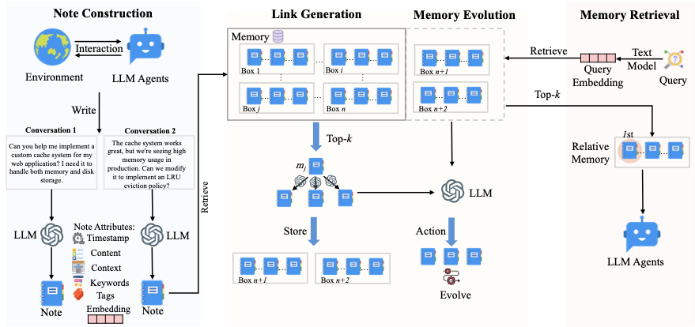
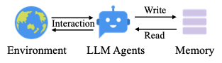
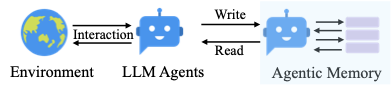
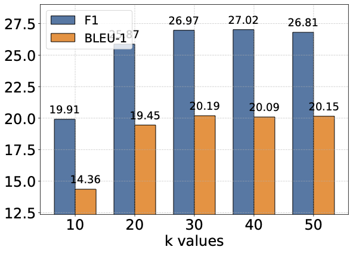
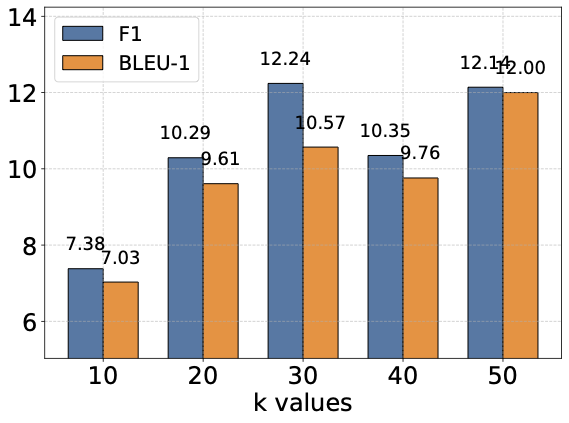
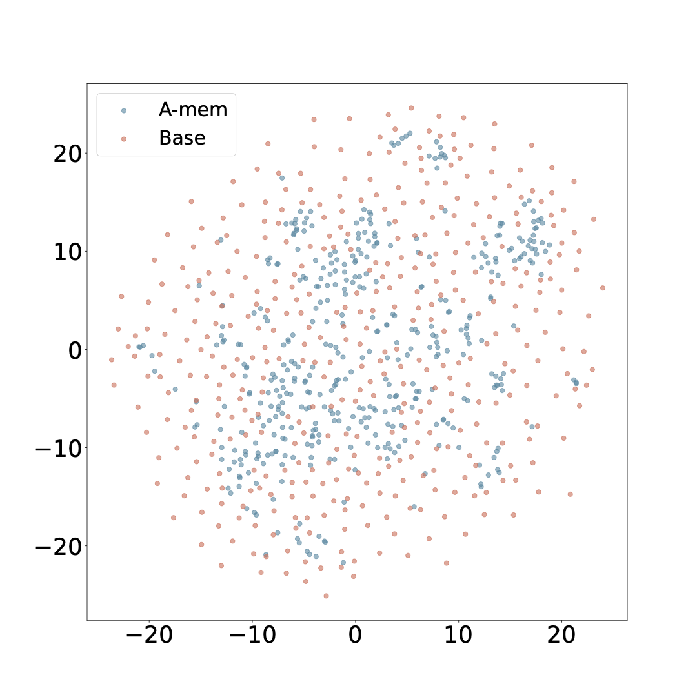
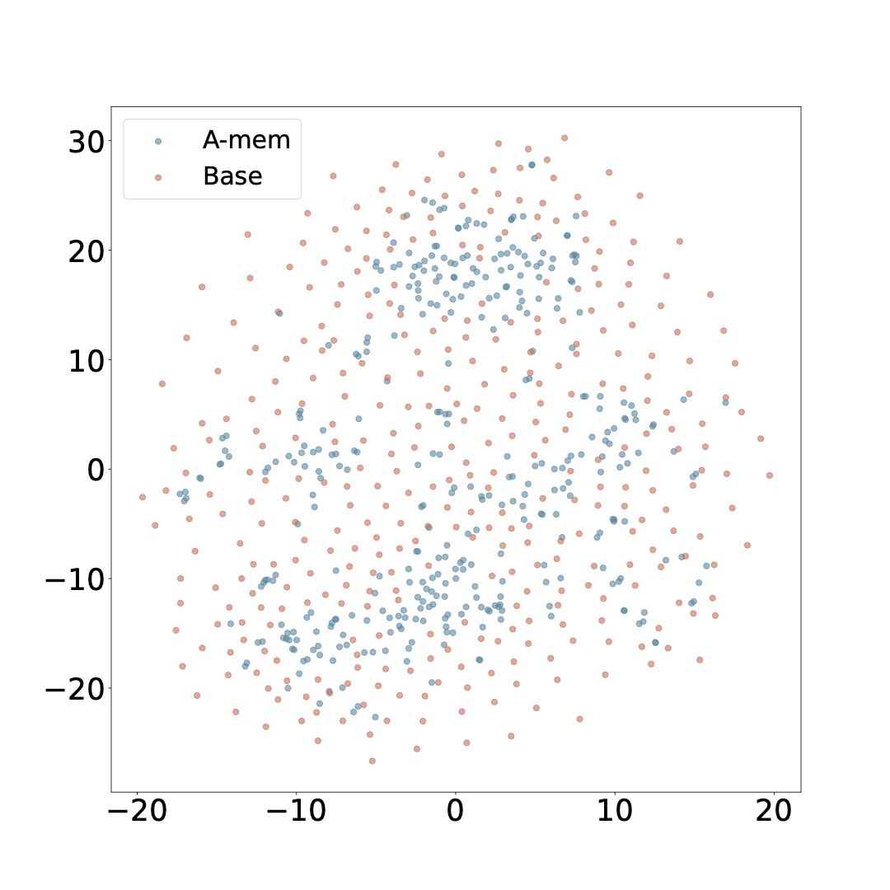

## A-Mem: Agentic Memory for LLM Agents

### 一句话定位

A-Mem 是 agent 长期记忆里的“自组织笔记网络”路线：它把每次交互写成一张带属性的 atomic note，然后让 LLM 自动给新 note 生成关键词、标签、上下文描述，并和历史 notes 建立链接；更重要的是，新记忆写入时会反过来触发旧记忆的 evolution，让整个 memory graph 随经验增长而重新组织。

```text
new interaction
  -> note construction
  -> retrieve similar historical notes
  -> link generation
  -> memory evolution
  -> query-time retrieval
```

如果说 Mem0 更像一个可生产化的 fact memory service，A-Mem 更像一个 Zettelkasten 风格的 agent memory notebook：不是只存事实，而是让记忆之间自己长出关联和更高层语义。

### 基本信息

- **论文**：A-Mem: Agentic Memory for LLM Agents
- **arXiv**：2502.12110
- **版本**：v11，2025-10-08 修订；v1 于 2025-02-17 提交
- **会议**：NeurIPS 2025
- **作者**：Wujiang Xu, Zujie Liang, Kai Mei, Hang Gao, Juntao Tan, Yongfeng Zhang
- **机构/项目**：Rutgers University / Independent Researcher / AIOS Foundation（论文 v11 源码标注）
- **arXiv 页面**：[https://arxiv.org/abs/2502.12110](https://arxiv.org/abs/2502.12110)
- **Benchmark 代码**：[WujiangXu/A-mem](https://github.com/WujiangXu/A-mem)
- **Agentic memory 系统代码**：[WujiangXu/A-mem-sys](https://github.com/WujiangXu/A-mem-sys)
- **论文 PDF**：[source/A-Mem_2502.12110v11.pdf](source/A-Mem_2502.12110v11.pdf)
- **arXiv 源码包**：[source/A-Mem_2502.12110v11_src.tar.gz](source/A-Mem_2502.12110v11_src.tar.gz)
- **核心关键词**：agentic memory、Zettelkasten、atomic note、link generation、memory evolution、long-term agent memory、LoCoMo、DialSim

### 摘要中文翻译

LLM agent 虽然可以用工具完成复杂任务，但要真正长期和环境交互，就需要能利用历史经验的 memory system。已有 memory 系统大多能做基本的存储和检索，有些也引入 graph database，但它们的操作和结构往往是预定义的，因此难以适应多样化任务。

A-Mem 提出一种 agentic memory system：参考 Zettelkasten 卡片盒笔记法，把记忆组织成动态互联的知识网络。每条新记忆会被构造成一个带多个结构化属性的 note，包括上下文描述、关键词和标签；系统再分析历史记忆，发现相关连接，并在有意义时建立链接。新记忆的加入还会触发 memory evolution，也就是更新旧记忆的上下文表示和属性，使记忆网络持续细化自己的理解。

论文在多个 foundation models 上评估，显示 A-Mem 相比 LoCoMo、ReadAgent、MemoryBank、MemGPT 等 baseline，在长期对话问答中有更好的整体表现，尤其在 multi-hop 这类需要跨记忆连接的问题上优势明显。

### 研究问题

这篇论文问的问题不是“怎么把更多历史塞进 prompt”，也不是“怎么做一个固定 schema 的图数据库”，而是：

> agent 的长期记忆能不能像一个会生长的笔记系统一样，自己组织、链接、更新，而不是依赖开发者预先规定所有 memory 操作？

作者批评的对象主要是两类：

```text
传统 agent memory:
  开发者预定义什么时候写、怎么存、什么时候读。
  结构固定，任务换了就不够灵活。

graph database memory:
  有显式实体和关系，但 schema / relation types 通常预先设好。
  新任务里出现新的抽象模式时，系统不容易自己长出新连接。
```

A-Mem 的回答是把 memory 设计成一个可演化的 note network：

```text
每条 memory 都是一张 atomic note。
note 自带 content / time / keywords / tags / context / embedding / links。
新 note 进入时，不只是被存起来，还会触发链接生成和旧 note 演化。
```

这就是它所谓的 “agentic”：agency 不只体现在 query time 决定检索什么，也体现在 storage / organization / evolution 阶段。

### 为什么这篇适合放在 memory layer

A-Mem 补的是 memory layer 里一个很关键的空位：memory 不应该只是 append-only log，也不应该只是静态向量库。长期 agent 的经验会不断改变已有知识的意义。

举个直觉例子：

```text
Memory 1:
  用户上次说喜欢简单直接的技术解释。

Memory 2:
  用户后来反复要求看论文时关注工程落点。

Memory 3:
  用户现在又要求补 agent memory layer 论文。
```

普通 memory store 可能只会存三条事实。A-Mem 想做的是：

```text
把这些 notes 连成一个 box:
  用户偏好 = 技术解释 + 工程落点 + 论文路线组织

同时更新旧 note 的 contextual description:
  这不只是“喜欢简单解释”，而是“偏好可落地、路线型 paper note”。
```

所以它特别适合理解 agent 长期个性化、项目记忆、研究助理记忆这些场景。

### 核心方法

#### 1. 总体架构：note construction、link generation、memory evolution、retrieval



这张图要看四段流程：左边把每次交互写成 note，中间检索相似历史 notes 并生成链接，再触发 memory evolution，右边查询时用 query embedding 检索相关 memory，且能顺带访问同一个 box 里的 linked memories。

A-Mem 的 memory storage 不是简单列表，而是一个 note network：

```text
notes = nodes
links = semantically meaningful connections
boxes = related memories naturally聚集出的主题簇
```

论文里 “box” 是对 Zettelkasten 的类比：相关 notes 会因为相似上下文描述和链接聚到一起。但一个 note 可以同时属于多个 box，这一点很重要，因为真实经验通常不只属于一个主题。

#### 2. Note Construction：把交互变成一张结构化 note

每个 memory note 表示为：

```text
m_i = {c_i, t_i, K_i, G_i, X_i, e_i, L_i}
```

各字段含义：

| 字段 | 含义 |
|---|---|
| `c_i` | 原始交互内容 |
| `t_i` | 时间戳 |
| `K_i` | LLM 生成的关键词 |
| `G_i` | LLM 生成的标签 |
| `X_i` | LLM 生成的上下文描述 |
| `e_i` | note 的 dense embedding |
| `L_i` | 和其他 notes 的链接集合 |

这个设计比“原文 + embedding”更厚一些。它让每条 memory 同时有：

- 原始事实内容；
- LLM 生成的语义解释；
- 可检索的 embedding；
- 可连接的 tags / keywords；
- 可沿着链接扩展的 graph structure。

论文用 LLM prompt `P_s1` 从 `content + timestamp` 生成关键词、标签和上下文描述，然后用 text encoder 对 `content + keywords + tags + context` 做 embedding。实验里使用 `all-minilm-l6-v2` 作为 text embedding model。

#### 3. Link Generation：新 note 进来后，自动找关联

当新 note `m_n` 加入系统时，A-Mem 先用 embedding cosine similarity 找 top-k 个相似历史 notes：

```text
M_near^n = top-k similar historical notes
```

这一步只是初筛，真正的 link 判断交给 LLM：

```text
LLM(new note, nearest notes, link prompt)
  -> decide meaningful links
```

链接不是固定 schema 的 `person-lives-in-city`，而是更自由的 memory-to-memory relation。论文的重点是：embedding 只能找相似，LLM 可以判断更细的共同属性、因果联系、概念联系或模式联系。

这使得 A-Mem 和普通 graph memory 不太一样：

```text
普通 graph memory:
  先定义实体和关系类型，再把信息填进去。

A-Mem:
  先生成 atomic notes，再让 note 之间动态建立语义链接。
```

#### 4. Memory Evolution：新记忆会反过来更新旧记忆

A-Mem 最值得记的地方是 memory evolution。

在建立链接后，系统会遍历 top-k 相关历史 notes，让 LLM 判断是否需要更新旧 note 的 context、keywords、tags：

```text
for each old note in M_near:
  evolved_old_note = LLM(new note, other related notes, old note, evolution prompt)
  replace old note with evolved_old_note
```

这一步的直觉是：旧记忆的意义会被新经验改写。

例如：

```text
旧 note:
  用户问过 LRU cache。

新 note:
  用户又问 custom cache system，还关注 high memory usage。

evolved old note:
  用户在做 cache/storage 相关工程设计，关注内存效率和 eviction policy。
```

这种 evolution 不是把旧事实删掉，而是让旧 note 的标签和上下文描述更贴近后来形成的模式。这也是 A-Mem 与 Mem0 的 `ADD / UPDATE / DELETE` 最明显的差异：Mem0 更像事实状态维护，A-Mem 更像知识结构生长。

#### 5. Retrieval：query embedding 找相关 note，并可读 linked memories

查询时，A-Mem 对当前 query 做 embedding，然后和 memory notes 的 embedding 算相似度，取 top-k：

```text
query -> e_q
score(q, m_i) = cosine(e_q, e_i)
retrieved = top-k notes
```

图里还体现了一个额外点：当某条相关 memory 被召回时，同一个 box 里 linked memories 也可以被自动访问。这让系统不只是检索“字面相似”的一条 memory，而是可以把关联网络一起带回来。

### 关键图表解读

#### Traditional memory vs agentic memory





这两张小图表达的是论文的动机：传统 memory 系统需要在 workflow 里预先写死 memory access pattern；A-Mem 希望让 agent 和 memory 的交互更动态，记忆操作不是固定插槽，而是由 memory system 根据新经验组织。

#### A-Mem architecture


这张图最重要的是中间两块：link generation 和 memory evolution。很多 memory 系统都有写入和检索，但 A-Mem 额外强调“写入新 note 后，历史 notes 也要被重新理解”。这正是它叫 agentic memory 的原因。

#### k 值影响：multi-hop



Multi-hop 对 k 更敏感，因为它要跨多条记忆合成答案。k 增大通常会带来更多可用线索，但继续增大后收益会变平甚至下降，说明 retrieved context 太多也会引入噪声。

#### k 值影响：open-domain



Open-domain 也呈现类似趋势：更多记忆不总是更好。A-Mem 的一个工程启示是，memory layer 需要按任务类型调 retrieval budget，而不是固定 “top-10 永远最好”。

#### Memory embedding 可视化





蓝色是 A-Mem，红色是去掉 link generation 和 memory evolution 的 base memory。作者用 t-SNE 展示 A-Mem 的 embeddings 更容易形成局部聚簇。这个图不能单独证明因果，但能直观看到：A-Mem 生成的 contextual descriptions 和 evolution 让 memory representation 更有组织性。

### 实验设置

#### 数据集

论文主要使用两个长期对话数据集：

| 数据集 | 作用 |
|---|---|
| LoCoMo | 长期 conversation QA，覆盖 multi-hop、temporal、open-domain、single-hop、adversarial 等问题 |
| DialSim | 来自 Friends、The Big Bang Theory、The Office 等 TV show 的长期多方对话 QA，覆盖更长时间跨度和 temporal knowledge graph 生成问题 |

论文对 LoCoMo 的描述是：

- 平均约 9K tokens；
- 最多 35 个 sessions；
- 总计 7,512 个 QA pairs；
- 比早期 1K token、4-5 session 的对话数据更适合长期记忆评估。

#### Models

论文在六个 foundation models 上做主实验：

- GPT-4o-mini；
- GPT-4o；
- Qwen2.5 1.5B；
- Qwen2.5 3B；
- Llama 3.2 1B；
- Llama 3.2 3B。

附录还报告了 DeepSeek-R1-32B、Claude 3.0 Haiku、Claude 3.5 Haiku 等结果。

#### Baselines

主表比较：

- LoCoMo full-history prompt；
- ReadAgent；
- MemoryBank；
- MemGPT；
- A-Mem。

注意这里的 LoCoMo baseline 经常使用完整历史，token 长度约 16,910；MemGPT 也接近这个级别。A-Mem 则通过 top-k memory retrieval，把回答每个问题所需 token 降到约 1,100 到 2,500。

#### Metrics

主表使用：

- F1；
- BLEU-1；
- Average ranking；
- Token length。

论文附录还补充 ROUGE-L、ROUGE-2、METEOR、SBERT Similarity。

### 关键实验结论

#### 1. A-Mem 在 multi-hop 上最突出

以 GPT-4o-mini 为例：

| 方法 | Multi-hop F1 | Temporal F1 | Open-domain F1 | Single-hop F1 | Token length |
|---|---:|---:|---:|---:|---:|
| LoCoMo | 25.02 | 18.41 | 12.04 | 40.36 | 16,910 |
| ReadAgent | 9.15 | 12.60 | 5.31 | 9.67 | 643 |
| MemoryBank | 5.00 | 9.68 | 5.56 | 6.61 | 432 |
| MemGPT | 26.65 | 25.52 | 9.15 | 41.04 | 16,977 |
| A-Mem | 27.02 | 45.85 | 12.14 | 44.65 | 2,520 |

这组数里，最显眼的是 temporal F1 从 MemGPT 的 25.52 到 A-Mem 的 45.85。对长期对话来说，时间和状态变化往往依赖多条记忆之间的连接，这正是 A-Mem 的 link / evolution 机制想解决的地方。

在 GPT-4o 上，A-Mem 的 multi-hop F1 是 32.86，高于 LoCoMo 28.00 和 MemGPT 30.36；但 single-hop、adversarial 上 LoCoMo 更强。这说明 A-Mem 并不是所有类型都碾压，优势集中在需要结构化记忆组织的问题。

#### 2. 小模型上的收益更稳定

对 Qwen2.5 1.5B / 3B、Llama 3.2 1B / 3B 这些小模型，A-Mem 在大多数类别上都明显优于 baselines。直觉上，小模型本身长上下文处理和跨证据整合能力较弱，A-Mem 先把历史组织成更干净的 note network，再检索给模型，收益更明显。

这点对本地 agent 很有用：

```text
如果 base model 很强:
  full history / MemGPT 在某些简单类别上也能硬读出来。

如果 base model 较小:
  memory layer 的组织质量会更关键。
```

#### 3. Ablation：link generation 和 memory evolution 都有用

GPT-4o-mini ablation：

| 方法 | Multi-hop F1 | Temporal F1 | Open-domain F1 | Single-hop F1 | Adversarial F1 |
|---|---:|---:|---:|---:|---:|
| w/o LG & ME | 9.65 | 24.55 | 7.77 | 13.28 | 15.32 |
| w/o ME | 21.35 | 31.24 | 10.13 | 39.17 | 44.16 |
| A-Mem | 27.02 | 45.85 | 12.14 | 44.65 | 50.03 |

这里可以读成两层：

- 只要有 link generation，性能就大幅上来，说明 memory 之间的连接是基础；
- 加上 memory evolution 之后，temporal / multi-hop / adversarial 都继续提升，说明更新旧 note 的语义表示不是装饰，而是真能帮助长期推理。

#### 4. Retrieval k 有最佳区间

论文扫了 `k = 10, 20, 30, 40, 50`。总体规律是：

```text
k 太小:
  线索不够，multi-hop / temporal 容易漏证据。

k 适中:
  历史上下文够用，噪声还可控。

k 太大:
  额外记忆可能变成干扰，模型处理更困难。
```

这和 Mem0 的结论是相通的：memory layer 的价值不是“召回越多越好”，而是“召回对当前问题最有用的那部分历史”。

#### 5. 成本和 scaling

论文报告 A-Mem 每次 memory operation 约 1,200 tokens，相比 LoCoMo / MemGPT 的约 16,900 tokens，token 使用降低约 85% 到 93%。作者还估算用商业 API 时每次 memory operation 成本低于 0.0003 美元。

Scaling 表里，A-Mem 和 MemoryBank、ReadAgent 在存储量上都是线性增长。检索时间方面，A-Mem 从 1,000 条 memory 的 0.31 microseconds 增加到 1,000,000 条 memory 的 3.70 microseconds。这个数字需要谨慎理解，因为它主要测的是向量检索层，不等于完整 ingest-time LLM link/evolution 成本；但至少说明 query-time retrieval 本身不是瓶颈。

### 和相关工作的关系

#### 和 Mem0

Mem0 和 A-Mem 都是系统层 agent memory，但关注点不同。

| 维度 | Mem0 | A-Mem |
|---|---|---|
| 基本单位 | fact memory / graph triplet | atomic note |
| 写入机制 | extract candidate facts，再 ADD / UPDATE / DELETE / NOOP | note construction，再 link generation / memory evolution |
| 结构 | vector store，增强版用 entity-relation graph | note network / boxes / links |
| 核心诉求 | 生产可用、低 token、低 latency、状态维护 | 动态组织、记忆连接、旧记忆演化 |
| 强项 | fact recall、temporal state、工程效率 | multi-hop、跨记忆模式发现、长期知识组织 |
| 风险 | 抽取/更新错误，删除旧事实可能丢 provenance | LLM evolution 可能改写过度，链接质量依赖模型 |

一句话区分：

```text
Mem0:
  管理事实状态。

A-Mem:
  组织经验网络。
```

工程上它们不是互斥的。更理想的 memory layer 可能同时包含：

```text
raw evidence store:
  保存原始对话和事件

fact memory:
  存明确偏好、身份、计划、状态

note network:
  存经验、模式、项目上下文、跨事件联系
```

#### 和 Generative Agents

Generative Agents 的 memory stream 会做 retrieval、reflection、planning。它已经有“反思生成更高层记忆”的味道。

A-Mem 更专注在 memory store 本身：

```text
Generative Agents:
  memory stream + reflection 支撑 agent 行为生成。

A-Mem:
  memory note network 自己维护 links 和 evolving attributes。
```

可以把 A-Mem 看成把 Generative Agents 里的 reflection / organization 部分抽成了一个更通用的 memory layer。

#### 和 MemoryBank

MemoryBank 强调长期对话存储、用户画像和 Ebbinghaus forgetting。它的问题是组织结构相对固定，更多是“存与取”。

A-Mem 不强调遗忘曲线，而强调：

- 每条 memory 的多属性 note 表示；
- memory 之间的动态链接；
- 新 memory 对旧 memory 的反向更新。

#### 和 MemGPT

MemGPT 更像 OS 式 memory hierarchy：

```text
main context = RAM
archival memory = disk
LLM 自己调用工具 paging in/out
```

A-Mem 不强调上下文分页，而是让外部 memory repository 自组织。它更像给 MemGPT 的 archival memory 换一个更聪明的后端。

#### 和 agentic RAG

Agentic RAG 的 agency 通常发生在 retrieval phase：

```text
什么时候检索？
检索什么？
要不要改写 query？
要不要多跳检索？
```

A-Mem 强调 agency 发生在 memory structure phase：

```text
新 memory 如何变成 note？
和哪些旧 memory 建 link？
旧 memory 是否要更新 context / tags / keywords？
```

这是这篇论文最重要的概念区别。

### 局限性

#### 1. Memory evolution 有改写风险

A-Mem 会让新记忆触发旧记忆更新，这很强，但也有风险：

- 旧事实可能被过度概括；
- LLM 可能生成不可靠的高层标签；
- evolving context 可能逐步偏离原始证据；
- 如果没有 provenance，后面很难追踪某个抽象结论从哪里来。

所以真实系统里最好保留 raw memory，不要只保存 evolved note。

#### 2. 评估主要是 QA，不等于完整 agent performance

LoCoMo / DialSim 都是长期对话 QA。它们能测 recall、multi-hop、temporal reasoning，但还不完全等价于 agent 在真实环境里的长期表现，比如：

- 长期项目开发；
- 工具调用后的经验沉淀；
- 多 agent 协作；
- 错误复盘和策略改进；
- 权限、隐私、删除请求。

#### 3. 写入侧 LLM 成本没有完全压进 retrieval time

论文的 token 和 retrieval time 结论很有价值，但 A-Mem 的 link generation 和 memory evolution 都需要 LLM 调用。对于高频实时应用，写入侧的延迟和成本可能比 query-time 向量检索更关键。

#### 4. 链接质量依赖 embedding 初筛和 LLM 判断

如果 top-k 初筛没找对历史 notes，LLM 再聪明也看不到该链接的对象；如果 LLM 判断过宽，又会产生很多弱链接。A-Mem 的效果依赖两个门：

```text
retrieval gate:
  top-k nearest notes 是否覆盖真正相关历史。

LLM gate:
  LLM 是否能判断哪些连接有意义。
```

#### 5. 缺少 memory governance 讨论

论文主要关注效果和效率，但生产 agent memory 还需要：

- 用户可见和可编辑；
- 删除和过期策略；
- 多租户隔离；
- 敏感信息识别；
- 记忆来源和审计。

这些不是 A-Mem 的重点，但是真实 memory layer 绕不开。

### 对我理解这条路线的意义

A-Mem 最重要的贡献不是某个公式，而是把 memory layer 从“检索历史片段”推进到“维护一个会演化的知识网络”。

传统做法经常是：

```text
save memory
retrieve memory
use memory
```

A-Mem 把中间补成：

```text
save as note
link to related notes
evolve old notes
retrieve note + linked context
```

这对 agent 很关键。长期 agent 的经验价值不只是某条事实本身，而是经验之间的关系。一个 agent 真正变得“更懂你”或者“更懂项目”，靠的不是记住更多句子，而是能把分散事件组织成稳定模式。

### 读这篇时抓住什么

最短版本：

```text
A-Mem = Zettelkasten-style self-organizing memory for LLM agents.

每条记忆:
  原始内容 + 时间戳 + keywords + tags + context + embedding + links

写入新记忆:
  构造 note
  检索相似历史 notes
  让 LLM 建 link
  让 LLM 更新旧 notes 的 context / tags / keywords

读取记忆:
  query embedding 检索 top-k notes
  相关 linked notes 也可进入上下文

核心 trade-off:
  更强的长期组织能力
  换来写入侧更多 LLM 调用和 evolution 风险
```

如果只带走一个判断：A-Mem 的重点不是“记忆更多”，而是“记忆会重新组织自己”。这让它和 Mem0 形成了很好的一组对照：Mem0 更像生产事实库，A-Mem 更像会生长的经验网络。
