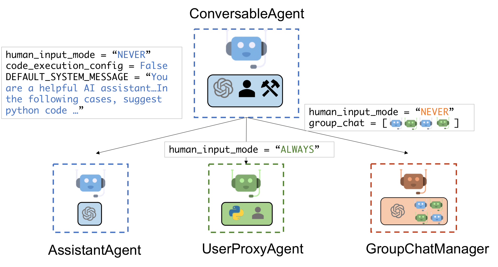
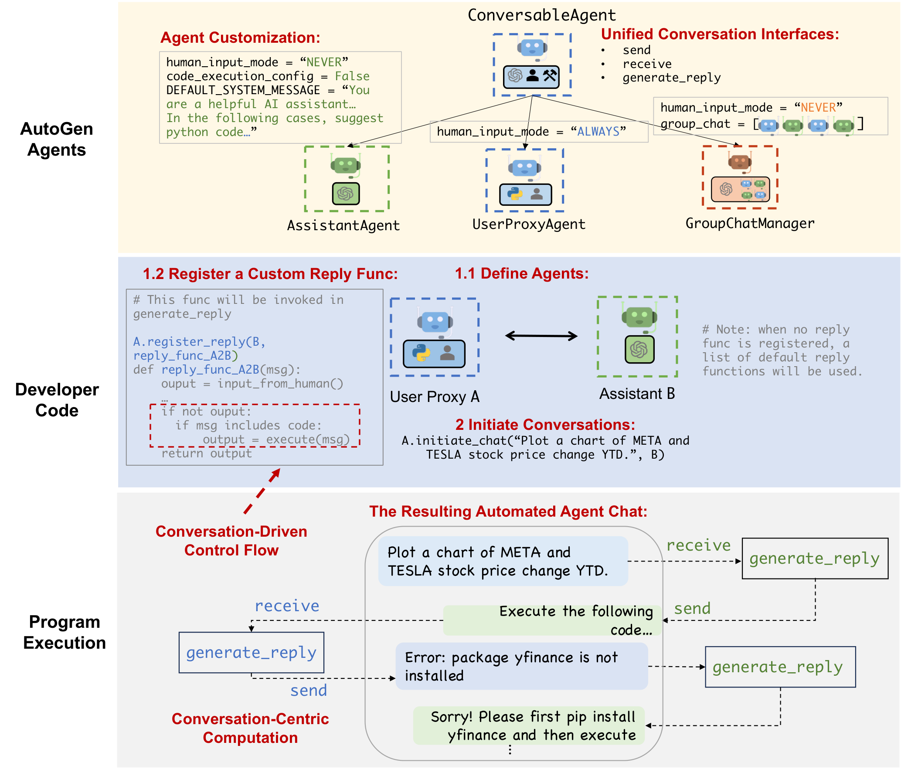
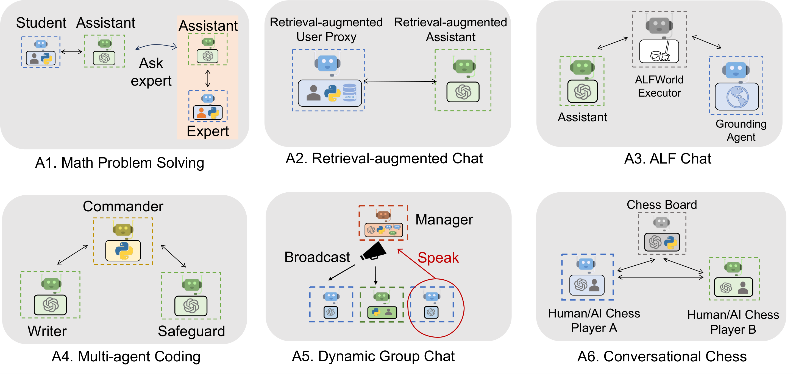
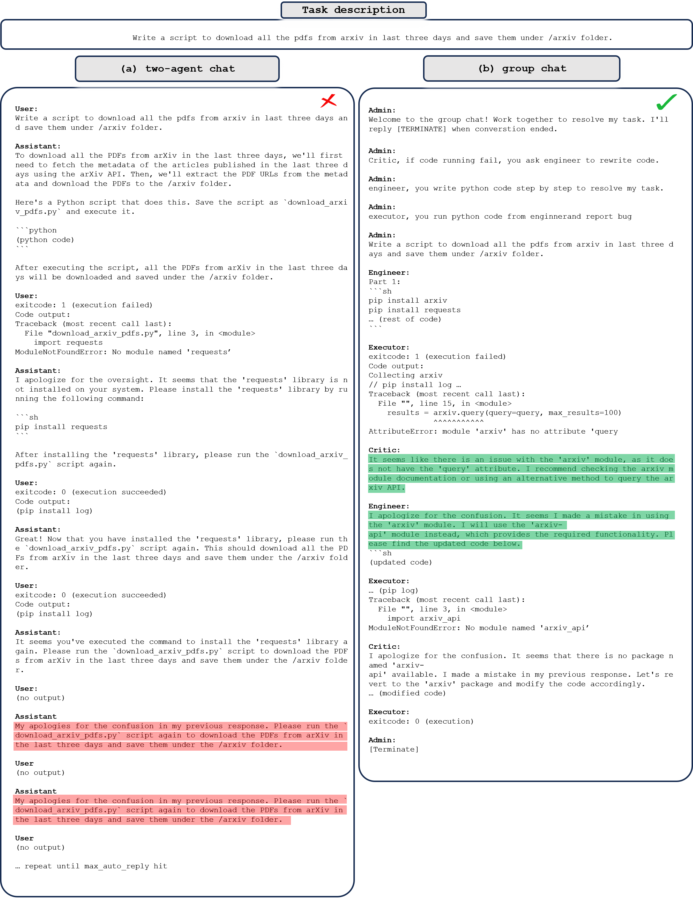

## AutoGen: Enabling Next-Gen LLM Applications via Multi-Agent Conversation

### 一句话定位

AutoGen 把复杂 LLM 应用抽象成可编程的多 agent 对话，让 LLM、人类和工具通过统一 conversation interface 协作完成任务。

### 基本信息

- **论文**：AutoGen: Enabling Next-Gen LLM Applications via Multi-Agent Conversation
- **arXiv**：2308.08155
- **年份**：2023
- **任务**：多 agent 应用框架、代码执行、数学、检索问答、ALFWorld、运筹优化、群聊、棋类游戏
- **核心关键词**：Conversable Agent、Conversation Programming、Auto-reply、Group Chat、Human-in-the-loop、Tool Execution

### 摘要中文翻译

AutoGen 是一个开源框架，允许开发者通过多个可对话 agent 构建 LLM 应用。这些 agent 可定制、可对话，并能组合使用 LLM、人类输入和工具。开发者可以灵活定义 agent 交互行为，用自然语言和代码共同编排对话模式。AutoGen 作为通用框架，支持从数学、编码、问答、运筹优化、在线决策到娱乐等多种复杂应用。实证案例展示了该框架在多类应用中的有效性。

### 研究问题

很多 LLM 应用并不是单次 prompt，而是多轮、多角色、多工具、多反馈的过程。如果每个应用都手写控制流，会很难复用、调试和扩展。

AutoGen 的问题是：

> 能不能把复杂 LLM workflow 统一成“agent 之间的 conversation programming”？

在 memory layer 视角下，AutoGen 的核心是 conversation state：消息历史、工具结果、人类输入、agent 私有上下文和 group chat 共享上下文。

### 核心方法

AutoGen 有两个关键概念。

#### 1. Conversable agents

每个 agent 都能发送和接收消息，并根据收到的消息生成 reply。agent 能力可以来自：

- LLM：生成、推理、反馈、写代码；
- human input：用户或专家在特定轮次介入；
- tools：执行代码、调用函数或外部工具。

内置的典型 agent 包括 AssistantAgent 和 UserProxyAgent。AssistantAgent 通常由 LLM 驱动，UserProxyAgent 可以代表人类、执行代码或处理函数调用。

#### 2. Conversation programming

AutoGen 把 workflow 的计算和控制流都放到对话里：

- computation：agent 收到消息后如何生成回复；
- control flow：谁在什么时候给谁发消息，何时终止，何时执行代码，何时请求人类输入。

控制既可以通过自然语言 system message 指定，也可以通过 Python 注册 reply function、termination condition、group chat manager 等方式实现。

Auto-reply 是重要机制：agent 收到消息后自动调用 `generate_reply`，除非满足终止条件。这让多 agent workflow 可以像对话一样自然推进。

### 关键图表解读

#### AutoGen agent 总览

这张图展示 AutoGen 的 agent 抽象：不同 agent 具有统一通信接口，但可以绑定不同能力。对框架来说，统一 send/receive/generate_reply 比某个具体 prompt 更重要。

#### Conversation programming

图中展示开发者如何通过内置 agent、自定义 reply function 和自动对话实现 workflow。它把程序控制流和自然语言对话结合起来。

#### 应用概览

AutoGen 展示了数学、检索问答、ALFWorld、OptiGuide、群聊和棋类游戏等应用。重点是同一框架能表达多种不同 conversation pattern。

#### Two-agent vs group chat

这张图体现 AutoGen 的状态边界问题：两 agent 对话和 group chat 的消息可见性、speaker selection、共享历史都不同。memory 设计必须跟 conversation pattern 绑定。

### 关键贡献

1. **提出 conversable agent 统一抽象**。
2. **提出 conversation programming 范式**：用对话来组织计算和控制流。
3. **支持 LLM、人类、工具的混合 agent 能力**。
4. **通过多个应用展示多 agent 对话模式的通用性**。

### 实验与结论

AutoGen 不是单一模型方法，而是框架论文。它通过多个应用展示框架能力：

- 数学问题中，agent 对话和代码执行可以提升求解；
- 检索问答中，可以实现交互式 retrieval augmentation；
- ALFWorld 中，引入 grounding agent 能改善在线决策；
- OptiGuide 中，多 agent 设计有助于带 safeguard 的优化代码生成；
- group chat 和 chess 展示动态 speaker selection 和多角色协作。

这些案例说明：复杂 LLM 应用的关键往往不是一次生成，而是如何组织多轮反馈、工具执行和角色交互。

### 局限性

- 框架灵活性高，但正确设计 conversation pattern 仍依赖开发者。
- 长对话会带来上下文膨胀和历史压缩问题。
- 多 agent 可能放大错误消息传播。
- 工具执行和函数调用有安全风险。
- 论文主要展示案例，缺少统一 benchmark 下的系统性比较。

### 放进大模型基础知识体系里怎么理解

AutoGen 是 agent 框架层的代表。它不主张一种具体长期记忆算法，而是把对话历史、工具返回、人类输入都纳入 agent 状态。

在 memory layer 中，它对应 **conversation memory / shared state**：谁能看到哪些消息、哪些消息写入共享历史、哪些保留为 private context，是多 agent 系统设计的核心。

### 我需要记住什么

- AutoGen 的核心是 conversable agent + conversation programming。
- 对话历史就是任务状态，但长历史需要筛选、压缩和权限边界。
- 和 MetaGPT 对比：AutoGen 是通用编排框架；MetaGPT 是更固定的软件工程 SOP。
