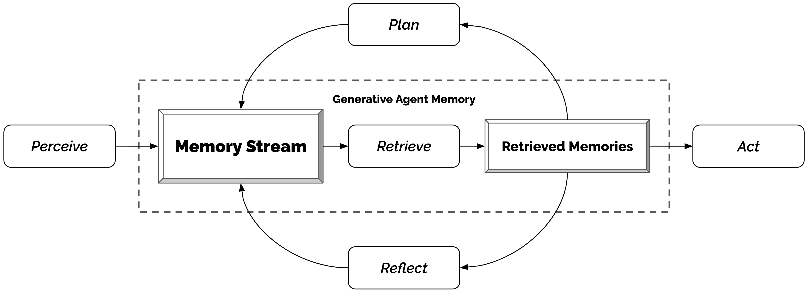
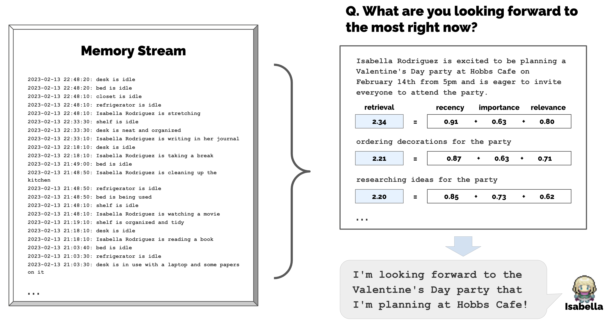
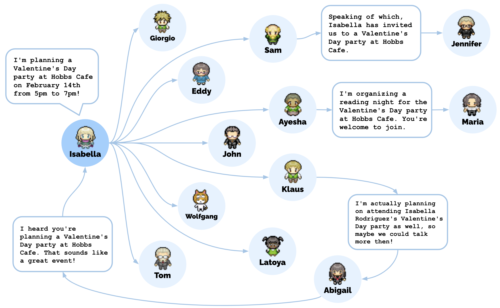

## Generative Agents: Interactive Simulacra of Human Behavior

### 一句话定位

Generative Agents 是 LLM agent memory architecture 的标志性论文：用 memory stream、retrieval、reflection、planning 让 25 个虚拟角色形成长期一致、可互动、可传播信息的行为。

### 基本信息

- **论文**：Generative Agents: Interactive Simulacra of Human Behavior
- **arXiv**：2304.03442
- **会议**：UIST 2023
- **场景**：Smallville 沙盒小镇，25 个 agent
- **任务**：可信人类行为模拟、社交传播、长期计划、对话与反应
- **核心关键词**：Memory Stream、Retrieval、Reflection、Planning、Believability、Interactive Simulation

### 摘要中文翻译

论文提出 generative agents，用计算代理模拟可信的人类行为。这些 agent 会起床、做饭、工作、交流、形成观点、记住过去、反思经验并计划未来。其核心是一套扩展 LLM 的 agent architecture：用自然语言保存完整经验记录，定期把低层记忆合成为高层 reflection，并根据当前情境动态检索相关记忆来规划行为。作者在一个类似 The Sims 的小镇中放置 25 个 agent，用户可以观察和干预。实验显示，agent 能产生可信的个人行为和群体社会行为，例如一个情人节派对信息能在两天内从一个人传播到多人，并促成邀请、约会和到场协调。消融表明 observation、planning、reflection 都对行为可信度重要。

### 研究问题

LLM 可以即时生成看似合理的行为，但长期模拟需要更多东西：

- 角色必须记住自己经历过什么。
- 角色必须从大量记忆中取回当前相关片段。
- 角色必须把低层事件综合成高层认识。
- 角色必须做长期计划，而不是每分钟重新即兴发挥。

Generative Agents 的核心问题是：

> 如何在不训练新模型的情况下，为 LLM 外接一套能支持长期一致行为的 memory layer？

### 核心方法

架构由三层组成。

#### 1. Memory stream

每个 agent 都有一个按时间追加的 memory stream。里面保存：

- observation：看到的事件和交互；
- reflection：由多条记忆归纳出的高层洞察；
- plan：未来行动安排。

每条 memory object 包含自然语言描述、创建时间、最近访问时间和重要性分数。

#### 2. Retrieval

当 agent 需要反应或计划时，不把全部记忆塞进 prompt，而是根据三个信号检索：

- **Recency**：最近访问的记忆更重要；
- **Importance**：LLM 给记忆打 1-10 的重要性分；
- **Relevance**：当前查询和记忆文本 embedding 的相似度。

最终分数是三者归一化后的加权组合。这个设计很简单，但直接回答了长期记忆系统里最实际的问题：上下文有限时取什么。

#### 3. Reflection

当最近记忆的重要性累计超过阈值时，agent 触发 reflection。流程是：

1. 取最近约 100 条记忆；
2. 让 LLM 生成几个高层问题；
3. 用这些问题检索相关记忆；
4. 让 LLM 生成带证据引用的 insight；
5. 把 insight 写回 memory stream。

Reflection 可以引用 observation，也可以引用旧 reflection，因此会形成更高层的反思树。

#### 4. Planning and reacting

agent 会先生成一天的粗计划，再递归拆成小时级、分钟级行动。每一步感知环境后，agent 会检索相关记忆，判断是否继续原计划、改计划或发起对话。

### 关键图表解读

#### 架构图

这张图是整篇论文的核心：perceive 写入 memory stream，retrieve 取回相关记忆，reflect 产生高层洞察，plan 形成未来行动，最后 act。它几乎可以作为后续长期记忆 agent 的 baseline。

#### Retrieval 示例

图中展示了 retrieval 如何从大量历史经验中筛出与当前问题相关的片段。重点是三信号组合：最近性保证当前上下文，重要性保留人生大事，相关性对齐当前查询。

#### Reflection 示例

Reflection 把零散事件合成更抽象的人格、关系和偏好判断。没有这一层，agent 往往只会复述最近事件，难以表现出“理解自己和别人”的行为。

#### 信息扩散

这张图对应 Smallville 中的群体涌现行为：候选人信息和派对信息会通过对话传播。它说明 memory 不只是个体能力，也会改变群体层面的信息流。

### 关键贡献

1. **提出完整 LLM agent memory architecture**：memory stream + retrieval + reflection + planning。
2. **把自然语言作为统一记忆表示**：观察、计划和反思都以文本进入 LLM。
3. **验证长期社交仿真中的群体行为**：信息传播、关系形成、活动协调。
4. **用消融支持 observation、planning、reflection 都会影响行为可信度**。

### 实验与结论

论文有两类评估。

受控评估中，100 名评估者比较完整架构、去掉 reflection、去掉 planning、去掉 memory 等条件下 agent 的回答可信度。完整架构的 TrueSkill 分数最高，去掉各模块都会下降。

端到端仿真中，25 个 agent 在 Smallville 生活两天。Sam 参选信息从 1 个 agent 传播到 8 个，情人节派对信息从 1 个传播到 13 个；关系网络密度从 0.167 增至 0.74；12 个被邀请者中有 5 个实际出席派对。

结论是：LLM 本身提供语言生成能力，但可信长期行为来自外部记忆、反思和计划机制。

初读时容易卡住的几个点：

- 论文说 planning 很重要，证据主要来自架构动机、受控消融和端到端案例，而不是像 ToT 那样用客观任务成功率做强因果证明。它的 planning 更像 **schedule/commitment memory**：把未来意图写进 memory stream，让 agent 不要每一步都即兴发挥。
- planning 解决的是长期行为一致性，不是单步决策质量。原文举的反例是：如果每个时间点只问 LLM “现在该干嘛”，agent 可能在 12:00、12:30、13:00 都觉得吃午饭合理；每一步单看没问题，串起来就不可信。
- 受控评估里的 `Full architecture: mu = 29.89` 不是准确率，也不是满分 100，而是 TrueSkill rating 的均值。TrueSkill 类似多人版 Elo：人类评估者把不同架构生成的回答按 believability 排序，TrueSkill 再从这些排序里估计每个条件“更常被排前面”的实力值。
- 这类研究确实主观性更强。它研究的是 agent 是否像一个有连续生活、记忆和社交关系的角色，而不是数学题或代码题那种有唯一正确答案的问题。因此论文把多人排序、消融、端到端 case study 和 failure analysis 拼在一起作为证据。
- 所以要带着保留读这篇：它的主要贡献是提出一个长期记忆 agent architecture，而不是给出特别干净的 planning 因果实验证明。结论可以理解为“planning access 会提高人类评估中的 believability”，但不能过度解读成“planning 已被严格证明是所有涌现社交行为的必要原因”。

### 局限性

- Retrieval 失败会导致 agent 遗忘关键事件或取回错误片段。
- Reflection 可能放大幻觉或错误归纳。
- 物理空间和社会规范难以完全用自然语言状态描述。
- agent 对话受 instruction tuning 影响，可能过度礼貌、过度合作。
- planning 的贡献没有被完全独立隔离，评估依赖人类对 believability 的主观排序。
- 架构成本高，需要大量 LLM 调用和 memory 管理。

### 放进大模型基础知识体系里怎么理解

这篇是 memory layer 的核心基准。它把长期记忆拆成三个问题：写什么、取什么、怎么压缩成高层认识。

如果 ReAct 是当前任务工作记忆，Generative Agents 就是跨时间生活记忆。它让 memory 从“日志”变成“人格和行为连续性”的基础设施。

### 我需要记住什么

- Memory stream 保存 observation、reflection、plan。
- Retrieval = relevance + recency + importance。
- Reflection 是把经历压缩成高层 insight，再写回 memory。
- Planning 在这里主要是 schedule/commitment memory，用来维持跨时间行为一致性。
- TrueSkill `mu` 表示人类排序中估计出的可信度实力值，不是准确率。
- 这是理解后续 MemGPT、long-term agent memory、social simulation agent 的必读基线。
