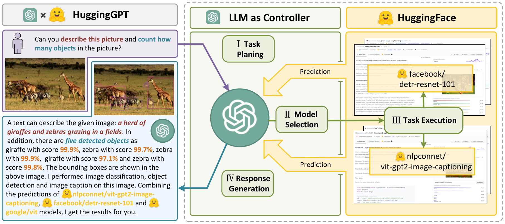
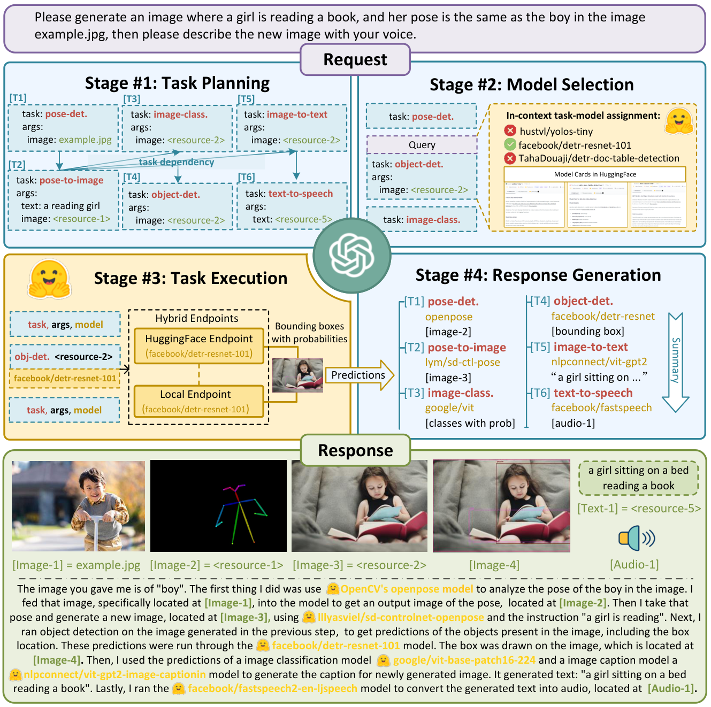
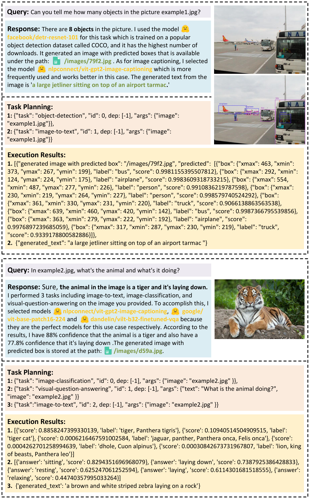
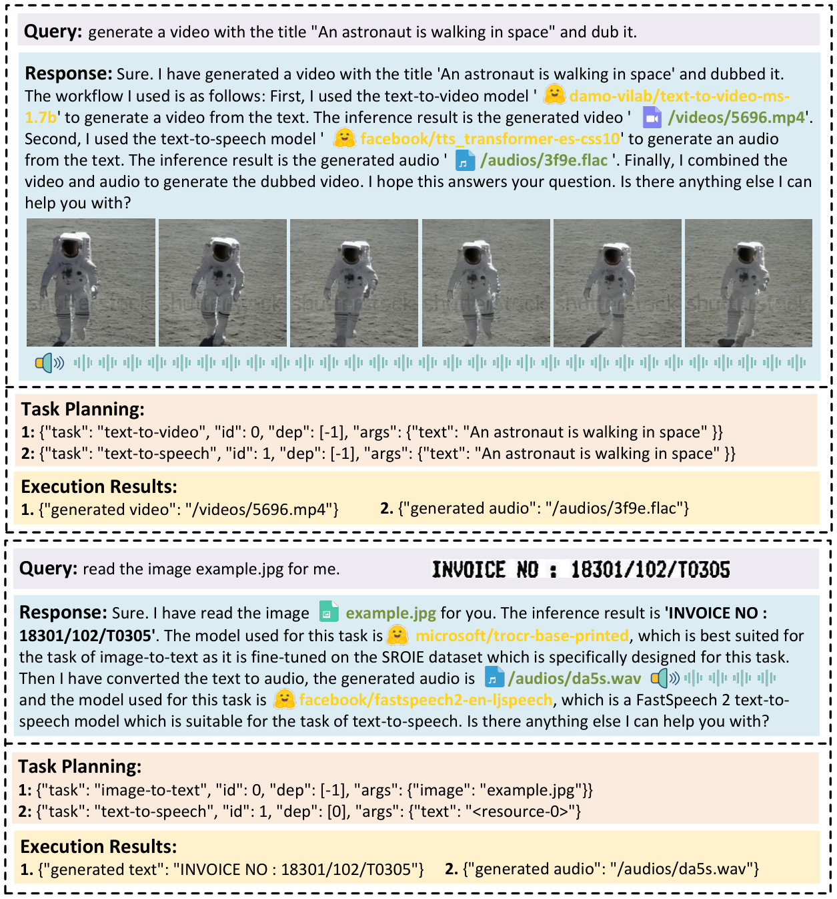

## HuggingGPT: Solving AI Tasks with ChatGPT and its Friends in Hugging Face

### 一句话定位

HuggingGPT 把 ChatGPT 放在 controller 位置，用自然语言模型描述连接 Hugging Face 专家模型，完成任务规划、模型选择、执行和结果汇总。

### 基本信息

- **论文**：HuggingGPT: Solving AI Tasks with ChatGPT and its Friends in Hugging Face
- **arXiv**：2303.17580
- **会议**：NeurIPS 2023
- **任务**：多模态复杂 AI 任务编排
- **核心关键词**：LLM Controller、Tool Use、Model Selection、Task Planning、Model Description、Multimodal Agent

### 摘要中文翻译

复杂 AI 任务往往跨领域、跨模态，单个 LLM 无法直接处理所有输入输出形式。HuggingGPT 提出让 LLM 作为 controller，借助自然语言作为统一接口，管理 Hugging Face 上的大量专家模型。系统收到用户请求后，先用 ChatGPT 做任务规划，再根据模型描述选择合适模型，执行每个子任务，最后根据执行结果生成回答。通过把 ChatGPT 的语言理解和推理能力与 Hugging Face 上的专家模型结合，HuggingGPT 能处理语言、视觉、语音等多种复杂任务。

### 研究问题

LLM 很擅长语言理解和推理，但它本身不能天然完成所有视觉、语音、视频和专业模型任务。另一方面，Hugging Face 上有大量专家模型，但它们缺少统一调度者。

HuggingGPT 的问题是：

> 能不能用自然语言模型描述作为接口，让 LLM 自动规划任务、选择专家模型并组织执行？

在 memory layer 视角下，它关注的是工具型 agent 的短期任务状态：任务拆解、依赖关系、模型选择、执行结果和最终汇总。

### 核心方法

HuggingGPT 有四个阶段。

#### 1. Task planning

ChatGPT 把用户请求解析成结构化任务列表。每个任务包含：

- `task`：任务类型；
- `id`：任务编号；
- `dep`：依赖的上游任务；
- `args`：文本、图像、音频、视频等参数。

这一步相当于把自然语言需求转成 DAG。

#### 2. Model selection

系统根据每个任务类型，从 Hugging Face 中筛选候选模型，再把模型描述、下载量等信息放入 prompt，让 ChatGPT 选择合适模型。这里的模型描述就是一种外部能力记忆：LLM 不需要内置所有模型能力，只要能读懂描述并匹配任务。

#### 3. Task execution

被选中的专家模型执行各自子任务。对有依赖的任务，HuggingGPT 使用 `<resource>-task_id` 这样的符号引用上游任务产物，并在执行时替换成实际资源。

#### 4. Response generation

ChatGPT 读取用户输入、任务计划、模型分配和执行结果，生成最终回答，并解释使用了哪些中间结果。

### 关键图表解读

#### 语言作为模型协作接口

这张图展示了 HuggingGPT 的核心理念：语言不仅是用户和 LLM 的接口，也是 LLM 和专家模型之间的接口。模型能力通过 description 暴露给 controller。

#### 系统总览

总览图清楚展示四阶段流水线：规划、选择、执行、响应。对 memory layer 来说，task list 和 execution logs 就是这类 agent 的 working memory。

#### 任务规划 prompt

HuggingGPT 强依赖结构化 prompt。任务规划输出必须遵守 JSON-like schema，否则后续模型选择和执行都会失败。

#### 复杂任务执行案例

案例图展示多模型、多资源依赖的执行过程。它说明工具 agent 的难点不只是调用模型，而是维护跨步骤资源和依赖关系。

### 关键贡献

1. **提出 LLM-as-controller 的多模型协作框架**。
2. **用自然语言模型描述连接外部专家模型**。
3. **把复杂请求拆成任务图并处理资源依赖**。
4. **强调任务规划和模型选择是 agent 能力核心**。

### 实验与结论

论文评估了 task planning 能力，覆盖 single task、sequential task 和 graph task。GPT-3.5 在自动标注数据上明显优于 Alpaca-7B 和 Vicuna-7B；在人类标注数据上，GPT-4 又显著优于 GPT-3.5。

人类评估中，GPT-3.5 在 task planning passing rate、model selection rationality 和最终 success rate 上都远高于开源小模型。这说明 controller 的规划能力是系统瓶颈：专家模型再多，如果 planner 拆错任务或选错模型，最终结果仍会失败。

消融显示，demonstration 的多样性和数量会影响 task planning，但收益有上限。

### 局限性

- 规划高度依赖 LLM 能力，不能保证最优或可执行。
- 模型选择依赖 Hugging Face model descriptions，描述质量会影响匹配。
- 多步骤执行中间错误会传递到最终回答。
- 资源依赖和文件路径管理容易出错。
- 论文更像系统原型，长期记忆和自我改进机制较弱。

### 放进大模型基础知识体系里怎么理解

HuggingGPT 是 tool-use agent 的早期代表。它告诉我们，LLM 可以不直接拥有所有能力，而是通过语言描述理解外部工具，并把任务编排成执行图。

在 memory layer 里，它对应 **orchestration state**：任务图、模型清单、资源引用、执行结果和日志。这类记忆生命周期通常只在当前任务内，但对复杂工具链至关重要。

### 我需要记住什么

- HuggingGPT = task planning + model selection + task execution + response generation。
- 模型描述是一种外部能力记忆。
- 它和 ReAct 的区别：ReAct 是通用 thought/action loop；HuggingGPT 更像面向专家模型的结构化工作流编排器。
