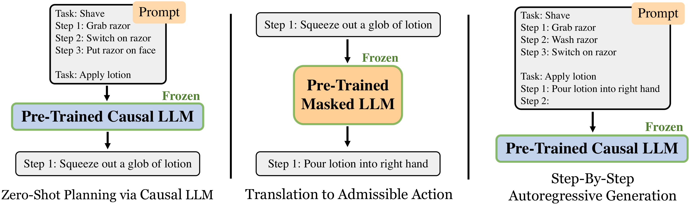
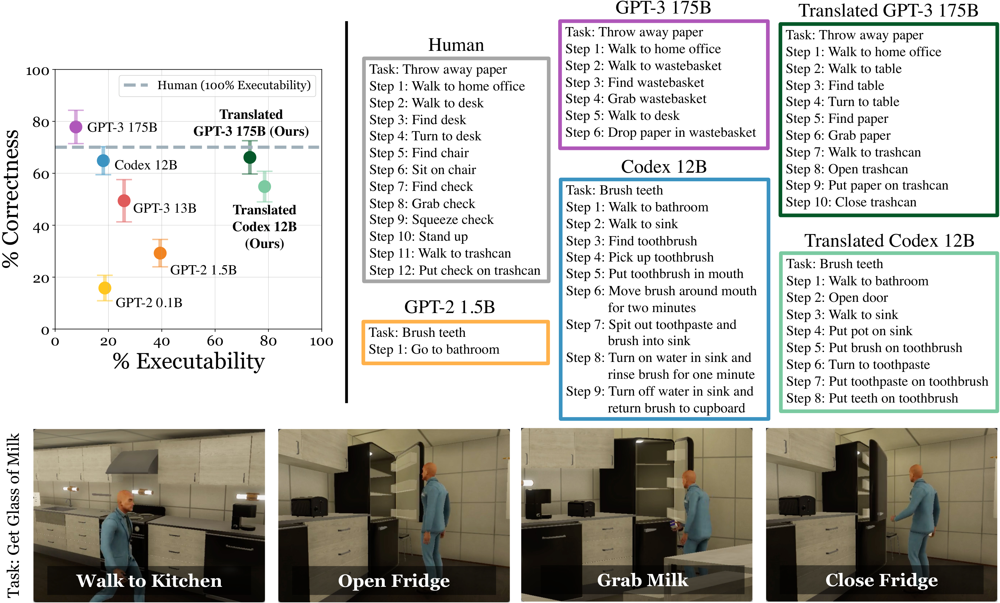
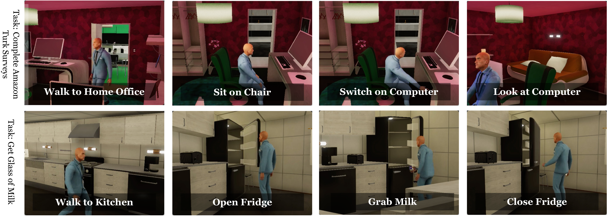

## Language Models as Zero-Shot Planners: Extracting Actionable Knowledge for Embodied Agents

### 一句话定位

这篇论文验证了一个早期但很关键的问题：预训练 LLM 里确实有“怎么做事”的世界知识，但要让它变成 embodied agent 可执行动作，还必须做 grounding。

### 基本信息

- **论文**：Language Models as Zero-Shot Planners: Extracting Actionable Knowledge for Embodied Agents
- **arXiv**：2201.07207
- **会议**：ICML 2022
- **环境**：VirtualHome
- **任务**：把自然语言高层目标生成可执行 household action program
- **核心关键词**：Zero-shot Planning、Embodied Agent、Action Grounding、Semantic Translation、VirtualHome

### 摘要中文翻译

论文研究 LLM 学到的世界知识能否用于交互式环境中的行动。作者发现，当模型足够大、prompt 设计合适时，预训练语言模型可以不用额外训练，就把 “make breakfast” 之类高层任务分解成合理的中层动作计划。但这些自由文本计划往往不能精确映射到环境支持的动作。为此，论文提出使用 demonstration conditioning、语义翻译和自回归轨迹校正，把计划转成 admissible actions。VirtualHome 实验显示，这些方法显著提高了可执行性，同时也暴露出 executability 与 human correctness 之间的权衡。

### 研究问题

预训练 LLM 读过大量人类文本，里面可能隐含了丰富的日常活动知识。但 embodied agent 不能只生成“听起来对”的步骤，它需要输出环境能执行的 action。

这篇论文的核心问题是：

> LLM 能否在不训练的情况下生成行动计划？如果能，怎样把自由文本计划落到具体 action space？

这和 memory layer 的关系在于：embodied agent 的上下文记忆不能只是自然语言经历，还必须和当前场景、可行动作集合、历史 demonstration 对齐。

### 核心方法

论文将问题拆成两层。

第一层是 **Planning LM**：用 GPT-3、Codex 等 causal LM，根据高层任务和一个示例 prompt 生成自然语言动作序列。比如把 “get glass of milk” 生成 “walk to kitchen / open fridge / grab milk ...”。

第二层是 **Translation LM**：把自由文本动作映射到 VirtualHome 支持的 admissible actions。做法是枚举环境中所有合法动作，用 Sentence-RoBERTa 等模型计算自由文本动作与合法动作之间的语义相似度，选择最接近的可执行动作。

论文提出三种关键改进：

1. **Semantic translation**：自由文本动作先翻译成环境动作。
2. **Autoregressive trajectory correction**：不是等完整计划生成完再翻译，而是每生成一步就翻译并把可执行动作写回 prompt，使后续生成被已 grounding 的轨迹约束。
3. **Dynamic example selection**：从 demonstration set 中选与当前任务最相似的示例放入 prompt，给模型弱监督。

这个流程可以理解为：

```text
high-level task
-> LLM generates next natural-language action
-> translate to admissible environment action
-> append grounded action back to context
-> continue generation
```

### 关键图表解读

#### 方法总览



这张图展示了核心闭环：causal LLM 负责把高层任务展开为动作计划，masked/embedding-style LM 负责把每一步翻译成环境允许的动作，翻译后的动作再回填到 prompt 中影响后续步骤。

#### 可执行性与正确性权衡



图中最重要的现象是：大型 LLM 生成的计划在人类看来可能很合理，但在 VirtualHome 中往往无法执行；经过翻译和校正后，可执行性大幅提升，但语义正确性可能下降。这正是 language planning 和 embodied grounding 的张力。

#### VirtualHome 可视化



可视化说明模型确实能从高层任务恢复出一系列合理动作，并在家庭环境中执行出来。但它也提醒我们：执行成功依赖环境动作空间覆盖了足够多真实世界动作。

### 关键贡献

1. **证明 LLM 具备零样本行动计划知识**：大模型能生成接近日常常识的任务分解。
2. **指出 naive language plan 不等于 executable plan**：语义合理和环境可执行是两个指标。
3. **提出 semantic translation grounding 流程**：通过 action embedding 匹配把自由文本计划映射到 admissible actions。
4. **系统评估 executability/correctness trade-off**：为后续 embodied LLM agent 提供了早期基线。

### 实验与结论

VirtualHome 实验显示，Vanilla GPT-3 175B 的人类正确性很高，但可执行性很低。论文报告通过 final translated method 可以把执行率提升到约 70% 以上，比如 Translated Codex 12B 达到 78.57% executability，Translated GPT-3 175B 达到 73.05%。

但提升可执行性并不等于完全解决任务。翻译可能把复合动作映射错，也可能因为环境缺失必要对象或动作而提前终止。结果说明 LLM 的常识计划能力真实存在，但 agent 系统还需要 grounding、校验和环境反馈。

### 局限性

- VirtualHome 动作空间有限，不能覆盖完整真实世界。
- 语义翻译依赖 embedding 相似度，容易混淆复合动作、同义动作和物体别名。
- 没有真正的在线试错学习，主要是 inference-time grounding。
- 动态示例选择仍依赖已有 demonstration set。
- 可执行性提升会带来 correctness 损失。

### 放进大模型基础知识体系里怎么理解

这篇是 embodied agent 方向很早的“LLM 作为 planner”论文。它告诉我们：LLM 可以当高层计划器，但不能直接当低层控制器。中间必须有一层把语言计划转成环境动作，并用当前环境状态约束生成。

在 memory layer 里，它对应 **grounded context memory**：agent 需要记住的不只是过去文本，还包括当前可行动作、场景对象、已翻译动作和相似 demonstration。

### 我需要记住什么

- LLM 的计划知识是有用的，但原生输出通常不是可执行程序。
- Grounding 的关键是把自然语言动作和 action space 对齐。
- 这篇和 Voyager 的区别：这里是 zero-shot planning + translation；Voyager 是长期探索 + skill library，把成功行为沉淀成可复用程序记忆。
