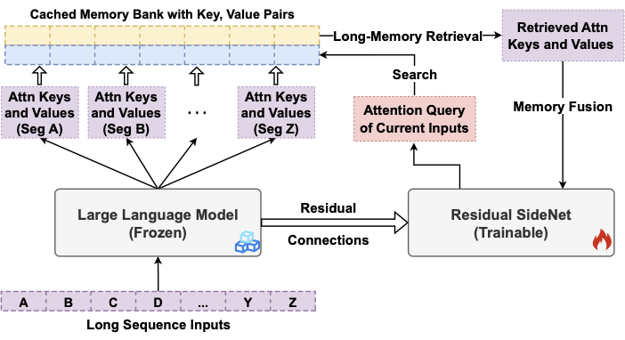
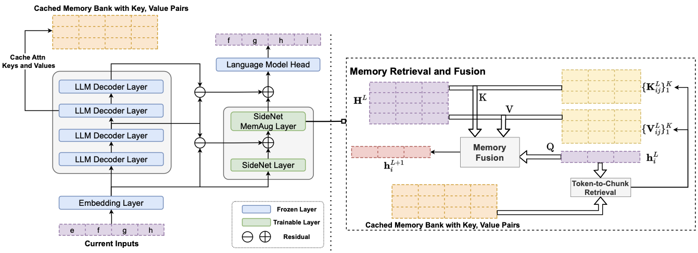
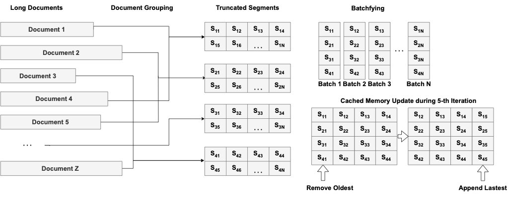
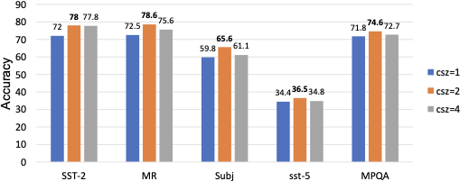

## LongMem: Augmenting Language Models with Long-Term Memory

### 一句话定位

LongMem 是模型侧长期记忆路线里非常早的一步：它把长历史编码成 Transformer 中间层的 attention `K/V`，存在一个外部 memory bank 里；当前输入到来时，模型用当前 query 检索相关历史 `K/V`，再通过一个可训练的 SideNet 把本地上下文和长期记忆融合起来。

### 基本信息

- **论文**：Augmenting Language Models with Long-Term Memory
- **arXiv**：2306.07174
- **版本**：v1，2023-06-12
- **作者**：Weizhi Wang, Li Dong, Hao Cheng, Xiaodong Liu, Xifeng Yan, Jianfeng Gao, Furu Wei
- **机构/项目**：University of California, Santa Barbara / Microsoft Research
- **代码**：[aka.ms/LongMem](https://aka.ms/LongMem)
- **论文 PDF**：[source/LongMem_2306.07174.pdf](source/LongMem_2306.07174.pdf)
- **arXiv 源码包**：[source/LongMem_2306.07174_src.tar.gz](source/LongMem_2306.07174_src.tar.gz)
- **核心关键词**：long-term memory、KV cache memory、SideNet、memory bank、token-to-chunk retrieval、memory staleness、many-shot ICL

### 摘要中文翻译

现有 LLM 受固定输入长度限制，很难利用超出上下文窗口的长历史。LongMem 提出一种给语言模型增加长期记忆的框架：冻结原始 backbone LLM，把它作为历史上下文的 memory encoder；同时训练一个残差 SideNet，作为 memory retriever 和 reader。历史文本经过 backbone 后，中间 attention 层的 key/value 被缓存到 memory bank；之后遇到新输入时，SideNet 根据当前 token 的 query 检索相关历史 `K/V` 并融合到语言建模过程里。

这个“编码历史”和“读取历史”解耦的设计，主要是为了解决 memory staleness：如果同一个模型一边被训练更新参数，一边又使用旧参数编码出的 memory，那么旧 memory 很快会和新模型不匹配。LongMem 冻结 backbone 后，历史 memory 的表征空间保持稳定，SideNet 专门学习如何读取这些 memory。论文实验把长期记忆扩展到 65k tokens，并展示它可以把大量 demonstration examples 缓存在 memory 中，用于 memory-augmented in-context learning。

### 研究问题

这篇论文问的问题不是“如何管理用户记忆”，而是：

> 如果 LLM 的本地上下文只有 1k/2k tokens，它能不能把更早的历史变成可检索的模型内部状态，并在生成时读回来？

普通长上下文 Transformer 的瓶颈是 full attention：

```text
所有 token 互相 attention
  -> 计算量随长度平方增长
  -> 训练和推理都很贵
```

Memorizing Transformer 这类方法已经把历史 token 的 `K/V` 存进外部 memory，但 LongMem 认为它有一个关键问题：**memory encoder 和 memory reader 耦合在同一个会更新的模型里**。训练过程中模型参数变了，过去缓存的 `K/V` 仍然来自旧参数，于是 memory 变“陈旧”。

LongMem 的回答是：

```text
冻结 backbone LLM:
  只负责把历史上下文编码成稳定的 K/V memory

训练 SideNet:
  只负责根据当前 query 检索和读取这些 memory
```

所以 LongMem 的核心贡献不是单纯“存 KV”，而是提出一种 **decoupled memory architecture**：历史编码器稳定，读取器可训练。

### 我们讨论中的理解沉淀

LongMem 和 MSA 很像，都是：

```text
历史文本 -> 模型内部 K/V memory
当前 query -> 检索相关 memory
生成过程 -> attend / fuse 被选中的 memory
```

但它们的工程落点不同：

| 维度 | LongMem | MSA |
|---|---|---|
| 记忆形态 | backbone 某层 attention `K/V` | compressed `K/V` + routing key |
| 读取模块 | 额外 SideNet 的 memory-augmented layer | attention 层内部的 Memory Sparse Attention |
| 检索粒度 | token-to-chunk，FAISS index | token/head/chunk/document 聚合 routing |
| 训练方式 | 冻结 backbone，只训练 SideNet | 端到端训练生成模型和 router |
| 系统目标 | 65k 级别长期历史和 many-shot ICL | 100M token 级别 latent memory scaling |
| 关键痛点 | memory staleness | sparse routing、RoPE 外推、CPU/GPU memory system |

因此，LongMem 可以看作 MSA 这条路线的早期形态：它已经把“长期上下文”转成“可检索的模型内部 `K/V`”，但还没有把 routing、压缩、位置编码和 serving 系统完整内化进 attention 架构。

和 Titans 相比，LongMem 也更偏检索式 memory：

```text
LongMem / MSA:
  记忆是外部缓存的 activation / KV，读取方式是 query 检索。

Titans:
  记忆是一个测试时持续更新的神经网络模块，历史被写入 memory module 的参数。
```

### 核心方法

#### 1. 三个组件：frozen backbone、SideNet、Cached Memory Bank

LongMem 里有三个核心模块：

- **Frozen backbone LLM**：原始预训练语言模型，训练 LongMem 时不更新参数。
- **Cached Memory Bank**：保存历史 segment 在 backbone 某一层产生的 attention `K/V`。
- **Residual SideNet**：较小的 Transformer side network，负责检索和融合 memory。

过去输入和当前输入都会过 frozen backbone，但用途不同：

```text
previous inputs
  -> frozen backbone
  -> 取第 m 层 attention K/V
  -> 写入 Cached Memory Bank

current input
  -> frozen backbone
  -> 保留各层 hidden states
  -> 传给 SideNet 做 memory-augmented decoding
```

#### 2. Cached Memory Bank：一个 head-wise KV 队列

论文把 memory bank 表示成一个 head-wise vector queue：

```text
Z_k, Z_v in R^{H x M x d}
```

其中：

- `H` 是 attention head 数；
- `M` 是 memory bank 可保存的历史 token 数；
- `d` 是每个 head 的维度。

更新方式很直接：每处理完当前 segment，就把当前 segment 的 `K/V` 追加进去，同时移除最旧的 `K/V`。这保证了自回归建模里的 segment-level causality：当前 token 只能读过去历史，不能偷看未来。

#### 3. Token-to-chunk retrieval：用当前 query 找历史 KV chunk

如果每个当前 token 都在 memory bank 里做 token-to-token 检索，成本很高。LongMem 采用 token-to-chunk retrieval：

```text
历史 K/V 按 chunk-size csz 切块
每个 chunk 的 key 做 mean pooling
当前 token query 与 chunk key 做 inner product
选 top-(K/csz) 个 chunk
再展开成 K 个 token-level K/V
```

实验里的典型设置：

- memory size `M = 65k` token-level key-value pairs；
- chunk size `csz = 4`；
- 每个 token 检索 `K = 64` 个 key-value pairs，也就是 16 个 chunk；
- 使用 FAISS 在 GPU 上做 exact search；
- 检索开销约为每 1k tokens 15ms，约等于 backbone forward 时间的 55%。

这里最关键的是：检索对象不是文本 embedding，而是 frozen LLM 中间层 attention key。它比普通 RAG 更靠近模型内部注意力空间。

#### 4. Memory fusion：local attention 和 memory attention 通过 gate 融合

在 SideNet 的某一层插入 memory-augmented layer。这个层同时计算两部分：

```text
A = 当前 segment 内部 self-attention 的输出
M = 当前 token query 对 retrieved memory K/V attention 的输出
```

然后用一个可训练的 head-wise gating vector `g` 融合：

```text
H = sigmoid(g) * A + (1 - sigmoid(g)) * M
```

直觉上，SideNet 每个 head 可以学习：

- 当前 local context 够不够；
- 需要多依赖长期 memory；
- 哪些 head 更适合读记忆。

这也是 LongMem 和“直接把检索文本拼进 prompt”的关键不同：它不是让 LLM 重新读文字，而是在 attention 层融合历史 `K/V`。

#### 5. Residual SideNet：用小网络读取大模型记忆

SideNet 本身是一个较小 Transformer decoder。论文的默认配置里 backbone 是 24 层，SideNet 是 12 层，即：

```text
L_side = L_backbone / 2
```

SideNet 的初始化来自 backbone 中对应深度的层。为了把 frozen backbone 的知识传给 SideNet，LongMem 加了 cross-network residual connection：

```text
H_side^l = f_side^l(H_side^{l-1}) + (H_LLM^{2l} - H_LLM^{2l-2})
```

也就是说，SideNet 不只是另起一个小模型，而是在每层拿到 backbone 两层之间的“增量表征”。最后输出层复用 frozen backbone 的 language modeling head。

#### 6. Memory-augmented adaptation training

LongMem 训练时只更新 SideNet，backbone 和输出 embedding 都冻结。训练目标仍然是标准 left-to-right language modeling。

但 batch 构造要特别处理。普通 LM 训练会全局 shuffle segments，而 LongMem 必须确保：

```text
当前 batch 中的 segment
  能在 memory bank 里看到同一文档的前序 segment
```

所以论文设计了特殊的 batchfying：按文档分组，保持组内 segment 顺序，让训练迭代时 memory bank 中缓存的 `K/V` 正好是当前 segment 的前文。

### 关键图表解读

#### Memory caching and retrieval flow



这张图是 LongMem 的核心流程：长文本被切成固定长度 segment；每个历史 segment 过 frozen LLM 后，中间层的 attention `K/V` 写入 memory bank；未来输入用 query-key 相似度检索 top-k memory，再融合进语言建模。

#### LongMem architecture



这张图要看两个路径：蓝色 backbone 是 frozen memory encoder，橙色 memory bank 存历史 `K/V`，SideNet 则读取 backbone hidden states 和 memory bank。LongMem 的“解耦”就发生在这里。

#### Batchfying



这张图解释为什么 LongMem 训练不能简单全局 shuffle。它要让连续 segment 在训练迭代中保持文档级前后关系，否则 memory bank 里存的就不是当前输入的真实过去。

#### Chunk-size ablation



chunk size 控制检索粒度。对于 NLU / ICL 这类需要找到标签 token 或短 span 的任务，小 chunk 更有利；对于长文建模，memory size 和文档平均长度是否匹配更重要。

### 实验与主要结果

论文复现了一个 GPT-2 规模 backbone：

- backbone：407M 参数，24 层，16 heads，使用 Alibi 位置编码；
- SideNet：12 层；
- LongMem 总参数约 558M；
- adaptation training：26B tokens，sequence length 1024，global batch size 256；
- memory bank：65k token-level `K/V`。

主要实验包括三类。

#### 1. 长文本语言建模

在 PG-22 和 ArXiv 长文本语言建模上，LongMem 比 GPT-2* 和 Memorizing Transformer 更低 PPL。比如：

- PG-22 不同长度 split 上，LongMem 比 GPT-2* 约低 1.38 到 1.62 PPL；
- ArXiv 上从 GPT-2* 的 11.05 降到 LongMem 的 10.05；
- 在 ChapterBreak AO3 suffix identification 上，LongMem 达到 40.5% accuracy，高于 GPT-3 等强 baseline。

这说明 cached memory 里的历史 `K/V` 对预测后续长文本确实有帮助，尤其是小说、论文这类需要前文背景的任务。

#### 2. Memory-augmented in-context learning

LongMem 把许多 demonstration examples 放进 memory，而不是塞进 prompt：

```text
local context:
  4-shot 或 20-shot examples

memory bank:
  额外 2000 个 demonstration examples
```

在 5 个 NLU 数据集上，20-shot + 2000 in-memory demonstrations 的平均准确率从 GPT-2* 的 58.7 提升到 LongMem 的 66.7。SQuAD 上也把 3-shot ICL 的 EM 从 22.28 提升到 26.77。

这展示了 LongMem 很有代表性的用法：**把 many-shot examples 变成长期 KV memory，让模型按需检索**。

#### 3. Ablation：chunk size 和 memory size

论文的结论很实用：

- chunk size 越小，越适合需要细粒度标签/短答案的 ICL；
- memory size 不是越大越好，应该和任务中有效历史长度匹配；
- 对平均 8k-50k tokens 的书籍建模，16k memory 有时比训练时的 65k 更合适。

这说明 LongMem 不是“存越多越强”，而是一个检索系统：容量、粒度、相关性都会影响读出的有效信息。

### 和 RAG / MSA / Titans 的关系

| 维度 | RAG | LongMem | MSA | Titans |
|---|---|---|---|---|
| 记忆对象 | 文本 chunk | attention `K/V` | compressed `K/V` + routing key | neural memory weights |
| 检索信号 | embedding / BM25 / reranker | 当前 token attention query | 模型内部 routing query | memory forward query |
| 读取位置 | prompt 中重新读文本 | SideNet memory layer | sparse attention layer | memory module forward |
| 是否更新模型内记忆 | 否 | 更新外部 KV bank | 更新外部 latent memory bank | 测试时更新 memory weights |
| 代表问题 | 找文本 | 读历史 activation | 超大规模 latent memory routing | 学会写入/遗忘长期记忆 |

LongMem 的位置很清楚：它不是完整的 Memory OS，也不是参数化记忆，而是 **KV-cache memory reader**。它把 RAG 往模型内部推进了一步，把“检索文本”变成“检索 attention 可直接使用的历史 `K/V`”。

### 局限性

- backbone 被冻结，SideNet 只能学习读取和融合 memory，不能让原模型整体习得更强的 long-context attention。
- memory bank 保存的是过去的 activation，不负责权限、版本、删除、冲突处理，也不是真正的记忆治理系统。
- 65k memory 在今天看已经不算长；论文更重要的是方法思想，而不是绝对长度。
- 检索基于 attention key 相似度，仍然可能漏掉需要复杂推理或多跳组合的证据。
- SideNet 增加了一套额外模型结构，部署时需要额外存储和检索系统。
- 训练 batchfying 对文档连续性有要求，数据 pipeline 比普通 LM 训练更复杂。

### 放进 agent memory 体系里怎么理解

LongMem 推进的是“模型如何读长期记忆”，不是“agent 如何管理记忆”。

可以放在这层：

```text
记忆治理层：
  Memory OS、用户画像、事件、权限、删除、冲突处理

记忆检索/读取层：
  RAG、LongMem、MSA、GraphRAG、agentic retrieval

模型推理层：
  LLM 根据取回的证据生成、规划、反思、行动
```

LongMem 负责第二层里更靠近模型的一种读取方式：把外部资料预编码成 `K/V`，让模型用 attention query 检索，而不是用独立 embedding 检索器。

### 我需要记住什么

- LongMem 的核心是 **frozen backbone as memory encoder + trainable SideNet as memory retriever/reader**。
- 它缓存的是历史 attention `K/V`，不是原始文本，也不是模型参数。
- 解耦设计主要为了解决 memory staleness。
- 检索方式是 token-to-chunk：当前 query 找历史 chunk key，再展开成 token-level `K/V`。
- Memory fusion 发生在 SideNet 的 memory-augmented layer，用 gate 混合 local attention 和 memory attention。
- 它和 MSA 同属“检索式 KV memory attention”路线，但 MSA 把这件事做成了更端到端、更大规模的 sparse attention 架构。
- 它和 Titans 不同：Titans 是测试时更新神经记忆参数，LongMem 是读取外部 KV cache。

### 资源清单

- arXiv 页面：[https://arxiv.org/abs/2306.07174](https://arxiv.org/abs/2306.07174)
- PDF 原文：[source/LongMem_2306.07174.pdf](source/LongMem_2306.07174.pdf)
- arXiv 源码包：[source/LongMem_2306.07174_src.tar.gz](source/LongMem_2306.07174_src.tar.gz)
- 章节源码：[source/0_abstract.tex](source/0_abstract.tex)、[source/1_introduction.tex](source/1_introduction.tex)、[source/2_method.tex](source/2_method.tex)、[source/3_experiment.tex](source/3_experiment.tex)
- 原始论文图：[source/figure/](source/figure/)
- 图片索引：[images/index.md](images/index.md)
