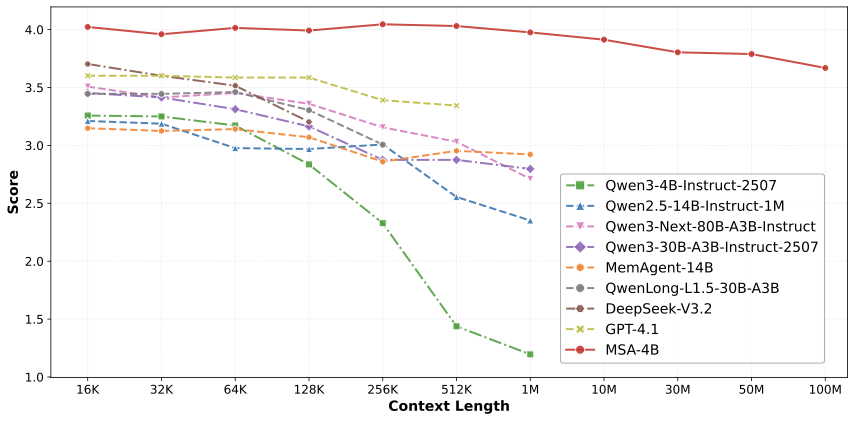
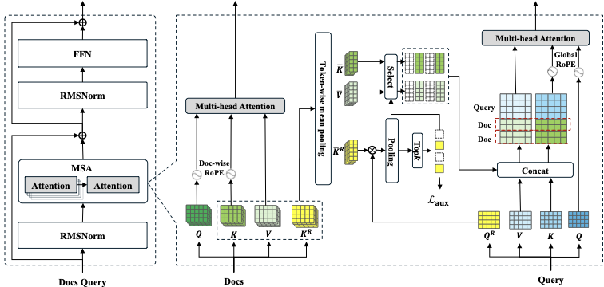
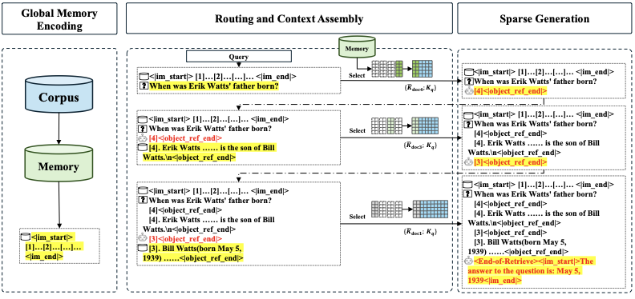
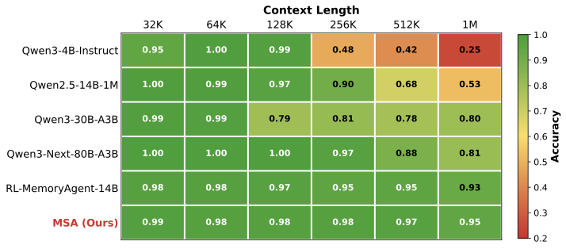

## MSA: Memory Sparse Attention for Efficient End-to-End Memory Model Scaling to 100M Tokens

### 一句话定位

MSA 是 EverMind 的模型侧长期记忆研究：它把传统 RAG 中独立的文本检索器，改造成生成模型内部可训练的 sparse attention / latent KV memory 读取机制，让 LLM 用自己的 hidden state 去选择和读取超大规模记忆。

### 基本信息

- **论文**：MSA: Memory Sparse Attention for Efficient End-to-End Memory Model Scaling to 100M Tokens
- **arXiv**：2603.23516
- **版本**：v2，2026-04-13
- **作者**：Yu Chen, Runkai Chen, Sheng Yi, Xinda Zhao, Xiaohong Li, Jianjin Zhang, Jun Sun, Chuanrui Hu, Yunyun Han, Lidong Bing, Yafeng Deng, Tianqiao Chen
- **机构/项目**：EverMind / Shanda Group
- **代码**：[EverMind-AI/MSA](https://github.com/EverMind-AI/MSA)
- **论文 PDF**：[source/MSA_2603.23516.pdf](source/MSA_2603.23516.pdf)
- **arXiv 源码包**：[source/MSA_2603.23516_src.tar.gz](source/MSA_2603.23516_src.tar.gz)
- **核心关键词**：Memory Sparse Attention、latent memory、KV cache memory、long-context LLM、document-wise RoPE、Memory Parallel、Memory Interleave、neural RAG

### 摘要中文翻译

长期记忆是通用智能的重要基础，但当前 LLM 受 full attention 架构限制，有效上下文通常停留在 128K 到 1M tokens。已有方法包括 RAG、agent 外部记忆、线性注意力、固定大小隐状态、KV-cache 记忆等，但它们往往在超大规模上下文下出现精度下降、延迟增长、无法端到端优化或难以动态维护记忆的问题。

MSA 提出一种端到端可训练的稀疏 latent memory 框架。它通过 Memory Sparse Attention 和 document-wise RoPE，让训练和推理复杂度接近线性；通过 KV cache 压缩和 Memory Parallel，在 2 张 A800 上支持 100M token 级别推理；通过 Memory Interleave 支持跨分散记忆片段的多跳推理。实验显示，MSA 在长上下文 QA 和 Needle-In-A-Haystack 任务中超过多个 RAG 系统、长上下文模型和 memory agent，并在 16K 到 100M tokens 扩展中保持低于 9% 的性能退化。

### 研究问题

这篇论文真正关心的不是“怎么保存用户记忆”，而是：

> 如果我们已经有一个极大的文档库、历史交互或长期记忆池，LLM 能不能不用外部 embedding 检索器，而是在自己的 attention / hidden-state 空间里直接读取相关记忆？

普通 RAG 的检索和生成是割裂的：

```text
embedding model / BM25 / reranker 负责找文本
LLM 负责读文本并生成答案
```

这导致检索器认为相似的文本，不一定是生成模型真正推理需要的证据。MSA 试图把这两个环节融合：

```text
同一个 LLM backbone 把文档编码成 latent KV memory
同一个 LLM 在回答时用内部 routing 选相关 memory
同一个 LLM 基于选中的 memory 生成答案
```

所以 MSA 的核心不是“外部记忆管理系统”，而是 **模型如何读取超大规模记忆**。

### 我们讨论中的理解沉淀

最开始容易把 MSA 和 Memory OS 混在一起。更清楚的分法是：

- **Memory OS / EverOS**：负责记忆生命周期。什么要保存、属于谁、什么时候有效、是否冲突、是否过期、能不能删除、如何跨 agent 共享。
- **传统 RAG**：负责从外部库里找文本块。检索器通常是 embedding model、BM25、reranker，和最终生成 LLM 是松耦合的。
- **MSA**：负责让模型从超大记忆池里“读”。它把文档预编码成模型可 attention 的 compressed KV / routing key，提问时让生成模型自己在 latent memory 中选相关片段。

我们可以把它理解成：

> RAG 是外部检索器先帮 LLM 找文本；MSA 是 LLM 自己在自己的 latent memory 里找可用于生成的证据。

更准确地说，MSA 不是把知识永久写进模型参数，也不是把原文塞进 prompt，而是介于二者之间：

```text
不是参数记忆：
知识没有真正写死进模型权重，仍然来自外部文档/历史。

不是传统 RAG：
不是检索文本块后拼进上下文，而是检索压缩后的 KV memory。

是 latent memory：
把外部资料预先编码成模型内部可 attention 的记忆形态。
```

因此，“如果 MSA 成功，外置 memory 是否还有必要？”这个问题的答案不是简单的否。外置 memory 仍然负责治理、版本、权限、删除、结构化关系和跨系统共享；MSA 则负责更高质量地把这些记忆读进生成模型。

一个比较贴切的产品形态是：

```text
EverOS / Memory OS
  管理原始记忆、事件、用户画像、权限、时间有效性、冲突处理

MSA / latent memory reader
  将一部分候选记忆编码成 KV memory，并在生成时通过 attention 读取

LLM answer
  基于当前 query + 选中的 latent memory + 少量显式证据生成答案
```

### 核心方法

#### 1. 把文档编码成 compressed KV memory

对每篇文档，模型先产生标准 attention 中的 `K` 和 `V`，同时新增一个 Router K Projector，产生用于检索的 routing key。随后按 chunk 做 mean pooling，得到压缩后的：

- compressed key：`\bar{K}`
- compressed value：`\bar{V}`
- compressed routing key：`\bar{K}^R`

这些就是 MSA 的 latent memory bank。

#### 2. 提问时用模型内部 routing 找相关 memory

用户 query 进入模型后，MSA 用 Router Q Projector 产生 routing query，然后和 memory bank 中的 routing key 做相似度匹配。它按 token、head、chunk、document 聚合分数，选出 Top-k 相关文档。

这一步看起来像检索，但和 RAG 不一样：它检索的是模型内部 attention 需要用的 latent KV，而不是外部 embedding 模型算出来的文本向量。

#### 3. 只让 query attend 到选中的 memory

选中 Top-k 文档后，MSA 把这些文档的 compressed `K/V` 和 query 本地的 `K/V` 拼起来：

```text
K_ctx = [selected memory K; query K]
V_ctx = [selected memory V; query V]
```

生成时，query 的 attention 只看这部分 sparse context，而不是对全部 100M tokens 做 full attention。

#### 4. Document-wise RoPE 解决超长位置外推

如果把所有文档直接拼成一个超长序列，RoPE 位置会随着文档数量暴涨，模型很容易在推理长度远超训练长度时崩掉。

MSA 的做法是：每篇文档的位置都从 0 开始，文档之间并行编码；只有 query 和生成部分使用 global RoPE，并把位置 offset 到已选 memory 之后。这样可以实现“训练时只见 64K，推理时扩展到 100M”的外推。

#### 5. Memory Parallel 让 100M tokens 放得下

论文估算 100M tokens 的 compressed KV 和 routing key 总体可能超过 2 张 A800 的显存。MSA 把 runtime 存储拆开：

- routing keys 放 GPU，用于低延迟打分；
- content K/V 放 CPU memory，只有 Top-k 选中后再异步搬到 GPU；
- 多 GPU 按 memory shard 并行打分，再汇总 Top-k。

这说明 MSA 不只是算法，也包含一套 serving/inference system 设计。

#### 6. Memory Interleave 支持多跳推理

单次检索对于多跳问题不够。MSA 引入 Memory Interleave：模型先生成一批 document IDs，取回原文或上下文后，把它们并入下一轮 query，再继续找下一批证据，直到模型认为证据足够，然后生成答案。

这有点像 agentic retrieval，但它发生在模型的 memory-routing 流程里。

### 关键图表解读

#### 100M tokens 扩展曲线



这张图展示 MSA 从 16K 扩展到 100M tokens 时性能退化低于 9%。论文用它支撑一个核心 claim：MSA 可以把 memory capacity 和 reasoning capacity 部分解耦。传统长上下文模型或 memory agent 在极长上下文下会明显退化。

#### Memory Sparse Attention layer



这张图是方法核心。文档侧被编码为 compressed `K/V` 和 routing key；query 侧产生 routing query；模型先根据 routing score 选择 memory，再把被选中的 compressed KV 接入 attention。

#### 三阶段推理与 Memory Interleave



推理流程分为三步：离线编码全局 memory、在线 routing 和 context assembly、在线 sparse generation。图里还展示了 Memory Interleave：先检索一批证据，再用已取回证据继续检索，支持多跳问题。

#### NIAH 结果



论文在 RULER Needle-In-A-Haystack 上测 32K 到 1M tokens。MSA 在 1M token 处仍报告 94.84% 准确率，而原始 Qwen3-4B backbone 在 256K 后明显崩掉。

### 实验与主要结果

MSA 基于 **Qwen3-4B-Instruct-2507**。新加的 router projectors 随机初始化，backbone 从官方权重开始。训练包括：

1. **Continual pre-training**：158.95B tokens，用 generative retrieval 训练模型生成相关 document IDs，同时用 auxiliary routing loss 监督内部 router。
2. **两阶段 SFT**：先用 8K context 建立 QA/指令能力，再扩展到 64K context 做课程学习。

QA 任务覆盖 9 个数据集：MS MARCO v1、Natural Questions、DuReader、TriviaQA、NarrativeQA、PopQA、2WikiMultiHopQA、HotpotQA、MuSiQue。memory bank 从 277K 到 10M tokens。

主要结果：

- 对 same-backbone RAG，MSA 平均分 3.760，高于 standard RAG、RAG+rerank 和 HippoRAG2。
- 对更强 RAG 系统，MSA 作为 4B 模型仍能和 KaLMv2 + Qwen3-235B / Llama3.3-70B 等配置竞争，平均分也更高。
- RULER NIAH 中，MSA 从 32K 到 1M tokens 下降很小，1M token 仍有 94.84%。
- 论文还强调 16K 到 100M tokens 的扩展中，MSA 在 MS MARCO 上性能退化小于 9%。

消融实验显示：

- 去掉 second-stage curriculum，平均分下降；
- 去掉 Memory Interleave，HotpotQA 这种多跳任务掉得明显；
- 去掉 continual pre-training，平均下降 31.3%；
- 不加载 original document text，下降最严重，说明 document ID/routing 只是定位证据，最终回答仍需要原始语义支撑。

### 和 RAG / Memory OS 的关系

| 维度 | 传统 RAG | Memory OS / EverOS | MSA |
|---|---|---|---|
| 主要问题 | 找相关文本块 | 管理长期记忆生命周期 | 让模型读取超大 latent memory |
| 检索空间 | embedding / BM25 / reranker | 结构化事件、profile、graph、text、metadata | 生成模型内部 hidden state / KV memory |
| 是否模型内 | 否 | 否，主要是外部基础设施 | 部分是，发生在 attention 层 |
| 是否负责删除/权限/版本 | 通常弱 | 强 | 弱 |
| 是否端到端训练 | 通常否 | 通常否 | 是，至少论文目标如此 |
| 更像什么 | 搜索引擎 + prompt 拼接 | 记忆数据库/操作系统 | 神经化 RAG / KV memory reader |

#### 一个容易误解的点：MSA 仍然很像 RAG

读 MSA 时最容易产生的困惑是：它是不是“只是把 RAG 的 embedding 向量换成了 LLM 自己的 query 向量”？这个直觉并不离谱。MSA 确实仍然有外部 memory bank，仍然做 Top-k selection，仍然是“先找相关东西，再让模型生成”。所以它不是把知识永久写进模型参数，也不是 Titans 那种测试时更新神经记忆权重。

但 MSA 和普通 RAG 的差别在于：它把“检索文本 + 拼进 prompt”改造成了“检索 latent KV + 接进 attention”。

```text
普通 RAG:
外部 embedding / BM25 / reranker
  -> 找到相关文本 chunk
  -> 把原文拼进 prompt
  -> LLM 重新读这些文字并生成

MSA:
LLM/同源 encoder 先把文档编码成 compressed K/V + routing key
当前 query 的 hidden state 产生 routing query
  -> 选中相关 latent memory
  -> 把 selected compressed K/V 接入 sparse attention
  -> LLM 在 attention 层直接读取这些 memory 并生成
```

一个具体例子：如果 memory 里有一篇 MSA 笔记，用户问“MSA 为什么不完全等于 RAG？”普通 RAG 会先找出几段包含“RAG”“KV memory”“sparse attention”的原文，再塞给模型读。MSA 则会先把这篇笔记离线编码成 compressed `K/V` 和 routing key；提问时，模型从当前 hidden state 产生 routing query，选中相关 memory，然后让生成 token 直接 attend 到这些 compressed `K/V`。

所以，MSA 的“模型侧”不在于 memory 完全不外置，而在于读取路径更靠近模型内部：检索信号来自模型 hidden state，读取对象是 attention 可用的 latent `K/V`，最终接入点也是 attention layer。可以把它理解成：

```text
RAG = 外部检索器把相关资料拿给模型看
MSA = 模型用自己的 hidden state 选择 latent memory，并在 attention 里读
```

因此更准确的定位不是“MSA 不是 RAG”，而是：**MSA 是把 RAG 神经化、attention 化的一步**。

所以 MSA 不会自动替代 Memory OS。它更像一个未来可以接在 Memory OS 后面的“模型内读取器”：

```text
Memory OS 先筛选和治理候选记忆
MSA 将候选记忆编码成 latent memory
LLM 在生成时通过 sparse attention 读取这些 memory
```

### 关键贡献

1. **提出 Memory Sparse Attention**：把 top-k memory selection 融入 sparse attention，使检索和生成更接近端到端训练。
2. **提出 document-wise RoPE**：让模型在训练较短上下文后外推到极长 memory bank。
3. **提出 KV cache 压缩和 Memory Parallel**：将 100M token memory 推理变成系统上可运行的问题。
4. **提出 Memory Interleave**：让模型在多跳任务中迭代检索和整合分散证据。
5. **把“模型内 latent memory”路线和 RAG / Memory Agent 做了系统对比**。

### 局限性

论文自己承认：当任务需要跨多个文档建模强耦合、强结构关系时，仅靠 intrinsic latent-state memory 仍然不稳。也就是说，如果证据不是简单分散片段，而是需要维护复杂关系图、时间版本、冲突事实或多实体结构，MSA 仍可能不如显式结构化 memory。

我补充的局限：

- 训练和部署成本很高，离普通应用还有距离。
- 100M token claim 更偏系统/benchmark 展示，真实生产中的动态增删改、权限控制、隐私删除还没有解决。
- 仍然需要外部系统提供干净、可治理的 memory corpus。
- QA 评估大量使用 LLM judge，需要谨慎看待绝对数值。
- MSA 的“记忆”更偏读取大量文本证据，不等同于 agent 的 procedural memory 或失败经验沉淀。

### 放进 agent memory 体系里怎么理解

这篇论文的位置很特殊。它不是 Generative Agents / Reflexion 那种外部记忆架构，也不是 EverOS 那种 Memory OS，而是试图改造模型读取记忆的机制。

可以把 agent memory 的技术栈分成三层：

```text
记忆治理层：
Memory OS、用户画像、事件、权限、删除、冲突处理

记忆检索/读取层：
RAG、GraphRAG、agentic retrieval、MSA

模型推理层：
LLM 根据取回的证据做生成、规划、反思、行动
```

MSA 主要推进的是第二层和第三层之间的边界：它想让“读取记忆”变成模型内部能力，而不是外部 pipeline。

### 我需要记住什么

- MSA 的核心不是“存储记忆”，而是“模型如何读取极大规模记忆”。
- RAG 检索文本相似度，MSA 检索模型内部 attention 可用的 latent KV memory。
- MSA 仍然很像 RAG；关键变化是从“检索文本并拼 prompt”变成“检索 compressed KV 并接入 attention”。
- MSA 不等于把知识写进参数；memory 仍然来自外部文档，只是被编码成模型内部表示。
- Memory OS 仍然必要，因为它负责记忆的治理、更新、删除、权限和结构化。
- EverMind 的产品主线是 EverOS 这种外置 Agent Memory Infra；MSA 是更模型侧的研究护城河。
- 最有想象力的组合是：Memory OS 管记忆，MSA 读记忆，LLM 用记忆推理。

### 资源清单

- PDF 原文：[source/MSA_2603.23516.pdf](source/MSA_2603.23516.pdf)
- arXiv 源码包：[source/MSA_2603.23516_src.tar.gz](source/MSA_2603.23516_src.tar.gz)
- 章节源码：[source/Sections/](source/Sections/)
- 附录源码：[source/Appendix/appendix.tex](source/Appendix/appendix.tex)
- 原始论文图：[source/Fig/](source/Fig/)
- 图片索引：[images/index.md](images/index.md)
