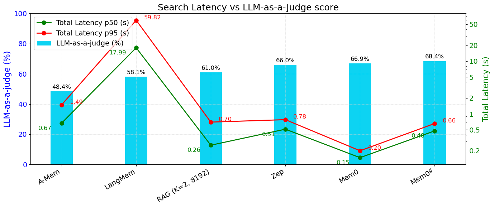
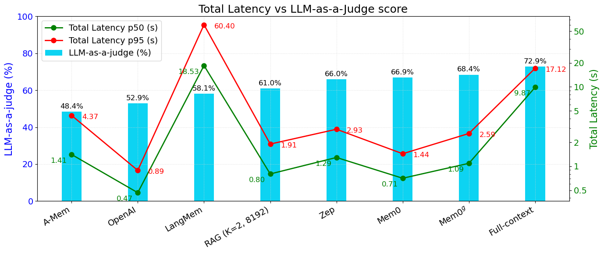

## Mem0: Building Production-Ready AI Agents with Scalable Long-Term Memory

### 一句话定位

Mem0 是 agent 长期记忆的系统层工作：它不试图把所有历史都塞进上下文，也不是改造 Transformer 内部 attention，而是把对话流转成可维护的长期事实记忆，再在需要回答问题时检索少量相关 memories。它的核心是两件事：

```text
写入侧:
  对话 pair + 全局 summary + 近期上下文
  -> LLM 抽取候选 memory facts
  -> 和已有 memory 对齐
  -> ADD / UPDATE / DELETE / NOOP

读取侧:
  当前问题
  -> 从 memory store 中检索少量相关事实
  -> 作为 answer context 给 LLM
```

增强版 `Mem0^g` 进一步把记忆组织成实体-关系图，用 graph memory 提升时间关系、实体关系和开放域问题上的表现。放在这个目录里，它补的是“可落地 agent memory service”这一层，和 LongMem / MSA / Titans 的模型侧长期记忆形成互补。

### 基本信息

- **论文**：Mem0: Building Production-Ready AI Agents with Scalable Long-Term Memory
- **arXiv**：2504.19413
- **版本**：v1，2025-04-28
- **作者**：Prateek Chhikara, Dev Khant, Saket Aryan, Taranjeet Singh, Deshraj Yadav
- **机构/项目**：Mem0
- **arXiv 页面**：[https://arxiv.org/abs/2504.19413](https://arxiv.org/abs/2504.19413)
- **官方研究页**：[https://mem0.ai/research](https://mem0.ai/research)
- **代码仓库**：[mem0ai/mem0](https://github.com/mem0ai/mem0)
- **论文 PDF**：[source/Mem0_2504.19413.pdf](source/Mem0_2504.19413.pdf)
- **arXiv 源码包**：[source/Mem0_2504.19413_src.tar.gz](source/Mem0_2504.19413_src.tar.gz)
- **核心关键词**：long-term memory、agent memory、memory extraction、memory update、graph memory、LOCOMO、LLM-as-a-Judge、latency/token efficiency

> 注：官方 Mem0 项目在 2026-04 已经展示了新的 production algorithm，强调 ADD-only extraction、entity linking、multi-signal retrieval 和 temporal retrieval。本笔记主体聚焦 arXiv:2504.19413 这篇论文版本；最后单独记一下它和当前项目演化的关系。

### 摘要中文翻译

固定上下文窗口让 LLM 很难在多轮、跨 session 的长期对话中保持一致性。Mem0 提出一个可扩展的长期记忆架构：从持续对话中动态抽取重要信息，和已有记忆合并、更新，并在需要时检索相关记忆。论文还提出 `Mem0^g`，把记忆表示为图结构，用实体和关系捕捉更复杂的对话结构。

实验在 LOCOMO 长期对话记忆 benchmark 上比较了多类 baseline，包括已有 memory-augmented systems、不同 chunk 配置的 RAG、full-context、OpenAI memory、Zep 等。结果显示，Mem0 在多个问题类型上优于已有 memory 系统，并且相比 full-context 方法显著降低 latency 和 token cost。论文主张：真正实用的 agent memory 不应该只是拉长上下文，而应该把长期历史压缩成可维护、可检索、可更新的结构化记忆层。

### 研究问题

这篇论文问的问题很工程化：

> 一个面向生产环境的 AI agent，怎样在多天、多 session 的对话中持续记住用户偏好、事实和事件，同时不让每次回答都背上完整历史上下文的成本？

普通长上下文和普通 RAG 都有明显问题：

```text
full-context:
  优点: 信息完整
  问题: 每次都读整段历史，latency/token cost 高，且远距离注意力不一定可靠

chunk RAG:
  优点: 能从历史中检索片段
  问题: chunk 常混入大量无关文本，事实更新、冲突处理、跨 session 合并都不自然

人工 summary:
  优点: 短
  问题: 容易丢证据，缺少细粒度可检索性和版本管理
```

Mem0 的回答是：不要把“原始对话历史”本身当成长期记忆，而是持续抽取、维护和检索 compact facts。

```text
conversation history
  -> salient memory facts
  -> conflict-aware update
  -> selective retrieval
```

这里的关键不只是“存向量库”。Mem0 真正想补的是 memory lifecycle：

- 新事实什么时候写入；
- 旧事实什么时候更新；
- 矛盾事实什么时候删除或置旧；
- 查询时用多少记忆就够；
- 这一套能不能在 latency 和 token cost 上接近生产可用。

### 为什么这篇适合放在 memory layer

这个目录里已有几条 memory 相关路线：

| 路线 | 代表 | 记忆形态 |
|---|---|---|
| agent 行为记忆 | Generative Agents, Reflexion, Voyager | memory stream、reflection、skill library |
| OS / self-managed memory | MemGPT | main context + archival memory，模型自己调用 memory tool |
| 模型侧 latent memory | LongMem, MSA | KV / latent memory bank |
| test-time neural memory | Titans | 测试时更新的 neural memory module |
| 系统层长期记忆服务 | Mem0 | 外部 memory store + LLM extraction/update/retrieval |

Mem0 的位置比较独特：它更像一个可以接入 agent runtime 的 memory provider。Agent 不一定要自己决定如何分页、总结或维护记忆；Mem0 把写入、更新、检索做成独立 memory layer。

### 核心方法

#### 1. Base Mem0：抽取和更新分离

Mem0 的 pipeline 分成 extraction phase 和 update phase。


这张图要看两个阶段：左边是从新对话中抽取 candidate memories，右边是把候选记忆和已有记忆比较后执行 ADD / UPDATE / DELETE / NOOP。数据库不仅存最终 memory，也提供全局 summary 和近期上下文，帮助抽取阶段避免只看当前 turn。

#### 2. Extraction：从一个对话 pair 里抽取候选 facts

每次新消息到来时，Mem0 不只看当前一句，而是构造一个包含三类信息的 prompt：

```text
P = (
  conversation summary S,
  recent messages m_{t-m} ... m_{t-2},
  current pair (m_{t-1}, m_t)
)
```

论文实验里：

- `m = 10`：抽取时看最近 10 条消息；
- 抽取 LLM 使用 `GPT-4o-mini`；
- summary 是异步刷新出来的，不阻塞主流程。

这个设计的直觉很直接：

- 只看当前 pair，容易抽错或抽重复；
- 只看全局 summary，又容易丢掉局部细节；
- 所以用 summary 提供全局主题，用 recent messages 提供局部时序上下文。

抽取函数 `phi(P)` 会输出一组候选记忆：

```text
Omega = {omega_1, omega_2, ..., omega_n}
```

这些候选记忆通常是自然语言事实，比如用户偏好、事件、关系、计划、状态变化等。

#### 3. Update：用 LLM tool call 做 memory reconciliation

抽取候选 facts 之后，Mem0 会对每个 fact 检索 top-s 个语义相似的已有 memories。论文实验中：

- `s = 10`：每个候选 fact 对比 10 个相似 memories；
- 通过 dense embeddings 在数据库中做 similarity search；
- 将候选 fact 和相似 memories 一起交给 LLM，让 LLM 通过 function calling 选择操作。

四种操作是：

| 操作 | 含义 |
|---|---|
| `ADD` | 新事实不存在，新增 memory |
| `UPDATE` | 新事实补充了已有事实，替换或增强 memory |
| `DELETE` | 新事实和旧事实矛盾，删除旧 memory |
| `NOOP` | 已有事实足够，或该候选不值得写入 |

可以把它理解成一个简化版 memory database transaction：

```text
candidate fact
  -> retrieve similar memories
  -> LLM decides operation
  -> execute update
```

这个点是 Mem0 和普通 RAG 的核心差异。RAG 通常只在 query time 检索原始 chunk；Mem0 在 ingest time 就做了事实抽取和状态维护。

#### 4. Query retrieval：取少量 compact memories，而不是大段原文

论文对查询侧的细节写得比写入侧少，但实验设置很清楚：回答问题时不是拼接完整对话历史，而是从 memory store 检索相关 memories。表 2 里 Mem0 平均使用 1764 个 memory tokens，`Mem0^g` 平均使用 3616 个 memory tokens，而 full-context 需要约 26031 tokens。

所以 Mem0 的有效性来自两个压缩：

```text
原始多 session 对话
  -> ingest-time fact extraction
  -> query-time selective retrieval
```

第一步把历史转成更干净的事实记忆；第二步只把相关事实喂给 LLM。

#### 5. Mem0^g：把记忆组织成实体-关系图

`Mem0^g` 是 graph-enhanced 版本。它把 memory 表示为有向标注图：

```text
G = (V, E, L)

V: entities
E: relationships
L: node labels / semantic types
```

节点可以是人、地点、事件、物品、属性等；边是关系，比如 `lives_in`、`prefers`、`owns`、`happened_on`。每个 entity node 还带有：

- entity type；
- embedding；
- metadata，比如 creation timestamp。


这张图要看 graph memory 的两个额外动作：先从对话中抽 entity 和 relation triplets，再在写入图数据库时做 conflict detection / update resolution。和 base Mem0 直接更新自然语言 facts 不同，`Mem0^g` 要处理节点对齐、关系冲突和时间状态。

#### 6. Graph 写入：节点对齐 + 关系冲突处理

对每个新 relationship triplet：

```text
(source_entity, relation, destination_entity)
```

系统会：

1. 给 source / destination entity 计算 embedding；
2. 搜索图中是否已有相似节点；
3. 如果没有，就创建新节点；
4. 如果有，就复用已有节点；
5. 添加关系边和 metadata；
6. 检测是否和旧关系冲突。

论文强调 `Mem0^g` 遇到冲突时不是简单物理删除，而是让 LLM-based update resolver 决定旧关系是否 obsolete，并把它标成 invalid。这一点对 temporal reasoning 很重要，因为“过去成立但现在不成立”的事实，本身仍然是时间问题的证据。

#### 7. Graph 读取：entity-centric + semantic triplet

`Mem0^g` 的检索有两条路径：

| 路径 | 做法 | 适合问题 |
|---|---|---|
| entity-centric retrieval | 从 query 中识别关键实体，定位图节点，扩展 incoming/outgoing edges | “Alice 后来搬到哪里了？”这种实体追踪 |
| semantic triplet retrieval | 把 query 和每条 relation triplet 文本编码成向量，按相似度取相关 triplets | 更宽泛的语义问题 |

这解释了为什么 graph 版本在 temporal 和 open-domain 上更有优势，但在简单 single-hop / multi-hop 上不一定赢 base Mem0：图结构提供关系归纳能力，也引入额外检索和对齐开销。

### 关键图表解读

#### 记忆为什么有必要


这张图的例子很朴素但好用：用户前一次说自己 vegetarian / dairy-free，下一次问晚餐推荐。如果系统没有跨 session memory，就可能推荐鸡肉；如果有长期记忆，就能把偏好带回来。Mem0 的目标不是证明“LLM 能理解偏好”，而是解决“偏好掉出上下文之后还能不能可靠进入决策”。

#### Search latency



这张图对比的是 search/retrieval 阶段。Mem0 的搜索 p95 是 0.200s，明显低于 Zep、A-Mem、LangMem 等 memory system。这里的核心收益来自 compact fact memory：检索对象不是长 chunk，也不是冗余很高的图摘要。

#### Total latency



这张图把 answer generation 也算进去。full-context 的整体质量最高，但 p95 到 17.117s；Mem0 的 p95 是 1.440s，`Mem0^g` 是 2.590s。论文的 practical claim 就落在这里：Mem0 不一定绝对超过 full-context 的 accuracy，但更像一个成本和延迟可接受的生产方案。

### 实验设置

#### 数据集：LOCOMO

LOCOMO 是长期对话记忆 benchmark：

- 10 个 extended conversations；
- 每个 conversation 约 600 个 dialogues；
- 每个 conversation 平均约 26000 tokens；
- 每个 conversation 平均约 200 个问题；
- 问题类型包括 single-hop、multi-hop、temporal、open-domain；
- 原本的 adversarial questions 因 ground truth 缺失没有纳入本文评测。

#### 指标

论文使用两类指标：

| 指标类型 | 指标 | 作用 |
|---|---|---|
| answer quality | F1, BLEU-1, LLM-as-a-Judge | 衡量答案是否事实正确、相关、完整 |
| deployment cost | token consumption, search latency, total latency | 衡量系统是否适合交互式 agent |

这里最有用的是 LLM-as-a-Judge，因为长期记忆问题里 lexical overlap 很容易误导。比如 ground truth 是 “Alice was born in March”，模型回答 “Alice was born in July”，F1/BLEU 可能还不低，但事实错了。

#### Baselines

论文比较了六类 baseline：

- LOCOMO 已有方法：LoCoMo、ReadAgent、MemoryBank、MemGPT、A-Mem；
- 开源 memory solution：LangMem；
- RAG：不同 chunk size 和 `k`；
- full-context：直接把完整对话历史塞给 LLM；
- OpenAI memory；
- memory provider：Zep。

所有适用场景下，论文将 temperature 设为 0，并使用 `GPT-4o-mini` / `text-embedding-small-3` 等模型栈。

### 关键实验结论

#### 1. 按问题类型看

| 类型 | 最值得记的结论 |
|---|---|
| Single-hop | Mem0 最强，J = 67.13；简单事实检索不太需要 graph |
| Multi-hop | Mem0 最强，J = 51.15；自然语言 fact memory 比 graph 版本更稳 |
| Open-domain | Zep 最高，J = 76.60；`Mem0^g` 紧随其后，J = 75.71 |
| Temporal | `Mem0^g` 最强，J = 58.13；graph 对时间关系和状态变化更有帮助 |

这组结果的直觉是：

```text
事实检索 / 跨 session 合成:
  compact natural-language memories already work well

时间顺序 / 实体关系 / 状态变化:
  graph memory starts to pay off
```

也就是说，不是“图一定更好”。图在关系和时间推理上更有价值，但对普通事实问答可能只是增加复杂度。

#### 2. Overall quality / latency trade-off

| 方法 | memory/context tokens | Total p95 latency | Overall J |
|---|---:|---:|---:|
| Full-context | 26031 | 17.117s | 72.90 |
| Mem0 | 1764 | 1.440s | 66.88 |
| `Mem0^g` | 3616 | 2.590s | 68.44 |
| Zep | 3911 | 2.926s | 65.99 |
| OpenAI memory | 4437 | 0.889s | 52.90 |
| Best RAG setting in table | varies | 1.907s / 9.942s depending config | 60.97 / 60.53 |

这里最值得抓住的是：

- full-context 的 quality 仍然最高，说明完整历史确实有信息优势；
- Mem0 相比 full-context p95 latency 下降约 91.6%；
- Mem0 的输入 token 从 26031 降到 1764，下降约 93.2%；
- `Mem0^g` quality 比 base Mem0 更高，但延迟也更高；
- OpenAI memory 的响应很快，但本文设置下 overall J 明显低，且 memory extraction 的成本没有完全体现在表里。

#### 3. Memory construction / storage overhead

论文还比较了 memory store 的 token footprint：

| 系统 | 每个 conversation 的 memory footprint |
|---|---:|
| Mem0 | 约 7k tokens |
| `Mem0^g` | 约 14k tokens |
| raw full context | 约 26k tokens |
| Zep graph | 超过 600k tokens |

这个结果很有意思：graph memory 不一定天然省。Zep 的图会在节点上缓存 abstractive summary，同时在边上存 facts，造成大量冗余。Mem0 的 graph 版本相对克制，主要存 entity / relation / metadata，因此 footprint 更小。

论文还观察到 Zep 的 memory graph 构建存在延迟：刚写入后立即查询有时回答不好，数小时后重查效果变好，说明后台图构建可能是异步长流程。Mem0 则报告 graph construction 在最坏场景下也能在 1 分钟内完成。

### 和相关工作的关系

#### 和 Generative Agents

Generative Agents 的 memory stream 更像一个 agent cognition loop：

```text
observation -> memory stream -> retrieval -> reflection -> planning
```

Mem0 更像工程化 memory middleware：

```text
conversation -> memory extraction/update -> retrieval API
```

Generative Agents 强调模拟人类行为；Mem0 强调在真实 agent 应用中降低上下文成本、维护用户长期事实。

#### 和 Reflexion / Voyager

Reflexion 存的是任务失败后的 verbal feedback，帮助下一次尝试；Voyager 存的是可执行 skill library。它们偏 procedural / episodic self-improvement。

Mem0 存的是用户、事件、偏好、关系、状态这些 conversational facts。它更适合：

- personal assistant；
- customer support；
- healthcare / education 场景；
- 需要跨 session personalization 的 agent。

#### 和 MemGPT / Letta

MemGPT 把 memory 管理做成类似 OS 的上下文分页：模型可以自己调用工具，把信息在 main context 和 archival memory 之间搬运。

Mem0 则更外部化：它让 memory layer 在 ingest 时自动抽取、更新和检索，agent 可以少操心 memory bookkeeping。

可以粗略理解成：

```text
MemGPT:
  LLM as memory manager

Mem0:
  memory service as manager, LLM used inside extraction/update modules
```

#### 和 RAG

RAG 的最小单位是 chunk；Mem0 的最小单位是 fact memory。

这带来两个差异：

- Mem0 的检索上下文更短、更干净；
- Mem0 需要在写入侧承担抽取和更新错误的风险。

所以 Mem0 不是“RAG 的替代品”，而是把长期个人/对话历史从 raw text retrieval 升级为 managed memory retrieval。

#### 和 LongMem / MSA / Titans

LongMem / MSA / Titans 都是模型侧记忆：

```text
LongMem / MSA:
  历史 -> KV / latent memory -> attention 读取

Titans:
  历史 -> 测试时更新 neural memory weights -> forward 读取
```

Mem0 是系统侧记忆：

```text
历史对话 -> 外部事实库 / 图数据库 -> prompt context
```

因此 Mem0 更容易直接接入现有 LLM API，也更容易做权限、审计、删除和多租户隔离；但它的记忆读写质量强依赖抽取模型、embedding、prompt 和数据库工程。

### 局限性

#### 1. LOCOMO 很有用，但规模仍然有限

LOCOMO 的对话很长，但只有 10 个 extended conversations。它能测试跨 session recall、temporal reasoning 和 multi-hop，但还不能完全覆盖真实生产 agent 的混乱场景：

- 多用户、多身份、多设备；
- 隐私和权限边界；
- 用户主动纠错；
- 事实长期漂移；
- 高噪声、低价值聊天混入。

#### 2. ingest-time cost 没有完全进入交互 latency

表 2 主要报告 search latency 和 total answer latency。Mem0 的优势很明显，但系统还有一个长期后台成本：抽取、更新、embedding、写库、图构建。论文在 memory construction 部分讨论了一些 overhead，但和 answer-time latency 不是同一个维度。

如果真实业务是超高频聊天，ingest-time LLM calls 也会是成本中心。

#### 3. LLM-as-a-Judge 和 LLM extraction 都会引入模型偏差

Mem0 使用 LLM 抽取 facts、判断 ADD/UPDATE/DELETE/NOOP，同时又使用 LLM-as-a-Judge 评估答案。这不代表结果无效，但读表时要意识到：

- judge 可能偏好某类回答风格；
- extraction LLM 的能力会直接影响 memory 质量；
- 不同模型栈下的结论可能变化。

#### 4. UPDATE / DELETE 有证据丢失风险

base Mem0 中 `DELETE` 会移除被新事实矛盾的 memory，`UPDATE` 可能替换旧 memory。对用户偏好这种“当前状态”来说很自然，但对审计、时间推理、可解释性来说有风险。

例如：

```text
2024: 用户住在北京
2025: 用户搬到上海
```

如果直接删掉“住在北京”，回答“用户以前住哪里”就会丢证据。`Mem0^g` 用 invalid 标记而非物理删除，部分缓解了这个问题，但 base pipeline 本身仍需要更强的 provenance / versioning。

#### 5. Graph memory 不是免费午餐

`Mem0^g` 在 temporal 和 open-domain 上更好，但在 single-hop / multi-hop 上不如 base Mem0，且 latency 更高。图结构适合关系和时间，但也会引入：

- entity linking 错误；
- relation extraction 错误；
- graph traversal 噪声；
- conflict resolution 成本。

所以工程上不一定“所有记忆都进图”。更稳的做法可能是分层：

```text
short facts:
  natural-language memory + vector retrieval

relations / timelines:
  graph memory

raw evidence:
  archival conversation store
```

### 和 2026 官方实现的关系

官方 Mem0 研究页和 GitHub README 当前展示的 production algorithm 已经和这篇 arXiv 版有明显差异，尤其是：

- 新版强调 single-pass ADD-only extraction，不再依赖 UPDATE/DELETE 覆盖旧记忆；
- agent-generated facts 也作为一等记忆写入；
- 检索侧融合 semantic similarity、keyword matching、entity matching；
- 增加 time-aware retrieval，用于 current state、past event、upcoming plan 等时间问题；
- benchmark 扩展到 LoCoMo、LongMemEval、BEAM。

这说明 arXiv 版 Mem0 更像一篇“memory lifecycle 原型论文”：用 extraction/update/retrieval 证明 managed memory 比 full-context/RAG 更实用。后续产品演化则把重点转向更稳定的 append-only memory、entity linking 和多信号检索。

读这篇时不必把 `ADD/UPDATE/DELETE/NOOP` 当成最终答案。更应该记住它提出的问题分解：

```text
what to remember
how to reconcile it
how to retrieve only what matters
how to keep latency/token cost low
```

### 对我理解这条路线的意义

Mem0 把 agent memory 从“prompt 里放一点历史”推进到“外部长期记忆服务”的形态。它的价值不在于某个单点算法多复杂，而在于把长期记忆拆成了工程上可讨论的接口：

- `add memory`：新事实怎么进入系统；
- `update memory`：旧事实怎么被修正；
- `delete / invalidate`：矛盾事实怎么处理；
- `search memory`：当前任务要读哪些事实；
- `cost metrics`：这套 memory 是否比 full-context 更便宜、更快。

这对 agent runtime 很关键。真正长期运行的 agent 不可能每次都带完整历史，也不能只靠模型自己“记得”。它需要一个明确的 memory substrate，既能服务个性化，又能控制成本、延迟和可治理性。

### 读这篇时抓住什么

最短版本：

```text
Mem0 = fact-level long-term memory service for agents.

Base Mem0:
  natural-language memory facts
  extraction + LLM operation selection
  fast retrieval, strong single-hop / multi-hop

Mem0^g:
  entity-relation graph memory
  better temporal / relation-heavy reasoning
  higher cost and latency

Main trade-off:
  slightly below full-context quality
  much lower latency and token cost
```

如果只带走一个判断：Mem0 的方向不是“让上下文更长”，而是“让历史变成可维护的记忆层”。这正是 agent memory layer 和普通 long-context inference 的分界线。
