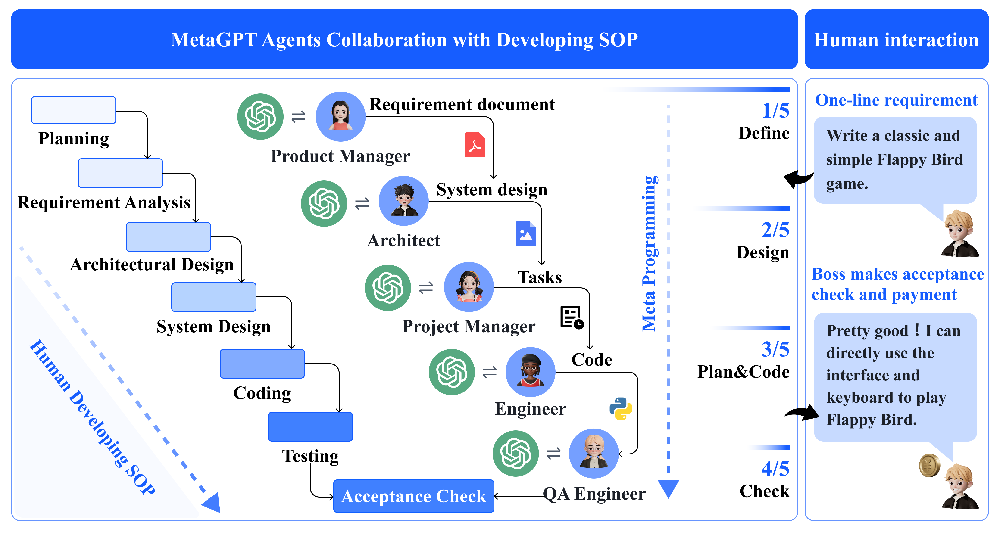
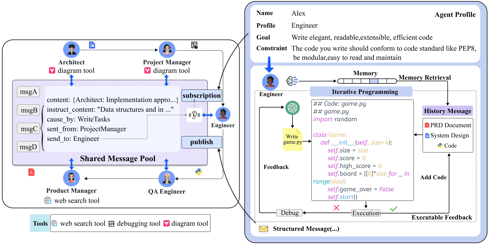
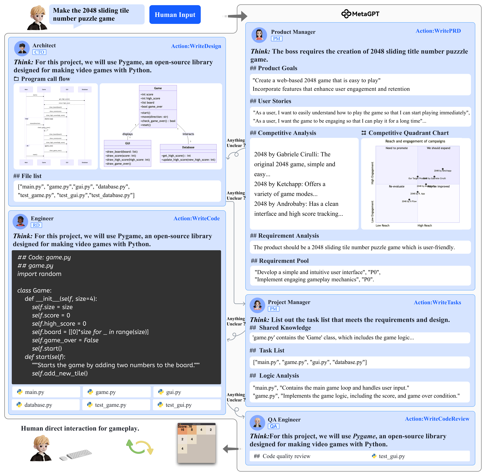
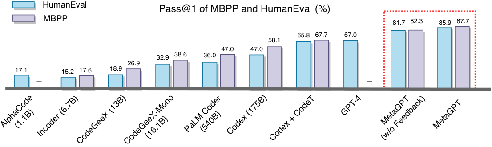

## MetaGPT: Meta Programming for A Multi-Agent Collaborative Framework

### 一句话定位

MetaGPT 把软件公司的 SOP 编码进多智能体系统，让不同角色通过结构化文档协作，减少纯聊天式 agent 串联带来的幻觉级联和上下文混乱。

### 基本信息

- **论文**：MetaGPT: Meta Programming for A Multi-Agent Collaborative Framework
- **arXiv**：2308.00352
- **会议**：ICLR 2024
- **任务**：多 agent 软件工程、代码生成、需求分析、架构设计、测试
- **核心关键词**：SOP、Role Specialization、Structured Communication、Message Pool、Executable Feedback、Artifact Memory

### 摘要中文翻译

基于 LLM 的多 agent 系统已经能解决一些简单对话任务，但复杂任务中，朴素串联 LLM 容易因为级联幻觉导致逻辑不一致。MetaGPT 提出一种 meta-programming 框架，把人类工作流中的标准操作流程 SOP 编码进多智能体协作。系统使用流水线范式为不同 agent 分配角色，让拥有领域专长的 agent 产生并验证中间结果。软件工程实验显示，MetaGPT 相比聊天式多 agent 系统能生成更一致的解决方案。

### 研究问题

多 agent 系统如果只是“几个角色轮流聊天”，很容易出现：

- 上游信息表达不完整；
- 下游误解需求；
- 中间决策没有结构化记录；
- 错误在多轮对话中级联放大；
- 代码无法执行但没有反馈闭环。

MetaGPT 的问题是：

> 能不能把人类软件公司的 SOP、角色分工和文档流变成 agent 的协作骨架？

从 memory layer 看，它的关键是 artifact memory：PRD、系统设计、接口定义、任务分解、代码和测试都是后续 agent 可读取的团队记忆。

### 核心方法

MetaGPT 将一个软件公司抽象成多个角色：

- Product Manager：分析需求，产出 PRD、用户故事、需求池；
- Architect：把需求转成系统设计、文件列表、数据结构、接口定义；
- Project Manager：拆任务和分配工作；
- Engineer：根据设计写代码；
- QA Engineer：生成测试和质量检查。

核心机制有三类。

#### 1. SOP workflow

agent 不再自由聊天，而是沿着标准流程产出结构化中间物。每个阶段的输出成为下一阶段的输入。

#### 2. Structured communication + message pool

MetaGPT 用共享 message pool 代替点对点闲聊。agent 发布结构化消息，并根据角色订阅相关信息。这样 Architect 可以读取 PRD，Engineer 可以读取系统设计，而不必从完整聊天历史里捞信息。

#### 3. Executable feedback

Engineer 写完代码后执行测试或检查。如果失败，错误信息和历史消息一起进入下一轮修复，最多重试若干轮。这相当于把 Reflexion/Self-Refine 的反馈循环落到软件工程任务中。

### 关键图表解读

#### MetaGPT 总览

这张图展示 MetaGPT 的核心思想：用户需求进入一个类软件公司的 agent 流水线，各角色依次产出文档和代码。重点不是 agent 数量，而是 SOP 约束了信息流。

#### Message sharing 与 executable feedback

左侧是共享消息池和订阅机制，右侧是工程师基于执行反馈修复代码。对 memory layer 来说，这是“团队共享记忆”和“运行时调试记忆”的结合。

#### 软件开发流程

图中展示 PRD、设计、任务、代码、测试之间的交接关系。相比聊天记录，这些 artifact 更稳定、更可检查，也更适合长期任务。

#### Benchmark 结果

这张图展示 MetaGPT 在 HumanEval 和 MBPP 上的 pass rate。论文报告 MetaGPT + GPT-4 在 HumanEval/MBPP 上分别达到 85.9% 和 87.7%，说明 SOP 和反馈机制能提升代码生成。

### 关键贡献

1. **把 SOP 引入 LLM multi-agent collaboration**。
2. **提出结构化文档流替代自由聊天流**。
3. **用 publish-subscribe message pool 管理共享上下文**。
4. **引入 executable feedback 改进代码质量**。

### 实验与结论

MetaGPT 在 HumanEval、MBPP 和 SoftwareDev 上评估。论文报告 MetaGPT + GPT-4 在 HumanEval 和 MBPP 上表现优于若干代码生成基线。

在 SoftwareDev 上，MetaGPT 相比 ChatDev 等系统生成的软件更可执行，人工修正次数更少，虽然 token 用量可能更高，但单位代码行 token 消耗更低。消融显示，增加角色和 executable feedback 都能改善 executability 和 revision cost。

结论是：复杂任务不只需要更强 LLM，还需要更好的组织结构。SOP 和 artifact memory 可以降低多 agent 中的混乱和级联幻觉。

### 局限性

- SOP 适合软件工程，但迁移到开放探索任务可能过硬。
- 多角色会增加 token 成本和流程延迟。
- 上游文档质量差仍会污染后续步骤。
- 角色划分和 schema 需要人工设计。
- 评估仍以代码任务为主，通用性需要更多验证。

### 放进大模型基础知识体系里怎么理解

MetaGPT 是 multi-agent memory 的一个重要范式：团队不应该共享所有聊天噪声，而应该共享结构化中间产物。

这对应 **artifact/procedural memory**：需求文档、接口、任务列表和测试报告本身就是记忆。它们比自然语言对话更适合作为复杂工程任务的上下文。

### 我需要记住什么

- MetaGPT 的核心不是“多个 agent”，而是 SOP + structured artifacts。
- 文档即记忆，消息池是共享记忆，测试结果是反馈记忆。
- 和 AutoGen 对比：AutoGen 偏通用 conversation programming；MetaGPT 偏软件工程 SOP 流水线。
