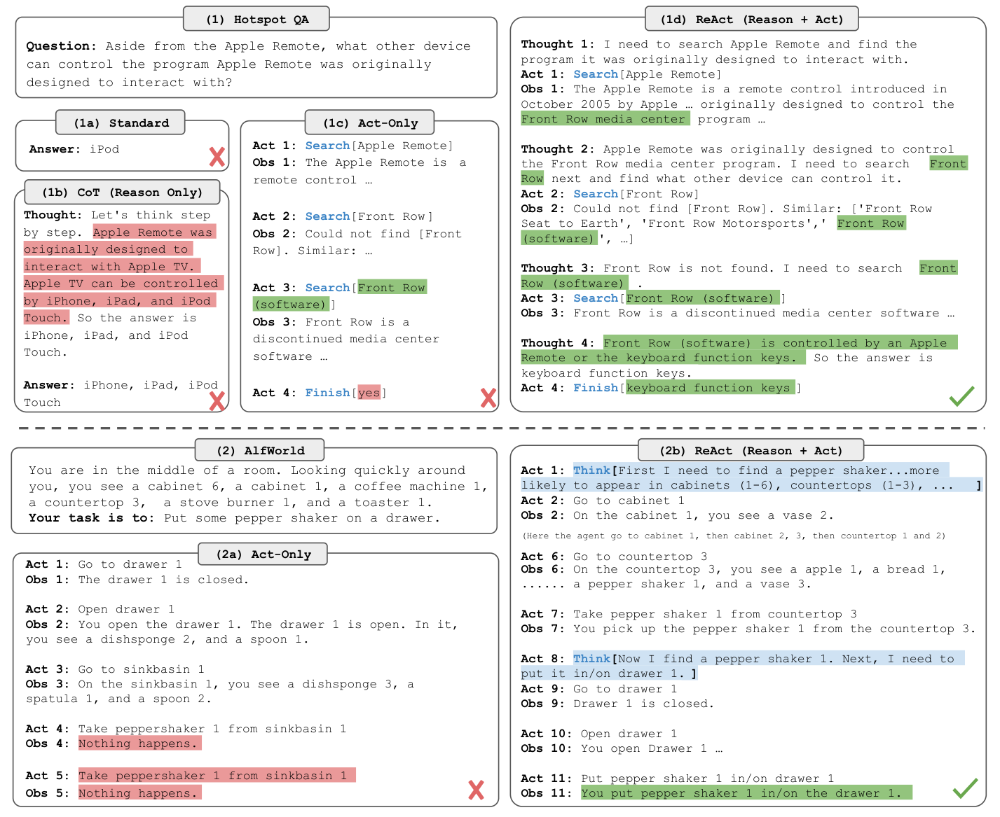
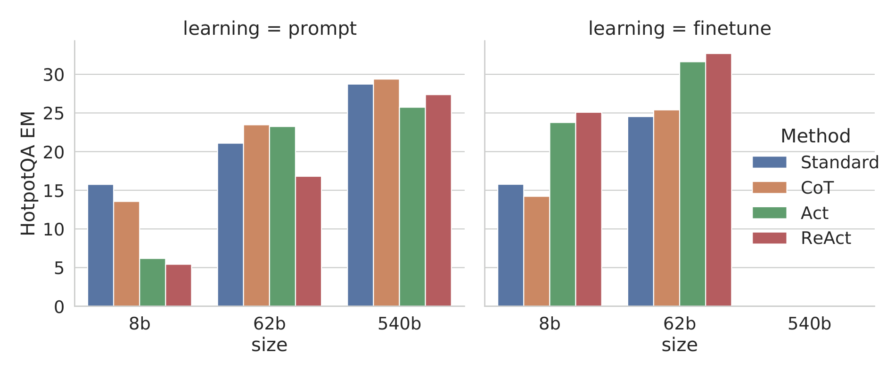
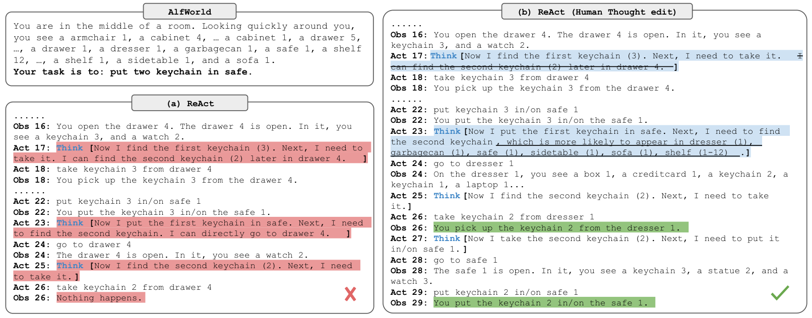

## ReAct: Synergizing Reasoning and Acting in Language Models

### 一句话定位

ReAct 把 LLM 的自然语言推理和外部环境动作交错成一条可执行轨迹，让模型不只是“想答案”，而是能边思考、边查证、边修正行动。

### 基本信息

- **论文**：ReAct: Synergizing Reasoning and Acting in Language Models
- **arXiv**：2210.03629
- **会议**：ICLR 2023
- **任务**：知识密集问答、事实验证、交互式决策、网页购物
- **核心关键词**：Reasoning Trace、Action、Observation、Tool Use、Interactive Agent、Working Memory

### 摘要中文翻译

大型语言模型在语言理解、推理和交互式决策上表现很强，但过去常把 reasoning 和 acting 分开研究。ReAct 的核心做法是让模型交替生成 reasoning traces 和 task-specific actions：推理帮助模型分解目标、跟踪状态、更新计划和处理异常；动作让模型访问外部知识库或环境，获得新的 observation。论文在 HotpotQA、FEVER、ALFWorld、WebShop 等任务上验证了这种模式，相比只推理或只行动的基线更有效，也更容易被人检查和信任。

### 研究问题

只做 Chain-of-Thought 时，模型可以给出一条看似合理的思路，但它缺少外部验证，容易在错误事实上继续推理。只做 action policy 时，模型能调用工具或环境动作，但没有显式思考过程，很难维护目标、解释行为或在异常时修正计划。

ReAct 问的是：

> 如果把“想”和“做”放进同一个上下文轨迹，LLM 能不能更稳地解决需要外部信息和多步决策的问题？

从 memory layer 角度看，这篇论文真正奠定的是 agent 的最小工作记忆格式：`Thought / Action / Observation`。它不是长期记忆系统，但它定义了后续很多 agent 框架的运行日志。

### 核心方法

ReAct 将 agent 的动作空间扩展为两类：

- **语言 thought**：不改变外部环境，只写入当前上下文，用来分解任务、总结 observation、更新计划。
- **环境 action**：调用 Wikipedia API、执行 ALFWorld 动作、点击 WebShop 页面等，会产生新的 observation。

因此一次典型轨迹是：

```text
Question / Goal
Thought: ...
Action: ...
Observation: ...
Thought: ...
Action: ...
Observation: ...
Answer / Finish
```

在知识任务中，ReAct 常用严格交替格式：先 thought，再 action，再 observation。这样模型可以在 HotpotQA 或 FEVER 中主动搜索 Wikipedia，并用 observation 校正后续推理。

在决策任务中，thought 不必每一步都出现。对于 ALFWorld 和 WebShop，行动序列可能很长，模型只在需要分解目标、记录进度、处理失败时写 thought。这种异步 thought/action 更接近实际 agent：不是每一步都长篇思考，而是在关键节点显式维护状态。

这篇的 memory 机制很朴素但重要：

- 写入：每一步 thought、action、observation 都追加到 prompt。
- 读取：下一步生成直接读取完整或截断轨迹。
- 作用：把当前任务的“我试过什么、看到了什么、接下来该怎么做”保存在上下文里。

### 关键图表解读

#### ReAct 轨迹示例



这张图是 ReAct 最重要的直觉图：Reason Only 会在内部推理里幻觉或继承错误；Act Only 能查信息但缺少显式计划；ReAct 把两者交错起来，模型可以先提出需要查证的中间问题，再根据 observation 更新答案。

#### HotpotQA 上的规模与微调结果



图里展示了 prompting 和 finetuning 场景下 ReAct 与 baselines 的对比。重点不是某个单点数值，而是 ReAct 的收益来自“推理轨迹 + 外部检索”的组合：检索降低事实幻觉，推理轨迹降低工具结果被误用的概率。

#### 人类可编辑性



ReAct 的轨迹天然可检查。人可以看到模型哪一步想错、查错或行动错，并通过编辑 thought 改变后续行为。这一点对 agent memory 很关键：可见的工作记忆不只是给模型读，也是给人类调试和接管用。

### 关键贡献

1. **提出 thought/action/observation 交错范式**：把语言推理和环境交互统一在一条轨迹里。
2. **证明 ReAct 能减少知识任务中的幻觉和错误传播**：模型可以通过 Wikipedia API 获取事实，再继续推理。
3. **证明少样例 prompt 能驱动交互式决策**：在 ALFWorld 和 WebShop 上，用少量 in-context 轨迹就能超过若干 imitation/RL 基线。
4. **提供可解释 agent 轨迹**：每一步 thought 和 observation 都可以被检查、编辑、复盘。

### 实验与结论

论文覆盖两大类任务。

第一类是知识密集任务：HotpotQA 和 FEVER。ReAct 通过搜索 API 获取证据，缓解纯 CoT 自说自话的问题。它的优势尤其体现在需要多跳查证和事实对齐的任务上。

第二类是交互式决策：ALFWorld 和 WebShop。ReAct 能用 thought 维护子目标、记录已经检查过的物品或位置，并在 observation 与预期不一致时调整行动。论文报告在 ALFWorld 和 WebShop 上分别带来显著成功率提升。

实验整体说明：当任务需要外部状态或工具返回时，单纯“多想几步”不够；把外部 observation 写入工作记忆，才是 agent 能持续推进的关键。

### 局限性

- 上下文会随轨迹增长，很快遇到窗口限制。
- 错误 thought 会污染后续决策，尤其在没有外部校验的步骤中。
- ReAct 没有长期记忆、经验压缩或跨任务学习机制。
- 工具接口和 prompt 格式依赖人工设计。
- 复杂任务中，何时思考、何时行动仍然主要交给模型自己判断。

### 放进大模型基础知识体系里怎么理解

ReAct 是 LLM agent 的“运行时协议”。很多后来的系统，无论叫 browser agent、coding agent、tool agent，底层都在做类似事情：把内部思考、外部调用和调用结果组织成一个可继续生成的上下文状态。

在 memory layer 里，它对应 **working memory / trajectory memory**：生命周期通常只在当前任务内，但它是后续反思记忆、长期记忆、工具执行日志和多 agent 对话状态的地基。

### 我需要记住什么

- ReAct 的关键不是 prompt 花样，而是把 thought、action、observation 变成 agent 的基本状态机。
- 它解决的是“推理不能落地、行动不能解释”的问题。
- 后续 Reflexion 是在 ReAct 轨迹之后写入“我学到了什么”；Generative Agents 是把观察、反思、计划长期存储；AutoGen/MetaGPT 是把这种轨迹扩展到多 agent 协作。
