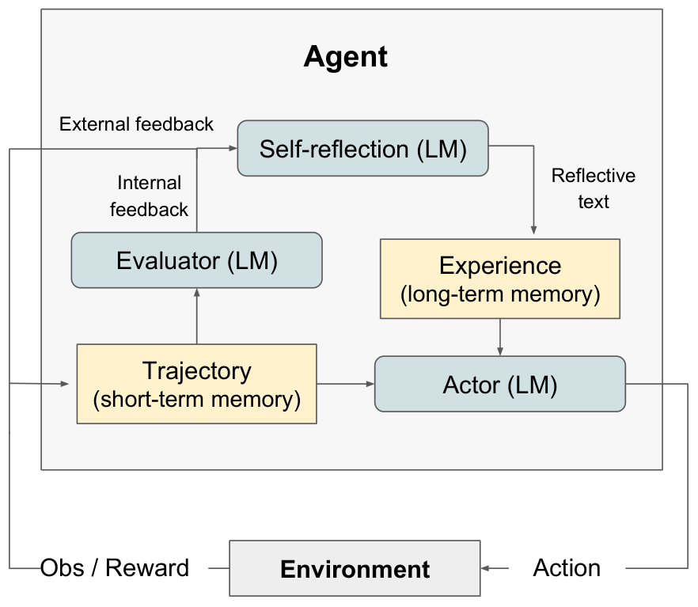
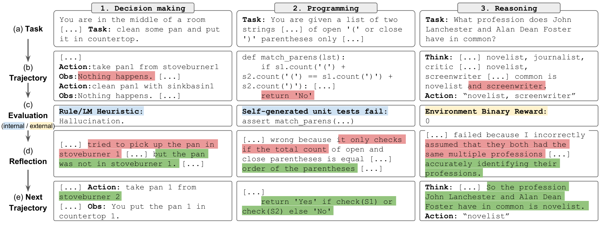
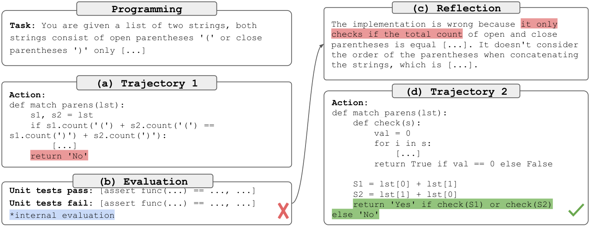

## Reflexion: Language Agents with Verbal Reinforcement Learning

### 一句话定位

Reflexion 把 trial-and-error 后的失败经验写成自然语言反思，并存入 episodic memory，让 agent 不改模型权重也能在下一轮任务中变聪明。

### 基本信息

- **论文**：Reflexion: Language Agents with Verbal Reinforcement Learning
- **arXiv**：2303.11366
- **会议**：NeurIPS 2023
- **任务**：ALFWorld、HotpotQA、HumanEval 等 sequential decision-making / reasoning / coding
- **核心关键词**：Verbal Reinforcement、Self-Reflection、Episodic Memory、Actor-Evaluator-Self-Reflection、Language Agent

### 摘要中文翻译

LLM agent 越来越多地用于游戏、编译器、API 等外部环境，但传统 RL 需要大量样本和昂贵微调，不适合快速从失败中学习。Reflexion 提出一种不用更新权重的 verbal reinforcement 框架：agent 根据任务反馈生成自然语言反思，把这些反思保存在 episodic memory buffer 中，并在后续尝试时作为上下文注入。它可以使用标量奖励、自由文本反馈、外部评价或自我评价，在决策、编程和推理任务上都显著提升性能，例如 HumanEval pass@1 达到 91%。

### 研究问题

ReAct 让 agent 拥有当前任务轨迹，但任务结束后，轨迹通常就消失了。下一次遇到类似任务，模型还是从原始 prompt 开始。

Reflexion 关心的是：

> Agent 能不能把失败后的教训写成可读文本，作为下一次尝试的经验记忆，而不是通过梯度更新模型参数？

这把 RL 中的 reward signal 转成 prompt-level memory。它不是训练模型，而是训练“上下文”。

### 核心方法

Reflexion 有三个模块。

1. **Actor**：执行任务的 agent，可以是 CoT、ReAct 或其他 prompting agent。它根据当前 observation、短期轨迹和长期反思记忆生成动作或答案。
2. **Evaluator**：评价 Actor 的输出。反馈可以来自环境成功/失败、exact match、unit test、启发式规则或另一个 LLM。
3. **Self-Reflection model**：根据轨迹和评价结果生成 verbal reflection，例如“我失败是因为没有先检查冰箱，下一次应该先确认目标物品位置”。

核心循环是：

```text
Actor generates trajectory
Evaluator scores trajectory
Self-Reflection writes lesson
Append lesson to memory
Actor retries with memory in prompt
```

论文区分两类 memory：

- **Short-term memory**：当前 episode 的 action-observation trajectory。
- **Long-term memory**：跨 episode 保留的 self-reflection 文本，通常限制在 1-3 条，以适配上下文窗口。

从 memory layer 看，Reflexion 的关键不是存储所有历史，而是把历史压缩成“可行动的教训”。

初读时容易卡住的几个点：

- Reflexion 可以先粗略理解成：跑完一次任务后，把失败 trajectory 里的教训总结成自然语言，并塞回下一次尝试的 prompt 里。但它不是普通摘要，而是面向下一次行动的错误归因和策略提醒。
- 它和 ReAct 不是互斥关系。ReAct 是执行任务时的在线轨迹：`Thought -> Action -> Observation`；Reflexion 是一条 trajectory 结束后的离线复盘：`Trajectory -> Evaluation -> Reflection -> Memory -> Next Trajectory`。Actor 本身完全可以是 ReAct。
- 和直接保存一整条 trajectory 相比，reflection 的价值在于 **压缩和归因**。完整 trajectory 很长、噪声多、包含许多无关动作；reflection 则把失败信号压成短句，例如“不要再假设 pan 在 stoveburner1，要先确认位置”。
- 每一步都做 evaluation 是可以的，甚至常常有用；但每一步都做 reflection 不一定更好。Observation 负责记录刚发生了什么，Evaluation 负责判断当前动作/状态有没有问题，Reflection 负责把关键失败原因沉淀成下一次可复用的策略记忆。
- 高频 reflection 容易退化成啰嗦版 trajectory：token 成本高、上下文被污染，还可能把局部偶然现象写成长期经验。更合理的做法是“重要错误触发式”或“episode 结束后”反思，而不是机械地每一步都反思。

### 关键图表解读

#### Reflexion 框架和算法



这张图展示了 Actor、Evaluator、Self-Reflection 三者的闭环。Evaluator 把环境反馈转成是否成功，Self-Reflection 把稀疏奖励放大成自然语言经验，memory 再影响下一次 Actor 决策。

#### 任务覆盖



Reflexion 不只用于一个环境，而是覆盖决策、编程、推理三类任务。这说明 verbal memory 是相当通用的接口：只要任务能评价成成功/失败或得分，就能生成反思。

#### 编程任务结果



HumanEval 场景里，unit tests 和自写测试提供反馈，反思文本帮助模型修正错误假设或遗漏边界条件。这里的 memory 更像 debug notebook：记录失败原因，而不是保存完整代码轨迹。

### 关键贡献

1. **提出 verbal reinforcement**：用自然语言反思替代权重更新。
2. **给出 Actor-Evaluator-Self-Reflection 模块化框架**。
3. **把 memory 明确分成短期轨迹和长期反思**。
4. **展示跨任务有效性**：决策、推理、编程任务都能从反思记忆中获益。

### 实验与结论

论文在 ALFWorld、HotpotQA 和 HumanEval 上评估。结果显示，Reflexion 可以在多轮尝试中持续提升。

在 ALFWorld 中，agent 通过失败后的反思逐步学会避免重复错误。HotpotQA 中，反思帮助模型修正检索或推理链条。HumanEval 中，执行反馈和测试结果尤其有效，论文报告 Reflexion 在 HumanEval 上达到 91% pass@1，高于当时若干强基线。

消融分析的核心信息是：反思文本不能太空泛，必须和失败轨迹、反馈信号绑定；反馈来源和 agent 类型也会影响收益。

### 局限性

- 反思质量依赖 LLM 自我诊断能力，可能写出错误教训。
- memory buffer 太短会丢失经验，太长会污染上下文。
- 对不可评价或反馈极弱的任务不稳定。
- 没有模型参数更新，长期能力增长受 prompt/context 限制。
- 多轮尝试本身增加成本。

### 放进大模型基础知识体系里怎么理解

Reflexion 是 agent memory 里“经验总结”的代表。它回答了一个很实用的问题：如果不训练模型，怎样让 agent 从上一轮失败中学到东西？

它和 ReAct 的关系很清楚：ReAct 记录“我刚才做了什么”；Reflexion 记录“这次失败说明我下次该怎么做”。

### 我需要记住什么

- Reflexion 的 memory 不是事实库，而是失败教训、策略提醒和行为约束。
- 它把稀疏 reward 变成自然语言梯度。
- ReAct 是在线行动轨迹，Reflexion 是离线复盘记忆；二者可以组合。
- Reflection 的价值在压缩和归因，不在反思次数越多越好。
- 很多 coding agent 的“运行测试 -> 总结错误 -> 再改代码”都可以看成 Reflexion 的工程化版本。
