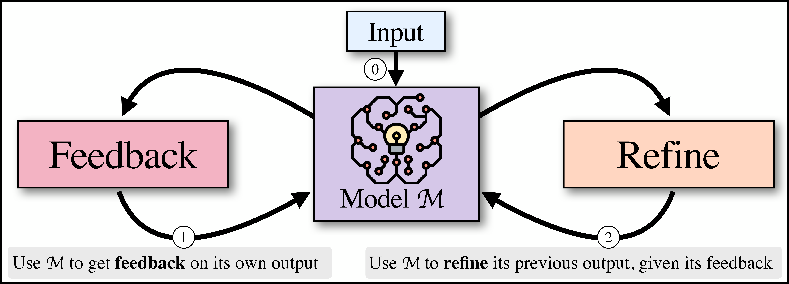
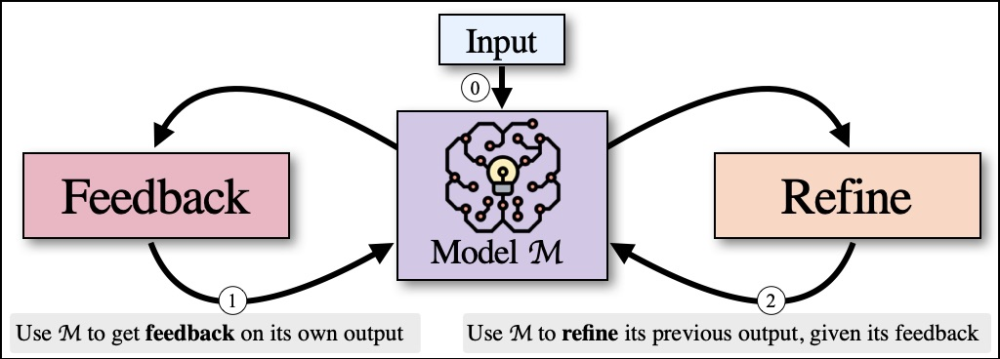
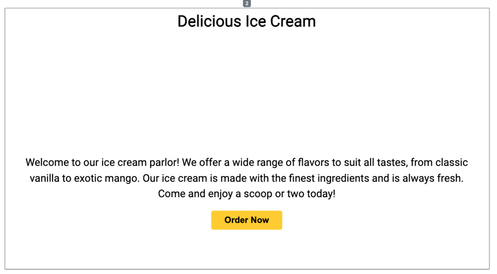

## Self-Refine: Iterative Refinement with Self-Feedback

### 一句话定位

Self-Refine 把一个 LLM 同时用作生成器、反馈器和改写器，在测试时通过 `generate -> feedback -> refine` 循环提升当前任务输出。

### 基本信息

- **论文**：Self-Refine: Iterative Refinement with Self-Feedback
- **arXiv**：2303.17651
- **会议**：NeurIPS 2023
- **任务**：对话、代码优化、数学推理、情感改写、受约束生成等
- **核心关键词**：Self-Feedback、Iterative Refinement、Test-time Improvement、No Training、Short-term Memory

### 摘要中文翻译

LLM 和人一样，第一次生成不一定最好。Self-Refine 提出一种简单方法：先让 LLM 生成初稿，再让同一个 LLM 对初稿给出反馈，然后根据反馈改写，反复迭代直到满足停止条件。它不需要监督数据、额外训练或强化学习，只依赖一个 LLM 和三个 prompt。论文在多类任务上验证了该方法，使用 GPT-3.5 和 GPT-4 时，Self-Refine 平均带来约 20% 绝对性能提升，说明即便强模型也能通过测试时自反馈继续改进。

### 研究问题

很多 LLM 输出并不是“知识不够”，而是第一次采样没有充分检查格式、约束、质量或边界条件。人类写作和编程通常会先草稿、再批评、再修订。

Self-Refine 问的是：

> 不训练模型、不引入外部监督，只靠模型自己的反馈，能不能让当前输出变好？

从 memory layer 看，这篇关注的是任务内短期可编辑记忆：初稿、反馈、修订历史被保留在 prompt 中，用来指导下一轮生成。

### 核心方法

Self-Refine 需要三个 prompt：

1. **Initial generation prompt**：给定输入 `x`，生成初始输出 `y_0`。
2. **Feedback prompt**：让模型基于 `x` 和当前输出 `y_t` 生成具体、可行动的反馈 `fb_t`。
3. **Refinement prompt**：让模型基于输入、历史输出和反馈，生成修订版本 `y_{t+1}`。

形式化流程是：

```text
y0 = M(p_gen, x)
for t:
  fb_t = M(p_fb, x, y_t)
  if stop(fb_t, t): break
  y_{t+1} = M(p_refine, x, y0, fb0, ..., y_t, fb_t)
return y_t
```

论文强调反馈要 **specific** 和 **actionable**。也就是说，反馈不应只是“写得更好一点”，而要指出哪一部分有问题、该怎么改。

初读时容易卡住的几个点：

- `y_t` 表示第 `t` 轮正在被评价和修改的当前版本。第一次生成的是 `y_0`，模型先对 `y_0` 提反馈 `fb_0`，再改成 `y_1`；下一轮再对 `y_1` 提反馈 `fb_1`，再改成 `y_2`。
- 停止条件不是固定只有一种。论文框架里可以用固定轮数，也可以从 feedback 里抽取任务特定信号，比如“已经满足目标”“没有明显可改进点”或质量分数达标。实验里通常会设最大迭代轮数作为上限。
- Self-Refine 的核心版本没有和真实环境交互。它不是 ReAct 那种 `Action -> Observation`，也不是 Voyager 那种把代码放进 Minecraft 执行后再看结果；它主要是在 prompt 里保留当前草稿、反馈和修改历史，让同一个 LLM 反复扮演作者、审稿人、改稿人。

所以可以把它直觉地记成：**多逼自己一下**。普通生成是“想一次，答一次”；Self-Refine 是“先答，再挑刺，再改，再挑刺，再改”。它不是凭空获得新事实，而是把模型已经具备的自评、审稿和改写能力，在测试时显式调用出来。因此它适合模型自己能判断好坏的任务；如果是事实核验、数学计算、代码运行这类需要外部验证的任务，纯自反馈就可能变成自洽但错误的修饰。

### 关键图表解读

#### 方法流程



这张图展示了 Self-Refine 的基本闭环：同一个模型在不同 prompt 下扮演 generator、feedback provider、refiner。它本质上是把 critic/reviewer 的角色从训练阶段搬到推理阶段。

#### 任务示例



论文用多类任务说明反馈可以有不同形态：代码任务关注效率和可读性，对话任务关注自然度和相关性，数学任务关注推理错误。Self-Refine 的通用性来自“反馈文本”这个统一接口。

#### 网页生成前后对比




这个附录例子很直观：初稿生成后，模型反馈布局、字体、颜色、内容等可改进点，再输出更完整的版本。它说明 Self-Refine 不限于纯文本，也可以作用于代码和结构化生成。

### 关键贡献

1. **提出无需训练的测试时自改进框架**。
2. **把生成、反馈、修订拆成三个 prompt 模块**。
3. **证明强模型仍可通过自反馈提升**。
4. **展示跨任务泛化**：文本、代码、数学、对话等任务都可套用。

### 实验与结论

论文在多个任务上比较 one-step generation 与 Self-Refine。总体结论是：当任务有明确质量维度、反馈可具体化时，Self-Refine 通常有效；当反馈不具体、任务评价难或模型自评能力不足时，收益会下降。

在代码优化和数学推理中，反馈可以指出效率或计算错误；在对话和生成任务中，反馈更偏定性，效果依赖 prompt 设计。论文也展示了 GPT-4 这样强模型仍能通过迭代反馈继续提升。

### 局限性

- 没有外部反馈时，模型可能自信地修坏答案。
- 反馈质量高度依赖 prompt 和模型能力。
- 多轮迭代增加 token 成本和延迟。
- 不是长期学习，经验一般不跨任务保存。
- 对有唯一客观答案的任务，缺少 verifier 时可能陷入自洽但错误的循环。

### 放进大模型基础知识体系里怎么理解

Self-Refine 是 agent 反思模块的最小原型。它不需要环境、不需要多 agent，也不需要长期 memory；只要把 draft 和 feedback 当作短期状态保留下来，模型就能在当前任务内改善输出。

它和 Reflexion 的区别是：Self-Refine 改当前答案，Reflexion 把失败经验带到下一次任务。

### 我需要记住什么

- Self-Refine = generate、feedback、refine 三段 prompt。
- 它的 memory 是当前任务内的 draft/feedback/revision trace。
- 它的直觉是“多逼自己一下”：不要相信第一稿，让模型自己挑刺再改。
- 工程上很多 reviewer/debugger/critic loop 都是 Self-Refine 的变体。
