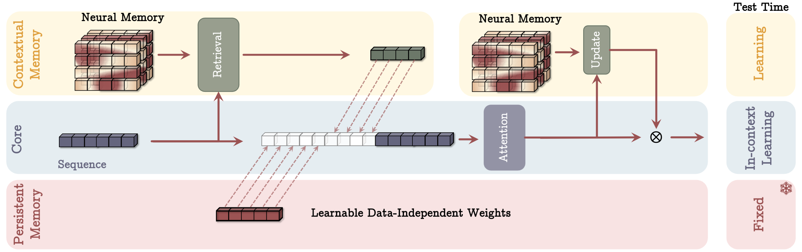
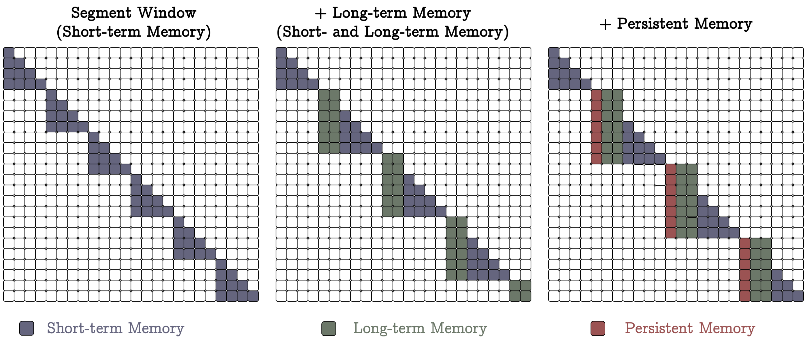
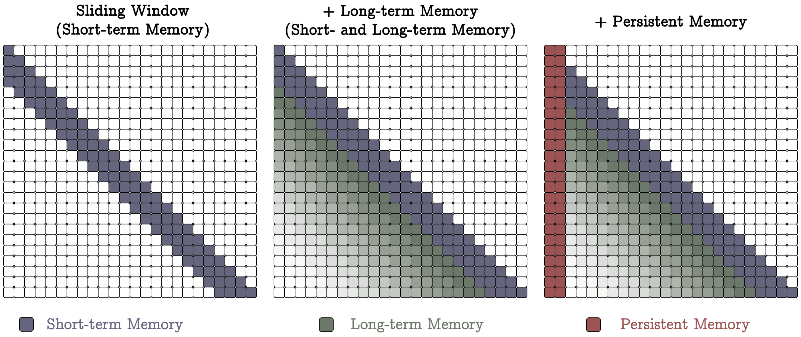
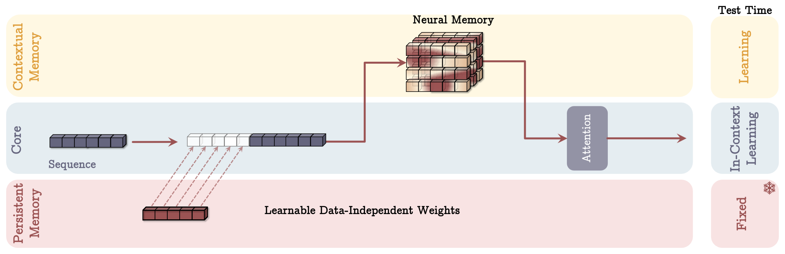
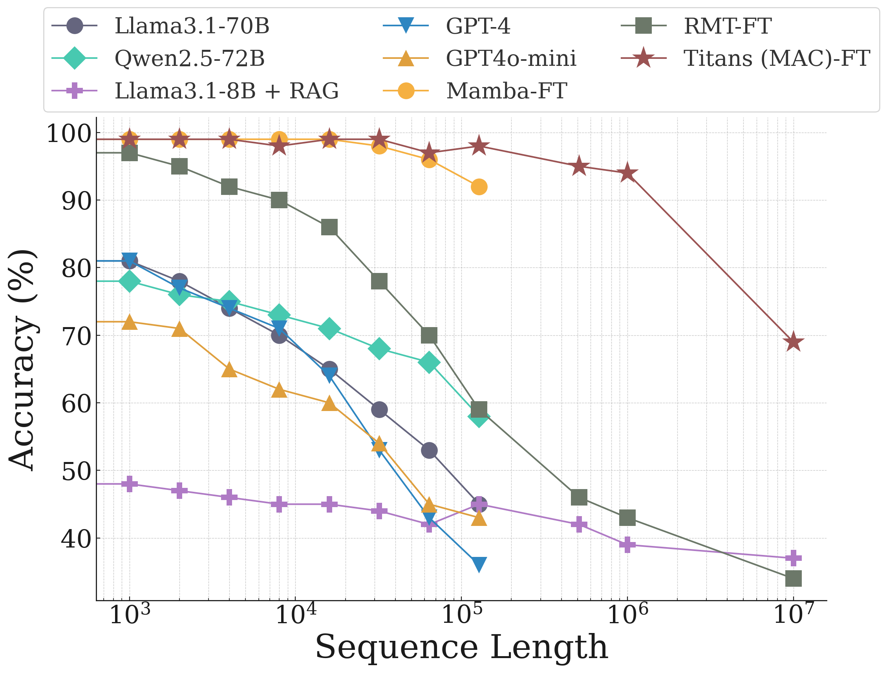
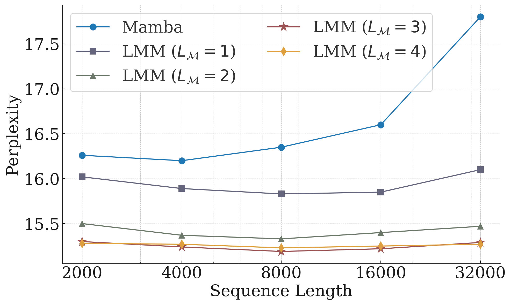

## Titans: Learning to Memorize at Test Time

### 一句话定位

Titans 是模型侧长期记忆路线里最“test-time learning”的一篇：它不把长期记忆保存成外部文本或 KV cache，而是设计一个会在测试时持续更新权重的 neural memory module，让 attention 负责短期上下文，neural memory 负责长期、可遗忘、可检索的历史信息。

### 基本信息

- **论文**：Titans: Learning to Memorize at Test Time
- **arXiv**：2501.00663
- **版本**：v1，2024-12-31 提交
- **作者**：Ali Behrouz, Peilin Zhong, Vahab Mirrokni
- **机构/项目**：Google Research
- **官方研究页**：[Google Research Publications](https://research.google/pubs/titans-learning-to-memorize-at-test-time/)
- **论文 PDF**：[source/Titans_2501.00663.pdf](source/Titans_2501.00663.pdf)
- **arXiv 源码包**：[source/Titans_2501.00663_src.tar.gz](source/Titans_2501.00663_src.tar.gz)
- **核心关键词**：test-time learning、neural long-term memory、associative memory、surprise、momentum、forgetting、MAC、MAG、MAL、persistent memory

### 摘要中文翻译

Transformer attention 能精确建模当前上下文里任意 token 之间的依赖，但代价是平方复杂度，因此上下文窗口有限；传统 recurrent model 推理高效，但会把历史压缩进固定大小 hidden state，容易丢失细节。Titans 提出一种 neural long-term memory module：它可以在测试时学习如何记住历史上下文，并辅助 attention 在处理当前上下文时利用更早的信息。

论文把 attention 理解成短期记忆：它准确但窗口有限；把 neural memory 理解成长期记忆：它把历史压缩进一个会更新的神经网络模块中，更持久。基于这两个模块，Titans 提出三种架构变体：Memory as Context、Memory as Gating、Memory as Layer。实验覆盖语言建模、常识推理、基因序列、时间序列和 needle-in-haystack，显示 Titans 比 Transformer 和多种现代线性 recurrent model 更有效，并且能在超过 2M 的上下文设置中保持更好的检索准确率。

### 研究问题

Titans 问的问题可以这样概括：

> 模型能不能不只是“把历史压进固定 hidden state”或“把历史都放进 attention window”，而是拥有一个会在测试时学习写入和遗忘的长期记忆模块？

传统路线有两个极端：

```text
Transformer attention:
  精确读取当前窗口
  但上下文长度受 O(n^2) 限制

RNN / linear recurrent models:
  推理高效
  但把全部历史压进固定大小状态，容易 memory overflow
```

Titans 的回答是：

```text
short-term memory:
  attention 负责当前局部上下文里的精确依赖

long-term memory:
  neural memory module 在测试时持续更新参数
  用 surprise / forgetting 机制决定写什么、忘什么
```

这里的“test-time learning”不是更新整个 LLM，而是在模型内部放一个专门的 memory module，它的参数在读序列时会发生在线更新。

### 我们讨论中的理解沉淀

Titans 和 LongMem / MSA 的差异非常大。

LongMem 和 MSA 都更像检索式 memory attention：

```text
历史文本 -> 预编码成 KV / latent memory
当前 query -> 检索相关 memory
模型 -> attend 到这些 memory
```

Titans 则是参数化 neural memory：

```text
历史 token -> 通过在线学习规则更新 memory module 权重
当前 query -> 对 memory module 做 forward
模型 -> 使用 memory forward 的输出
```

所以 Titans 的“记忆”不是外部 memory bank 中的一堆向量，而是一个会被历史输入改写的函数。更像：

```text
LongMem / MSA:
  我保存了很多历史激活，可以按需查。

Titans:
  我用历史数据训练了一个小记忆网络，现在它的参数本身携带了历史摘要。
```

这也是 Titans 最值得注意的地方：它把“记忆写入”明确变成了测试时在线优化问题。

### 核心方法

#### 1. Neural memory 是一个在线学习器

Titans 把长期记忆写成一个神经网络 `M_t`。这里的下标 `t` 表示：读到第 `t` 个 token 或 segment 后，memory module 的参数已经被历史更新过。

最朴素的写入规则是：

```text
M_t = M_{t-1} - theta_t * gradient(loss(M_{t-1}; x_t))
```

论文把这个 gradient 解释成 surprise：如果当前输入让 memory module 预测得很差，梯度就大，说明这个信息更“意外”，也更值得写入。

但只看瞬时 surprise 会有问题：一个重要事件发生后，后续一段内容可能都很重要，但它们的瞬时梯度不一定一直大。因此 Titans 引入 past surprise / momentum：

```text
S_t = eta_t * S_{t-1} - theta_t * gradient(loss(M_{t-1}; x_t))
M_t = M_{t-1} + S_t
```

其中：

- `S_t`：surprise 的动量，表示最近一段时间的记忆写入趋势；
- `eta_t`：surprise decay，决定过去 surprise 是否继续影响当前写入；
- `theta_t`：momentary surprise 的写入强度。

这些量是 data-dependent 的，模型可以根据当前 token 判断“这是不是同一个上下文里的延续”。

#### 2. Forgetting mechanism：用 weight decay 清理长期记忆

长期记忆如果只写不忘，一定会 overflow。Titans 加了一个自适应遗忘 gate：

```text
M_t = (1 - alpha_t) * M_{t-1} + S_t
```

其中 `alpha_t in [0, 1]`：

- `alpha_t` 接近 0：保留旧记忆，只做小幅更新；
- `alpha_t` 接近 1：强力遗忘旧记忆，相当于清理 memory。

这让 Titans 和很多线性 recurrent model 不同。它不仅有一个状态转移，还显式建模“什么时候应该忘掉旧东西”。

#### 3. Associative memory objective：把 key 映射到 value

Titans 的 memory module 学的是 key-value association。给定输入 `x_t`，先投影出：

```text
k_t = x_t W_K
v_t = x_t W_V
```

然后让 memory module 学会：

```text
M(k_t) ~= v_t
```

对应的 inner-loop loss 是：

```text
loss(M; x_t) = || M(k_t) - v_t ||^2
```

这和 attention 的 `K/V` 视角很统一：attention 把当前窗口里的 `K/V` 暂时放进上下文；Titans 把历史 `K -> V` 映射训练进一个长期 neural memory。

#### 4. Memory retrieval：读 memory 就是一次 forward

写入时更新 memory weights；读取时不更新权重，只做 forward。

```text
q_t = x_t W_Q
y_t = M^*(q_t)
```

这里 `M^*` 表示 forward without weight adjustment。也就是说：

- 写 memory：对 memory module 做在线优化；
- 读 memory：用当前 query 调用 memory module。

这和 LongMem / MSA 的检索差异很清楚：

```text
LongMem / MSA:
  q 和 memory keys 做相似度，选 top-k memory vectors。

Titans:
  q 输入一个已经被历史训练过的 memory network，输出 y。
```

#### 5. Deep memory：长期记忆不只是一个矩阵

很多 recurrent / linear attention 方法可以看成 matrix-valued memory，本质上接近在线线性回归。Titans 认为这太弱，因为历史依赖不一定是线性的。

所以 Titans 使用 MLP 作为 neural memory，且强调 `L_M >= 2` 的 deep memory 更有表达力。实验中也专门比较了 memory depth，发现更深的 memory 在长序列上 PPL 更好，但训练 throughput 会下降。

这是 Titans 的一个重要取舍：

```text
更深的 memory:
  表达力更强，长上下文更稳
  但训练/推理更贵
```

#### 6. Parallel training：把在线更新改写成 matmul / scan

测试时更新 memory 是天然串行的，但训练时如果完全按 token 顺序做 inner-loop 更新，会很慢。Titans 借鉴 TTT / mini-batch gradient descent 的并行化思路，把 chunk 内的 memory update 改写成矩阵乘法和 associative scan。

直觉上：

```text
原始形式:
  token 1 更新 M
  token 2 基于 M 更新
  token 3 再更新...

并行训练:
  把一个 chunk 内的梯度和 decay 系数张量化
  用 matmul / scan 一次算出更新效果
```

这部分是 Titans 能作为 sequence model 训练的关键，否则 test-time memory 的想法会卡在训练效率上。

#### 7. Persistent memory：输入无关的任务记忆

除了 contextual long-term memory，Titans 还加入 persistent memory：一组 learnable 但输入无关的参数，拼在序列前面。

它的作用有三层：

- 从 memory 视角看，它保存任务级别的抽象知识；
- 从 FFN 视角看，它像数据无关的 key-value memory；
- 从 attention 视角看，它缓解 causal attention 过度偏向初始 token 的问题。

可以理解为：

```text
long-term memory:
  当前序列相关，测试时会更新

persistent memory:
  任务相关，训练后固定，测试时不更新
```

### 三种 Titans 架构

#### 1. MAC: Memory as Context

MAC 把长期 memory 的输出当成当前 segment 的上下文。

流程是：

```text
当前 segment S_t
  -> 用 S_t 的 query 读取上一时刻 memory M_{t-1}
  -> 得到历史信息 h_t
  -> 拼接 [persistent memory; h_t; S_t]
  -> 做 attention
  -> 用 attention 输出更新 long-term memory
```

MAC 的核心是 attention 能同时看到：

- 当前 segment；
- 从 long-term memory 读出的历史；
- persistent memory。

因此 attention 可以判断哪些信息真的需要写入长期 memory。论文实验里，MAC 在长上下文任务上通常最强，尤其是 BABILong 这种需要跨远距离事实推理的任务。

#### 2. MAG: Memory as Gating

MAG 把 short-term attention 和 long-term memory 做成两个并行分支：

```text
branch 1:
  sliding window attention 处理局部上下文

branch 2:
  neural memory module 处理长期历史

output:
  gate(short-term output, memory output)
```

这个设计更像一个混合专家：attention 分支精确处理当前窗口，memory 分支提供长期信息，最后用 gate 合并。

MAG 的好处是结构直接、并行性较好；缺点是 attention 不能像 MAC 那样显式地把 memory 输出当上下文一起推理。

#### 3. MAL: Memory as Layer

MAL 是最常见的混合方式：把 memory module 当成网络中的一层，然后再接 sliding window attention。

```text
x
  -> memory layer
  -> sliding window attention
  -> output
```

论文认为 MAL 的缺点是模块之间更串行，表达力受每层处理能力限制，不能充分利用 attention 和 memory 的互补性。但它也更接近已有 hybrid sequence model 的设计，训练效率更好。

#### 4. LMM: memory without attention

论文还评估了单独的 neural memory module，称为 LMM 或 Titans (LMM)。这用于验证：即使没有 attention，长期 memory module 本身也应该是一个强 sequence model。

### 关键图表解读

#### MAC architecture



这张图展示 MAC 的三分支结构：core branch、contextual long-term memory、persistent memory。重点看 long-term memory 在测试时仍然学习，而 persistent memory 固定，attention 则负责当前上下文内的精确组合。

#### MAC attention mask



MAC 把 long-term memory token 和 persistent memory token 拼到当前 segment 前面，让当前 segment 的 attention 可以直接读这些 memory。

#### MAG attention mask



MAG 使用 sliding window attention 作为短期记忆，同时让 neural memory 作为长期分支，通过 gate 组合两者输出。

#### MAL architecture



MAL 把 memory module 当成一层来压缩历史，再交给 attention。它更像常见的 recurrent + attention hybrid stack。

#### BABILong fine-tuning



这张图对应 Titans 的长上下文推理 claim。作者用 BABILong 说明 MAC 在极长文档、多事实推理上强于多个大模型和 RAG baseline。

#### Deep memory



这组实验说明 memory depth 的作用：更深的 memory module 在长序列上 PPL 更好，但也带来效率开销。

### 实验与主要结果

论文评估了四类 Titans：

- Titans (LMM)：单独 neural memory module；
- Titans (MAC)：Memory as Context；
- Titans (MAG)：Memory as Gate；
- Titans (MAL)：Memory as Layer。

模型规模包括 170M、340M、400M、760M。训练使用 Llama 2 tokenizer，训练长度 4K tokens；前三个规模在 FineWeb-Edu 上训练 15B tokens，760M 训练 30B tokens。

主要结论：

- **语言建模和常识推理**：LMM 在非 hybrid 模型里表现最好；MAC/MAG/MAL 三个 hybrid 版本也超过多个 recurrent + attention baseline。
- **Needle-in-a-Haystack**：Titans 在 2K 到 16K 的 RULER S-NIAH 上随长度增长更稳定，作者认为得益于 momentum、forgetting 和 deep memory。
- **BABILong**：MAC 在更难的长文多事实推理上表现突出，论文强调它甚至强于一些大模型和 RAG baseline。
- **Deep memory ablation**：memory depth 增加时，长序列 PPL 更好，但 throughput 下降。
- **组件消融**：weight decay / forgetting、momentum、convolution、persistent memory 都有正贡献，其中 forgetting 和 momentum 尤其关键。
- **跨模态/跨任务**：Titans 也在 DNA modeling 和 time series forecasting 上做了实验，说明它不只是语言模型里的特化技巧。

### 和 LongMem / MSA / TTT 的关系

| 维度 | LongMem | MSA | Titans | TTT |
|---|---|---|---|---|
| 记忆形态 | cached `K/V` | compressed `K/V` + routing key | neural memory weights | test-time trained layer/state |
| 写入方式 | frozen backbone 编码后追加到 bank | 离线编码到 latent memory bank | inner-loop 更新 memory 参数 | test-time objective 更新隐藏层 |
| 读取方式 | query 检索 top-k `K/V` | router 选择 memory 后 sparse attention | memory forward `M(q)` | layer forward after test-time update |
| 遗忘机制 | 队列移除旧 `K/V` | memory selection / system 管理 | adaptive weight decay `alpha_t` | 取决于具体 TTT 设计 |
| 核心问题 | 如何读长历史 KV | 如何扩到 100M latent memory | 如何在测试时写入/遗忘长期记忆 | 如何把预测变成测试时学习 |

Titans 和 TTT 的血缘更近，因为它们都把序列建模变成 test-time optimization。但 Titans 的目标更明确：设计一个长期 neural memory，并给它加上 surprise momentum 和 forgetting。

Titans 和 LongMem/MSA 的关系则更像两条分叉：

```text
检索式 activation memory:
  LongMem -> MSA

参数化 test-time memory:
  TTT / DeltaNet / recurrent memory -> Titans
```

### 局限性

- 论文的模型规模主要是 170M 到 760M，和现代大 LLM 规模仍有距离。
- 测试时更新 memory 权重会带来工程复杂度：batching、cache、状态隔离、回滚、并发 serving 都更难。
- memory module 的状态管理还不是 Memory OS：它不解决用户级权限、删除、版本、冲突事实等问题。
- 长期记忆写入到参数里会带来隐私和可遗忘性问题；不像文本 memory 那样容易删除某条记录。
- 论文源码中表示计划开放代码；截至本笔记整理时，官方 arXiv 页面没有列出官方代码仓库。
- Titans 的强 claim 依赖特定 benchmark，真实 agent 任务中的动态知识更新、工具调用和多轮交互还需要额外验证。

### 放进 agent memory 体系里怎么理解

Titans 不像 Memory OS，也不像 RAG。它推进的是模型本体架构：

```text
记忆治理层：
  Memory OS、用户画像、事件、权限、删除、冲突处理

记忆读取/写入层：
  RAG、LongMem、MSA、Titans memory module

模型推理层：
  attention + memory 共同完成生成、推理、规划
```

LongMem/MSA 更像“读一个外部记忆池”；Titans 更像“模型内部有一个会被当前经历改写的长期记忆器”。

一个可能的未来组合是：

```text
Memory OS:
  管原始事实、权限、删除、版本

MSA / LongMem:
  从受治理的外部记忆中读取大量证据

Titans-style neural memory:
  在一次会话或任务过程中快速写入临时规律、状态和近期经验
```

### 我需要记住什么

- Titans 的核心不是检索 KV，而是 **test-time 更新 neural memory weights**。
- attention 被看成短期记忆；neural memory 被看成长期记忆。
- 写入 memory 的信号来自 surprise，也就是 associative memory loss 的梯度。
- momentum 让一段事件后的相关 token 也能被写入；forgetting gate 让旧记忆可以被清理。
- 读取 memory 是 `y = M^*(q)`，不是 top-k 检索。
- MAC / MAG / MAL 是三种把 memory 接进模型的方法，其中 MAC 更适合极长上下文，MAL 更像传统 hybrid stack。
- Titans 和 LongMem/MSA 属于不同路线：一个是参数化在线记忆，一个是检索式 activation memory。

### 资源清单

- arXiv 页面：[https://arxiv.org/abs/2501.00663](https://arxiv.org/abs/2501.00663)
- Google Research 页面：[https://research.google/pubs/titans-learning-to-memorize-at-test-time/](https://research.google/pubs/titans-learning-to-memorize-at-test-time/)
- PDF 原文：[source/Titans_2501.00663.pdf](source/Titans_2501.00663.pdf)
- arXiv 源码包：[source/Titans_2501.00663_src.tar.gz](source/Titans_2501.00663_src.tar.gz)
- 主要源码：[source/main.tex](source/main.tex)、[source/MainText/Methods.tex](source/MainText/Methods.tex)、[source/MainText/Experiments.tex](source/MainText/Experiments.tex)
- 原始论文图：[source/Figures/](source/Figures/)
- 图片索引：[images/index.md](images/index.md)
