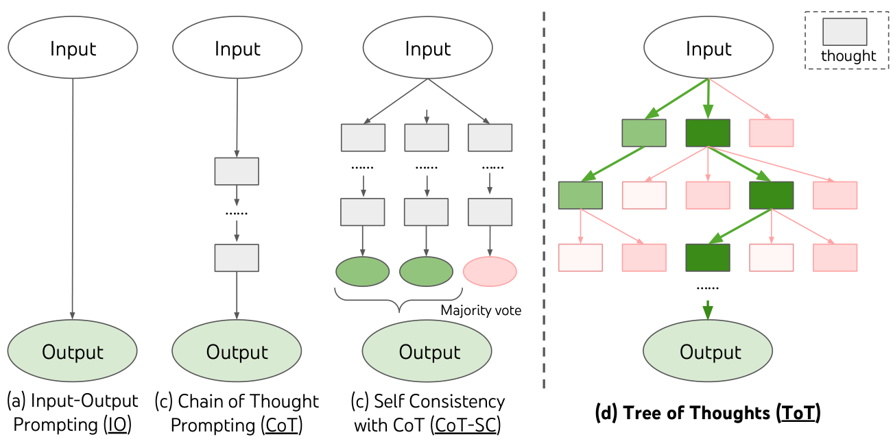
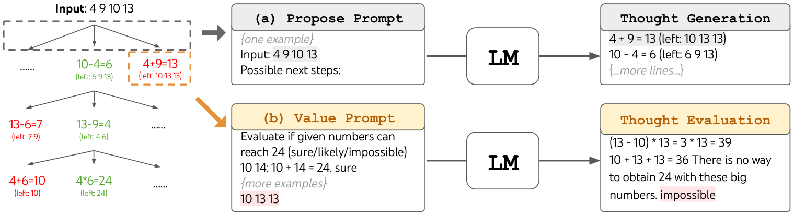
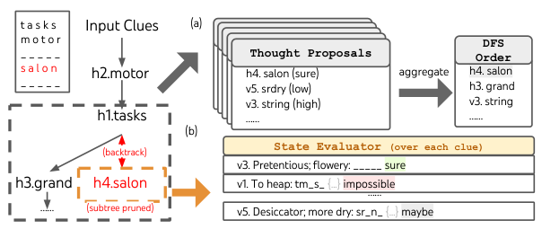

## Tree of Thoughts: Deliberate Problem Solving with Large Language Models

### 一句话定位

Tree of Thoughts 把 LLM 的推理从单条 Chain-of-Thought 扩展成可搜索、可评估、可回溯的 thought tree，让模型具备更显式的 deliberative search。

### 基本信息

- **论文**：Tree of Thoughts: Deliberate Problem Solving with Large Language Models
- **arXiv**：2305.10601
- **会议**：NeurIPS 2023
- **任务**：Game of 24、Creative Writing、Mini Crosswords
- **核心关键词**：Tree of Thoughts、Deliberate Search、State Evaluation、BFS、DFS、Backtracking、Search Memory

### 摘要中文翻译

语言模型越来越多地用于通用问题求解，但推理时仍主要受限于 token-level、从左到右的生成方式。这在需要探索、策略性前瞻或早期决策影响全局结果的任务上容易失败。Tree of Thoughts 提出一种新的推理框架，把 CoT 中的单条思路推广为由多个“thought”组成的搜索树。模型可以生成多个候选 thought，评估不同状态，选择下一步搜索方向，并在必要时回溯。实验显示，ToT 在 Game of 24、Creative Writing、Mini Crosswords 上显著提升 GPT-4 的问题求解能力，例如 Game of 24 中 CoT 只解出 4%，ToT 达到 74%。

### 研究问题

CoT 的问题不是没有中间步骤，而是中间步骤通常只有一条路。一旦前几步选错，后续生成会被锁死。

ToT 问的是：

> 能否把 LLM 的中间推理显式外部化为一个搜索空间，让模型生成、评估和回溯多个候选路径？

从 memory layer 看，ToT 把“正在思考的候选状态”变成外部数据结构。它不是长期记忆，而是 planning/search working memory。

### 核心方法

ToT 把问题定义为树搜索。一个状态是：

```text
s = [x, z1, z2, ..., zi]
```

其中 `x` 是输入，`z1...zi` 是已经生成的 thought 序列。

一个 ToT 实例需要回答四个问题：

1. **Thought decomposition**：把任务拆成多大粒度的 thought。Game of 24 中 thought 可以是一行算式；Creative Writing 中 thought 可以是一段写作计划。
2. **Thought generation**：从当前状态生成多个候选 thought。可以独立 sample，也可以一次 propose 多个候选。
3. **State evaluation**：用 LLM 给候选状态打分、分类或投票。Game of 24 可以判断 sure/likely/impossible；写作任务可以在多个方案间投票。
4. **Search algorithm**：用 BFS、DFS 或其他算法维护 frontier、剪枝和回溯。

本质上，ToT 把 LLM 从“下一个 token 预测器”包装成三个角色：候选生成器、状态评估器、搜索控制器。

初读时容易卡住的几个点：

- ToT 确实很像搜索里的 BFS/DFS，也有点像强化学习里的 trajectory，但它更准确地说是 **LLM-guided heuristic search**。RL trajectory 通常是 `state -> action -> environment transition -> reward`，ToT 则是 `当前 thought state -> 生成候选 thought -> 评估候选状态 -> 搜索/剪枝/回溯`。它没有训练 policy，也没有真实环境给 reward。
- 这里为什么还叫 **Thought**？因为树上的节点不是最终给用户看的答案，也不是单个 token，而是有语义粒度的中间思考单元。Game of 24 里 thought 可以是一行算式，Creative Writing 里 thought 可以是一段写作计划，Crossword 里 thought 可以是一个候选填法。
- **Evaluation 不是剪枝算法本身，而是剪枝用的估值函数**。它更像 heuristic/value function，负责判断某个 partial state 还有没有希望；真正的保留、剪掉、回溯，是 BFS/DFS 等 search algorithm 根据 evaluation 做出的动作。
- 标准 ToT 在工程里没有普通 CoT 那么常用，因为成本高、慢、需要人工设计 thought 粒度，而且 LLM 自评可能误判。但 ToT-like 的套路很常见：生成多个候选、用 verifier/reranker/critic 打分、保留更好的分支。
- 如果看到模型输出到一半说“等等，我刚才错了”，那通常不是论文意义上的 ToT，而是 **visible self-correction**。它已经进入最终输出流了。ToT 的 thought 更像草稿纸上的候选路线，通常在内部被搜索和筛选，最后只把选中的答案给用户。
- CoT 最初强调的是“把推理写成一条链”：`x -> step1 -> step2 -> answer`。它可以在链内自我修正，也可以通过 self-consistency 多采样投票，但没有显式机制管理多个中间候选、比较中间状态、剪枝和回溯。ToT 的升级点正是把单链推理变成可搜索的树。

### 关键图表解读

#### 从 IO/CoT 到 ToT



这张图展示了三种推理形态：直接输入输出、单链 CoT、多分支 ToT。ToT 的核心是把 thought 作为可管理节点，而不是让模型在一条不可回退的链上继续写。

#### Game of 24 搜索过程



Game of 24 是 ToT 最有代表性的例子。每个 thought 是一步算式，状态包含剩余数字。模型不仅生成下一步，还评估该状态是否可能到达 24，并剪掉不可能分支。

#### Mini Crosswords 搜索



Mini Crosswords 展示了 DFS/backtracking 的价值。模型尝试填词、评估剩余线索是否可行，发现不可能时回溯。这和普通 CoT 的“错了也继续编”形成鲜明对比。

### 关键贡献

1. **提出 thought-level search**：让推理单位从 token 或完整答案变成可评估的中间状态。
2. **把 LLM 同时用于生成和启发式评价**。
3. **给出 BFS/DFS 两种简单实例化**。
4. **证明在需要规划/搜索的任务上大幅超过 CoT**。

### 实验与结论

在 Game of 24 上，GPT-4 + CoT 的成功率很低，论文报告只有 4%，而 ToT 达到 74%。这是因为 Game of 24 对早期步骤非常敏感，需要探索多条组合路径。

在 Creative Writing 中，ToT 通过生成多个写作计划并投票选择，让文章整体连贯性更好。Mini Crosswords 中，ToT 通过 DFS 和剪枝处理组合约束。

实验说明：当任务需要全局搜索、候选比较或回溯时，增加“思考长度”不如增加“思考分支和评价机制”。

### 局限性

- 成本高，需要多次生成和评估。
- thought 粒度需要人工设计，不同任务差异很大。
- LLM 评价器可能不可靠，错误打分会误剪枝。
- 主要适合离散搜索或可拆中间状态任务。
- 不是一个完整 agent 框架，没有环境 observation 或长期 memory。

### 放进大模型基础知识体系里怎么理解

ToT 是 LLM 推理的搜索层。它告诉我们：推理 memory 不一定是向量库，也可以是“候选状态 + 分数 + frontier + 回溯路径”。

如果 ReAct 是环境交互轨迹，ToT 是内部候选计划树。复杂 agent 往往需要二者结合：对外用 ReAct 获取 observation，对内用 ToT 规划和比较方案。

### 我需要记住什么

- ToT = thought decomposition + generation + evaluation + search。
- 它解决的是 CoT 单路径不可回退的问题。
- Evaluation 是给剪枝/回溯提供依据的估值函数，不是剪枝动作本身。
- ToT 的 thought 是内部候选思考状态；可见的“等等我错了”更像输出流里的自我纠正。
- 在 memory layer 中，它代表 search-state memory，而不是长期经验记忆。
