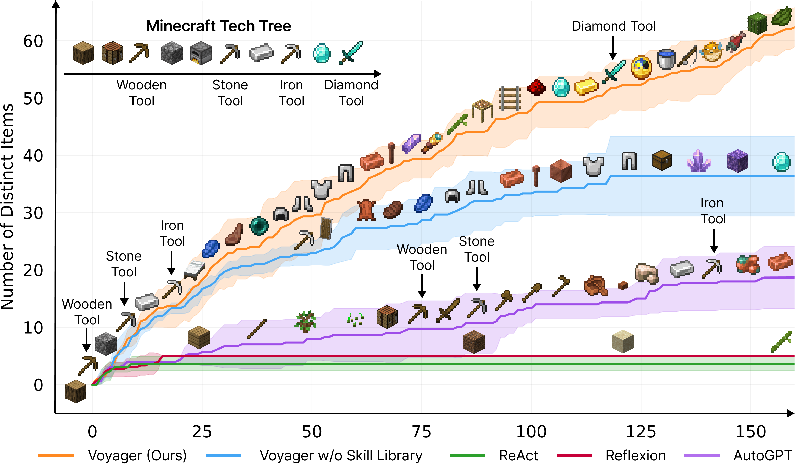
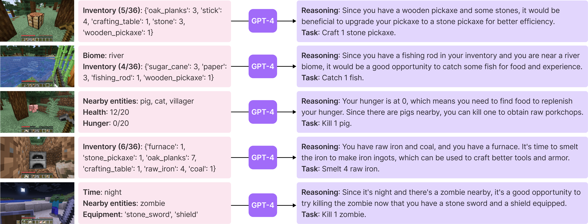
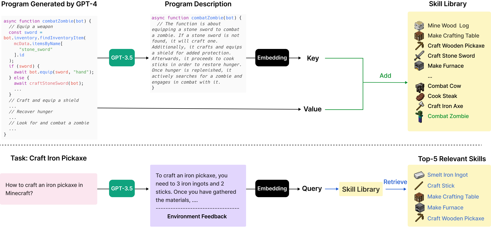
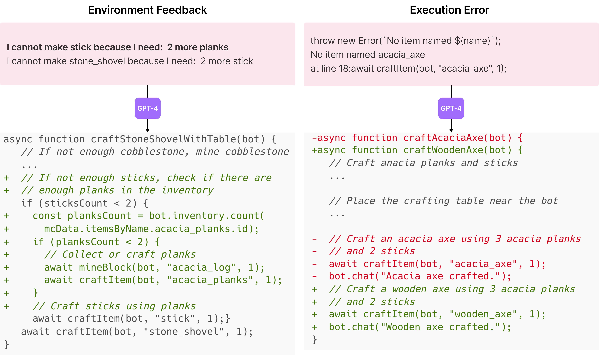
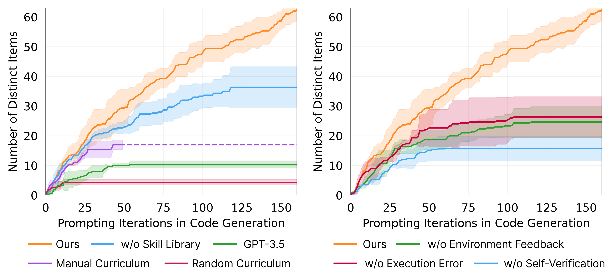

## Voyager: An Open-Ended Embodied Agent with Large Language Models

### 一句话定位

Voyager 把 LLM agent 的长期记忆从“文本经验”推进到“可执行技能库”：在 Minecraft 中持续探索、写代码技能、复用技能并形成能力复利。

### 基本信息

- **论文**：Voyager: An Open-Ended Embodied Agent with Large Language Models
- **arXiv**：2305.16291
- **期刊**：TMLR 2024
- **环境**：Minecraft / MineDojo / Mineflayer
- **任务**：开放世界 lifelong learning、探索、合成、技能获取、零样本迁移
- **核心关键词**：Automatic Curriculum、Skill Library、Iterative Prompting、Embodied Agent、Procedural Memory

### 摘要中文翻译

Voyager 是一个由 LLM 驱动的 Minecraft lifelong learning agent。它不用人工干预，持续探索世界、学习技能并发现新物品。系统包含三个核心组件：自动课程，用于提出适合当前能力边界的新任务；不断增长的可执行代码技能库，用于保存和检索复杂行为；迭代 prompting，用环境反馈、执行错误和自我验证来改进程序。Voyager 不微调模型，只通过 GPT-4 黑盒调用工作。实验显示，它获得的独特物品数量是强基线的 3.3 倍，移动距离是 2.3 倍，关键科技树里程碑最高快 15.3 倍，并能把学到的技能迁移到新世界的新任务。

### 研究问题

ReAct 和 Reflexion 能让 agent 一轮轮行动和反思，但在开放世界中还不够。Minecraft 这样的环境需要 agent 长期积累可复用能力：砍树、做木镐、挖石头、做铁工具、挖钻石。这些不是一次性文本教训，而是可组合程序。

Voyager 问的是：

> LLM agent 能不能在开放环境里持续学习，并把成功经验沉淀成可执行、可检索、可组合的技能记忆？

### 核心方法

Voyager 有三个模块。

#### 1. Automatic curriculum

GPT-4 根据 agent 当前状态、背包、附近实体、已完成任务和失败任务，提出下一个“刚好有挑战但不太难”的目标。目标不是固定脚本，而是根据探索进度动态生成。

这解决开放世界中的探索问题：如果目标太难，agent 会卡住；如果目标太简单，技能库不会增长。

#### 2. Skill library

每个成功任务会被封装成一个 JavaScript/ Mineflayer 代码函数，并按描述 embedding 建索引。之后遇到新任务，Voyager 会根据 task plan 和环境反馈检索相关技能，作为 in-context examples 和可调用代码。

这就是 Voyager 最重要的 memory 设计：memory 不是“我曾经做过什么”，而是“我现在会调用什么”。

#### 3. Iterative prompting

每轮代码生成后，Voyager 执行程序并收集三类反馈：

- environment feedback：例如缺少多少铁锭；
- execution errors：语法错误、API 调用错误；
- self-verification：另一个 GPT-4 critic 判断任务是否完成，并给出失败原因。

如果失败，反馈被放回 prompt 继续修代码；如果成功，技能进入 skill library。若多轮失败，则 curriculum 换任务。

### 关键图表解读

#### 主实验结果

图中展示 Voyager 在发现物品数量上持续增长，而 ReAct、Reflexion、AutoGPT 很快停滞。原因是 Voyager 有 curriculum 推动探索，也有 skill library 让能力累积。

#### 自动课程

这张图说明 curriculum 不是静态任务列表，而是结合当前状态、已完成/失败任务和额外上下文动态提出目标。它承担了“下一步该学什么”的元控制。

#### 技能库

技能库是 Voyager 的长期程序记忆。技能以代码形式保存，可以被检索、组合和复用。对 agent memory 来说，这是从 declarative memory 到 procedural memory 的关键转变。

#### 反馈闭环

反馈图展示环境反馈和执行错误如何进入下一轮代码生成。这里的 prompt history 类似 Self-Refine，但产物不是自然语言答案，而是可执行程序。

#### 消融实验

这张图对应论文的 ablation study。横轴是代码生成/修正的 prompting iteration，纵轴是发现的 distinct items 数量。

左图比较 automatic curriculum、skill library 和 GPT-4 代码生成能力。完整 Voyager 持续增长；去掉 skill library 后，前期还能靠 GPT-4 写代码推进，但后期明显 plateau，因为复杂任务需要复用和组合旧技能；随机课程最差，论文报告 discovered item count 下降 93%，说明开放世界探索里“下一步学什么”非常关键。

右图比较 iterative prompting 中不同反馈源。self-verification 的影响最大，去掉后发现物品数下降 73%。原因是 execution errors 只能说明代码有没有 crash，environment feedback 只能说明环境发生了什么；self-verification 额外判断“任务到底完成没有”，并决定应该继续修代码、重试，还是把成功代码加入 skill library 后切到新任务。

### 关键贡献

1. **提出开放世界 LLM lifelong agent**：无需人工任务脚本即可持续探索。
2. **把 skill library 作为长期程序化记忆**。
3. **用 automatic curriculum 驱动能力边界增长**。
4. **用 execution feedback + self-verification 改进代码技能**。

### 实验与结论

Voyager 在 Minecraft 中显著超过 ReAct、Reflexion 和 AutoGPT 风格基线：

- 发现 63 个 unique items，是对照方法的 3.3 倍；
- 移动距离是基线的 2.3 倍；
- 科技树中，木制、石制、铁制工具阶段分别最高快 15.3、8.5、6.4 倍，并且只有 Voyager 解锁钻石层级；
- 在新世界的新任务中，Voyager 能用旧技能库完成任务，其他基线基本无法在 50 次 prompting iteration 内成功。

消融表明，automatic curriculum、skill library 和 self-verification 都很关键：

- **Automatic curriculum 决定学什么**。开放世界探索不是随机给目标就行，目标必须贴近 agent 当前能力边界。太难会卡住，太简单不会增长。论文中 random curriculum 让 discovered item count 下降 93%。
- **Skill library 决定学到的东西能不能复用**。没有技能库时，agent 每次更像从零写代码，前期还能推进，后期复杂任务需要组合旧技能时就容易停滞。技能库让 `craftWoodenPickaxe` 这类成功程序成为后续技能的积木。
- **Self-verification 决定什么时候算学会了**。执行错误只能判断程序是否报错，不能判断 Minecraft 任务是否真的完成。self-verification 让 GPT-4 critic 根据当前状态判断成功/失败，并给出 critique；去掉后 discovered item count 下降 73%。

可以把三者记成 lifelong agent 的三个问题：下一步挑战什么、成功经验怎么保存、什么时候把一次尝试记为成功技能。

### 局限性

- 依赖 GPT-4 强代码生成能力，GPT-3.5 效果明显下降。
- 依赖高层 Mineflayer API，不解决低层视觉和运动控制。
- 技能库检索和命名质量会影响复用。
- self-verification 仍可能误判任务是否完成。
- Minecraft 成功不等于真实机器人环境可直接迁移。

### 放进大模型基础知识体系里怎么理解

Voyager 是 agent memory 的重要跃迁：长期记忆不一定是文本、向量和摘要，也可以是可执行程序。它更接近人类的程序性记忆：会骑车、会开门、会做工具。

它和 Reflexion 的关系是：Reflexion 存“下次别这样”的文字教训，Voyager 存“下次直接调用这个函数”的技能。

### 我需要记住什么

- Voyager = automatic curriculum + skill library + iterative prompting。
- Skill library 是 procedural memory，非常适合代码 agent、工具 agent 和机器人 agent。
- 能力复利来自成功技能的可组合复用，而不是单次 prompt 更聪明。
