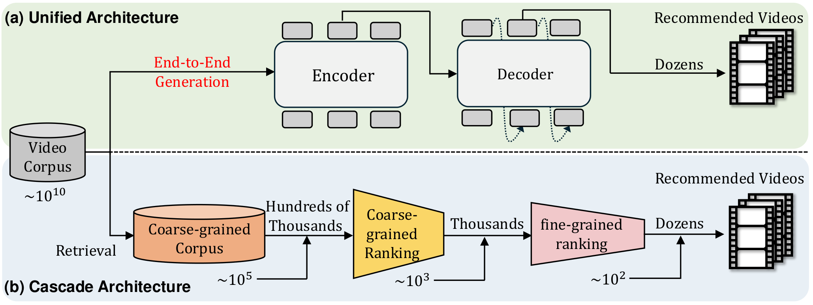
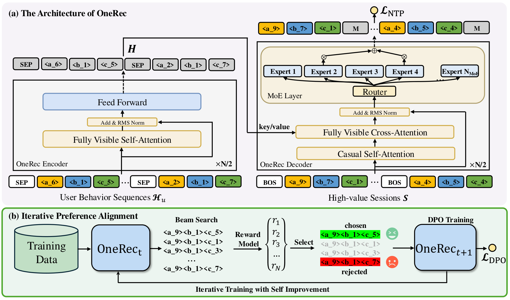
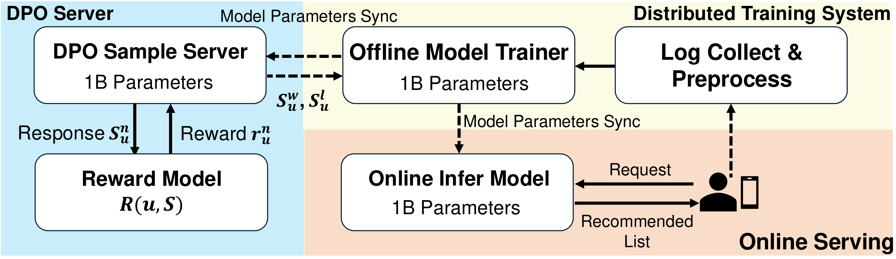
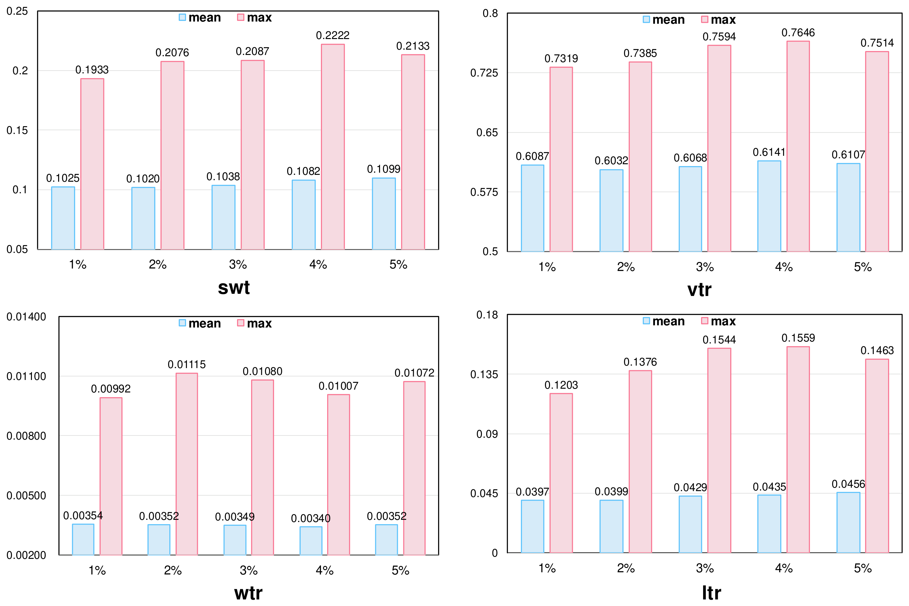
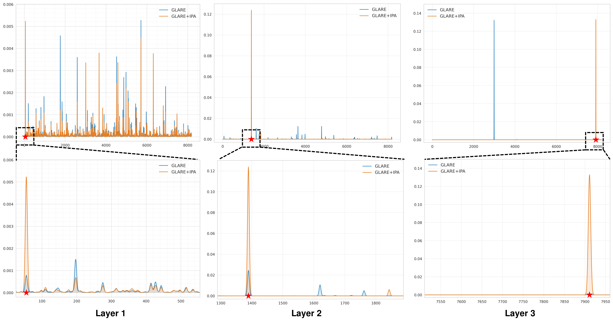
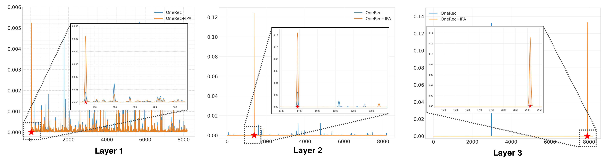

## OneRec: Unifying Retrieve and Rank with Generative Recommender and Iterative Preference Alignment

### 一句话定位

OneRec 把推荐系统传统的“召回-粗排-精排”级联架构，改造成一个端到端的生成式推荐模型：直接根据用户历史行为生成一整个推荐 session，并用类似 LLM 对齐中的 DPO 做偏好对齐。

> 依据说明：以下笔记基于摘要、TeX 正文摘录、给出的离线表格和一张 DPO 比例实验图；不是完整全文逐页精读。

### 基本信息

- 论文：**OneRec: Unifying Retrieve and Rank with Generative Recommender and Iterative Preference Alignment**
- arXiv：2502.18965
- 作者：Jiaxin Deng, Shiyao Wang, Kuo Cai, Lejian Ren, Qigen Hu, Weifeng Ding, Qiang Luo, Guorui Zhou
- 机构：Kuaishou
- 发布时间：2025-02-26
- 关键词：
  - Generative Recommendation
  - Autoregressive Generation
  - Semantic Tokenization
  - Session-wise Generation
  - Mixture-of-Experts, MoE
  - Direct Preference Optimization, DPO
  - Iterative Preference Alignment, IPA

### 摘要中文翻译

近期，基于生成式检索的推荐系统开始受到关注：模型以自回归方式直接生成候选视频。但现代推荐系统通常仍采用“召回-排序”的级联架构，生成模型大多只在召回阶段充当 selector，无法替代完整的排序链路。

本文提出 **OneRec**，用一个统一的生成模型替代级联学习框架。它包含三部分：

1. **Encoder-Decoder 架构**：编码用户历史行为序列，逐步解码用户可能感兴趣的视频；使用稀疏 **MoE** 扩大模型容量，同时控制 FLOPs。
2. **Session-wise Generation**：不是传统 next-item prediction，而是一次生成一个 session 内的视频列表，使推荐列表更连贯，减少人工规则拼接。
3. **Iterative Preference Alignment + DPO**：由于推荐系统一次请求通常只能展示一组结果，无法像 NLP 那样同时获得正负反馈，作者训练 reward model 模拟用户偏好，并设计采样策略构造偏好对，迭代优化生成质量。

在线部署在快手主场景后，OneRec 带来 **1.6% watch-time 提升**。

### 研究问题

#### 1. 传统级联推荐的问题

工业推荐通常是：

```text
Retrieval → Pre-ranking → Ranking
```

每一阶段都从上一阶段候选集中选 top-k。

问题：

- 后一阶段的上限受前一阶段限制；
- 每个 ranker 单独训练，目标不完全一致；
- 系统复杂，维护成本高；
- 生成式模型目前多只用于召回，精度无法替代复杂 ranker。

OneRec 试图回答：

> 能否用一个生成模型同时完成召回和排序，直接生成最终推荐列表？

#### 2. 生成式推荐的基础难点

把推荐变成生成任务，需要解决：

- item 如何表示成 token？
- 用户历史如何编码？
- 推荐列表如何生成，而不是只预测下一个 item？
- 如何让生成结果符合用户真实偏好？
- 如何在工业规模下扩大模型容量并控制推理成本？

### 核心方法

#### 1. 整体框架

OneRec 分两阶段：

```text
Stage 1: Session-wise Training
用户历史行为 → Encoder → Decoder 生成目标 session

Stage 2: Iterative Preference Alignment, IPA
当前模型生成多个 session → Reward Model 打分 → 构造偏好对 → DPO 迭代优化
```

输入：

$$
H_u = \{v_1^h, v_2^h, ..., v_n^h\}
$$

表示用户有效观看、点赞、关注、分享等历史行为。

输出：

$$
S = \{v_1, v_2, ..., v_m\}
$$

表示一次请求返回的一组短视频 session，通常包含 5 到 10 个视频。

---

#### 2. Item Semantic Tokenization

视频先被表示成多模态 embedding：

$$
e_i \in \mathbb{R}^d
$$

然后通过多层残差量化生成 semantic ID：

$$
(s_i^1, s_i^2, ..., s_i^L)
$$

每个视频不再是一个巨大 item ID，而是一串语义 token。

第 $l$ 层残差量化：

$$
s_i^l = \arg\min_k \|r_i^l - c_k^l\|_2^2
$$

$$
r_i^{l+1} = r_i^l - c_{s_i^l}^l
$$

其中：

- $C_l = \{c_1^l, ..., c_K^l\}$ 是第 $l$ 层 codebook；
- $L$ 是 semantic ID 层数；
- $K$ 是每层 codebook size。

作者没有直接用普通 RQ-VAE，而是强调 **Balanced K-means**，避免 code 分布不均，即所谓 hourglass phenomenon。

Balanced K-means 的目标：

> 每个 cluster 分到相同数量的视频，避免少数 token 过热、多数 token 无效。

---

#### 3. Session-wise List Generation

传统方法多做 point-wise next-item prediction：

$$
p(v_{t+1} \mid v_1, ..., v_t)
$$

OneRec 改成生成整个 session：

$$
S := M(H_u)
$$

也就是：

$$
H_u \rightarrow \{v_1, v_2, ..., v_m\}
$$

优点：

- 模型能学习 session 内 item 的相对关系；
- 能同时考虑兴趣、连贯性、多样性；
- 不需要大量手工规则把单点预测结果拼成列表；
- 更接近真实推荐系统一次请求返回一批视频的机制。

训练数据选取高质量 session，例如：

- 用户实际观看数量 $\geq 5$；
- session 总观看时长超过阈值；
- 有点赞、收藏、分享等交互。

---

#### 4. Encoder-Decoder 生成模型

架构类似 T5：

```text
用户历史 semantic IDs → Transformer Encoder
目标 session semantic IDs → Transformer Decoder autoregressive generation
```

编码：

$$
H = Encoder(H_u)
$$

解码端按 semantic token 自回归生成。

目标 session 会被展开为：

$$
\tilde{S} =
[s_{BOS}, s_1^1, ..., s_1^L,
s_{BOS}, s_2^1, ..., s_2^L,
...,
s_{BOS}, s_m^1, ..., s_m^L]
$$

训练目标是 next-token prediction：

$$
\mathcal{L}_{NTP}
= - \sum_{i=1}^{m} \sum_{j=1}^{L}
\log P(s_i^j \mid H_u, s_{<i,<j})
$$

本质上：

> 把推荐列表生成建模成条件语言建模，只是词表从自然语言 token 换成 item semantic token。

---

#### 5. MoE 扩容

作者认为推荐模型也遵循类似 LLM 的 scaling law：容量越大，兴趣建模能力越强。

但直接扩大 dense model 成本高，所以在 decoder FFN 中使用 sparse MoE：

$$
H_t^{l+1}
=
\sum_{i=1}^{N_{MoE}}
g_{i,t} FFN_i(H_t^l)
+
H_t^l
$$

gate：

$$
s_{i,t} = Softmax_i((H_t^l)^T e_i^l)
$$

只激活 top-$K_{MoE}$ 个专家：

$$
g_{i,t} =
\begin{cases}
s_{i,t}, & s_{i,t} \in TopK \\
0, & otherwise
\end{cases}
$$

意义：

- 参数量变大；
- 每个 token 只经过少数专家；
- 计算量不随参数量线性增长；
- 适合工业推荐的大模型化。

---

#### 6. Reward Model

推荐系统不像 NLP，可以让人同时比较两个回答。一次推荐请求通常只展示一组结果，无法天然得到 winner/loser pair。

所以作者训练一个 session-wise Reward Model：

$$
R(u, S) \rightarrow r
$$

表示用户 $u$ 对 session $S$ 的偏好分数。

RM 流程：

1. 对 session 中每个 item 做 target-aware 表征：

$$
e_i = v_i \otimes u
$$

2. session 内 item 通过 self-attention 交互：

$$
h_f = SelfAttention(hW_s^Q, hW_s^K, hW_s^V)
$$

3. 多目标 tower 预测：

$$
r^{swt}, r^{vtr}, r^{wtr}, r^{ltr}
=
Tower(Sum(h_f))
$$

其中可能对应：

- swt：session watch time
- vtr：view-through rate / 有效观看相关指标
- wtr：watch-time rate
- ltr：like-through rate

训练 loss 是多目标 BCE：

$$
\mathcal{L}_{RM}
=
-\sum_{x \in \{swt, vtr, wtr, ltr\}}
\left[
y^x \log r^x + (1-y^x)\log(1-r^x)
\right]
$$

---

#### 7. Iterative Preference Alignment, IPA

IPA 是 OneRec 的偏好对齐阶段。

对每个用户，用当前模型 $M_t$ 生成 $N$ 个候选 session：

$$
S_u^n \sim M_t(H_u), \quad n \in [N]
$$

用 RM 打分：

$$
r_u^n = R(u, S_u^n)
$$

选最高分为 winner：

$$
S_u^w = \arg\max_{S_u^n} R(u, S_u^n)
$$

选最低分为 loser：

$$
S_u^l = \arg\min_{S_u^n} R(u, S_u^n)
$$

构造偏好对：

$$
D_t^{pairs} = (S_u^w, S_u^l, H_u)
$$

再用 DPO 优化。

标准 DPO 形式可理解为：

$$
\mathcal{L}_{DPO}
=
-\log \sigma
\left(
\beta
\left[
\log \frac{\pi_\theta(S^w|H_u)}{\pi_{ref}(S^w|H_u)}
-
\log \frac{\pi_\theta(S^l|H_u)}{\pi_{ref}(S^l|H_u)}
\right]
\right)
$$

其中：

- $\pi_\theta$ 是当前待训练模型；
- $\pi_{ref}$ 是参考模型，通常是上一轮模型或 seed model；
- $S^w$ 是 RM 认为更好的 session；
- $S^l$ 是 RM 认为更差的 session。

最终训练：

$$
\mathcal{L}
=
\mathcal{L}_{NTP}
+
\mathcal{L}_{DPO}
$$

为了降低 beam search 构造样本成本，作者不是所有样本都做 DPO，而是按比例 $r_{DPO}$ 抽样。

### 关键图表解读

#### 原始图表

##### 图 1：OneRec 生成式推荐框架



##### 图 2：训练与偏好对齐流程



##### 图 3：模型结构或语义 token 机制



##### 图 4：DPO / IPA 相关实验



##### 图 5：实验结果图



##### 图 6：补充实验图



#### Fig. 1：统一生成式架构 vs 传统级联架构

图意：

```text
传统：
Retrieval → Pre-ranking → Ranking → Final list

OneRec：
User history → One generative model → Final session
```

核心差异：

- 传统架构是多模型、多阶段、逐级过滤；
- OneRec 是单模型、端到端、直接生成最终列表；
- 论文的基础问题就是：能否让生成模型不仅做召回，还承担排序决策。

---

#### Fig. 2：OneRec 总体框架

图中分两阶段：

1. **Session Training**
   - 用高质量 session 训练 encoder-decoder；
   - 学习如何生成一组推荐视频；
   - loss 是 next-token prediction。

2. **IPA Stage**
   - 当前模型生成多个候选 session；
   - reward model 评估；
   - 选最好和最差构成 preference pair；
   - 用 DPO 进一步对齐用户偏好。

---

#### 给出的柱状图：DPO 数据比例实验

图中横轴是 DPO 样本比例：1%、2%、3%、4%、5%。

指标包括：

- swt
- vtr
- wtr
- ltr

每个指标有 mean 和 max。

主要观察：

- **swt**：mean 从 1% 的 0.1025 提升到 5% 的 0.1099；max 在 4% 达到 0.2222。
- **vtr**：max 在 4% 达到 0.7646，mean 也在 4% 较高。
- **wtr**：不随 DPO 比例单调提升，2% max 最高。
- **ltr**：mean 随比例总体提升，5% 达到 0.0456；max 在 4% 达到 0.1559。

结论：

> 少量 DPO 样本已经能显著改善生成质量，但比例不是越大越好；4% 左右在多个指标上表现较优，说明偏好对齐需要控制强度。

### 关键贡献

1. **统一 retrieve and rank**
   - 不是让生成模型只做召回；
   - 而是直接生成最终推荐 session。

2. **把推荐建模成 session-level autoregressive generation**
   - 从 next-item prediction 升级为 list/session generation；
   - 更符合实际推荐系统一次返回一批内容的场景。

3. **Balanced semantic tokenization**
   - 用 semantic ID 表示视频；
   - 通过 balanced K-means 缓解 code 分布不均。

4. **MoE 推荐大模型化**
   - 用 sparse MoE 扩容；
   - 在不同比例增加 FLOPs 的情况下提升模型容量。

5. **将 DPO 改造到推荐系统**
   - 用 Reward Model 构造偏好对；
   - 用 self-hard negative，即模型自己生成的差结果作为 hard negative；
   - 形成 Iterative Preference Alignment。

6. **工业级在线验证**
   - 在快手主场景部署；
   - watch-time 提升 1.6%。

### 实验与结论

#### 离线结果

对比方法包括：

- Pointwise discriminative：
  - SASRec
  - BERT4Rec
  - FDSA
- Pointwise generative：
  - TIGER-0.1B
  - TIGER-1B
- Listwise generative：
  - OneRec-0.1B
  - OneRec-1B
- Preference alignment：
  - OneRec-1B + DPO
  - IPO / cDPO / rDPO / CPO / simPO / S-DPO 等

主要结论：

1. **生成式方法优于传统判别式序列推荐**
   - TIGER 明显超过 SASRec、BERT4Rec、FDSA。

2. **OneRec 优于 TIGER**
   - 说明 session-wise list generation 比 pointwise generation 更适合工业推荐列表生成。

3. **扩大模型规模有收益**
   - OneRec-1B 通常优于 OneRec-0.1B；
   - 支持推荐模型 scaling 的观点。

4. **DPO 类偏好对齐进一步提升**
   - OneRec-1B + DPO 在 watch-time 类指标上表现强；
   - S-DPO 在部分指标如 swt mean 上也很强；
   - 说明偏好对齐对生成推荐质量有实际帮助。

#### 在线结果

论文称在快手主场景上线后：

$$
\text{Watch-time} + 1.6\%
$$

在大规模推荐系统中，1% 级别 watch-time 提升通常已经是显著收益。

### 局限性

1. **高度依赖工业数据和系统**
   - 快手短视频场景有极大规模行为数据；
   - 中小规模推荐系统未必能复现。

2. **Reward Model 可能引入偏差**
   - IPA 的 preference pair 来自 RM，而非真实用户同时比较；
   - 如果 RM 偏了，DPO 会放大这种偏差。

3. **生成式推理成本仍需关注**
   - session 生成需要 autoregressive decoding 和 beam search；
   - 虽然 MoE 控制计算，但延迟压力仍可能较大。

4. **Semantic ID 维护成本高**
   - 视频库动态变化时，需要处理新 item tokenization、codebook 更新、分布漂移。

5. **DPO 比例敏感**
   - 图中不同指标最优比例不同；
   - 说明偏好对齐强度需要调参，不是简单加数据即可。

6. **细节披露有限**
   - 摘录中未完整展示线上系统延迟、吞吐、召回覆盖率、冷启动处理等工程细节。

### 放进大模型基础知识体系里怎么理解

这篇论文可以看作：

> 把 LLM 的“tokenization + seq2seq generation + scaling + MoE + preference alignment”迁移到推荐系统。

对应关系：

| LLM | OneRec |
|---|---|
| 文本 token | item semantic token |
| prompt | 用户历史行为 |
| response | 推荐 session |
| next-token prediction | 下一个 semantic ID 预测 |
| instruction tuning / SFT | session-wise supervised training |
| reward model | session-wise RM |
| RLHF / DPO | IPA + DPO |
| MoE LLM | MoE generative recommender |
| beam search decoding | 生成多个候选推荐列表 |

基础理解：

1. **推荐可以被语言模型化**
   - 只要把 item 离散成 token，推荐就能变成序列生成。

2. **生成式推荐的目标不是生成“一个 item”，而是生成“一个结构化列表”**
   - 这对应 LLM 中生成长回答，而不是只预测一个词。

3. **DPO 的本质是偏好排序约束**
   - 不需要显式 reward reinforcement learning；
   - 直接让 winner 的相对概率高于 loser。

4. **Reward Model 是连接用户行为和偏好学习的关键**
   - 推荐系统没有天然 pairwise feedback；
   - RM 用历史行为数据模拟偏好判断器。

5. **MoE 是工业推荐大模型化的重要路线**
   - 推荐有海量用户、海量 item、多兴趣分布；
   - MoE 的专家分化天然适合多兴趣建模。

### 我需要记住什么

- OneRec 的核心不是“又一个推荐模型”，而是：**用生成式模型统一召回和排序**。
- 它把推荐任务改写成：

$$
用户历史行为 \rightarrow 推荐 session 的 semantic token 序列
$$

- 三个关键词：
  1. **Session-wise Generation**：一次生成一组推荐，而不是 next item。
  2. **MoE Scaling**：扩大推荐模型容量。
  3. **IPA + DPO**：用 RM 构造偏好对，迭代对齐用户偏好。

- 推荐系统里的 DPO 难点：
  - NLP 可以人工比较两个回答；
  - 推荐系统一次只展示一组内容；
  - 所以 OneRec 用 reward model 选 winner/loser。

- 最重要的基础启发：

> 当 item 被 token 化后，推荐系统可以被纳入大模型的统一范式：tokenization、autoregressive generation、scaling law、MoE、preference alignment。
